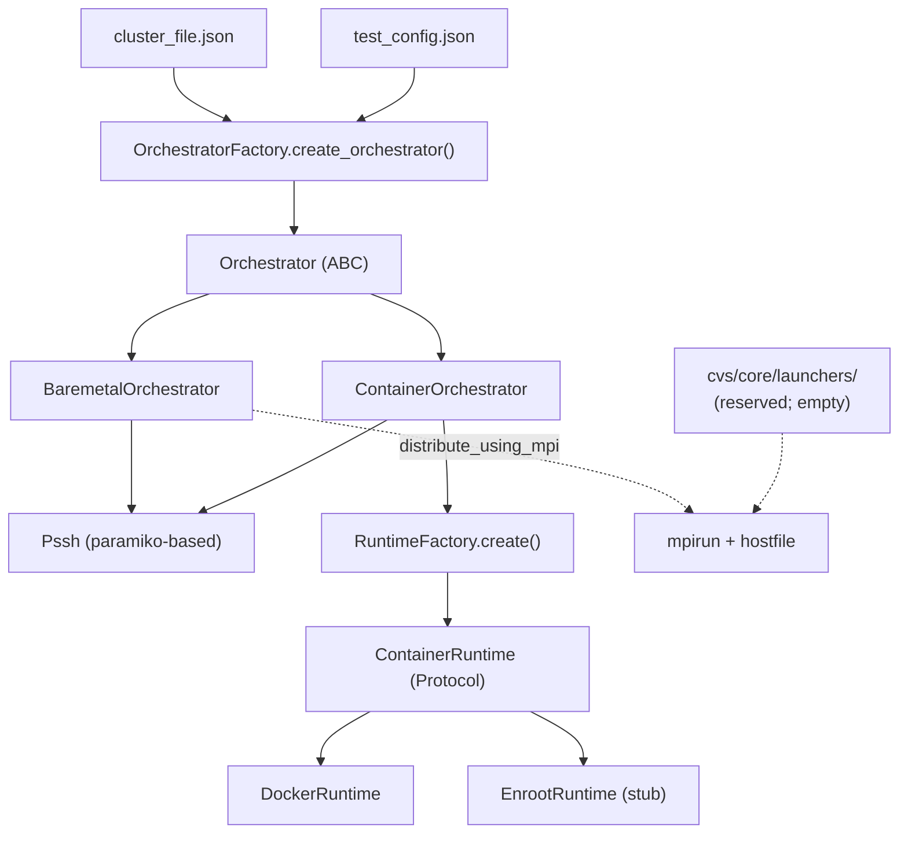

# `cvs/core/` — Cluster orchestration layer

This package is the execution substrate that test suites under `cvs/tests/`
build on. It abstracts "where and how a command runs on the cluster" so test
code can be backend-blind: the same suite source runs on baremetal hosts via
SSH, inside long-lived Docker containers, or (in the future) under Slurm /
Kubernetes / enroot, with the choice deferred to a JSON cluster file.

This README is the **contributor guide**. If you're a test author looking for
how to *use* the orchestrator, start at
`[docs/reference/configuration-files/cluster-file.rst](../../docs/reference/configuration-files/cluster-file.rst)`.

## Architecture




- **Orchestrator** (`cvs/core/orchestrators/base.py`) is the public ABC. It
defines what a backend must do.
- **OrchestratorFactory** (`cvs/core/orchestrators/factory.py`) instantiates a
concrete orchestrator from `OrchestratorConfig.from_configs(cluster_file, test_config)`.
- **BaremetalOrchestrator** runs commands directly on hosts via SSH (`Pssh`,
built on top of `parallel-ssh` / paramiko).
- **ContainerOrchestrator** inherits the host-SSH plumbing from the baremetal
orchestrator and overlays a container runtime (`DockerRuntime`, `EnrootRuntime`)
for routing the suite's workload through `docker exec` (or equivalent) into a
long-lived per-host container.
- **ContainerRuntime** (`cvs/core/runtimes/base.py`) is a `typing.Protocol` —
structural typing, no explicit inheritance required.
- `**cvs/core/launchers/`** is currently empty. It is the reserved location for
job-launching abstractions when we add Slurm / k8s / future backends; today
the only "launcher" is `BaremetalOrchestrator.distribute_using_mpi`, which
builds an MPI hostfile and shells out to `mpirun`. See *How to add a launcher*
below.

## `Orchestrator` ABC contract

Every concrete orchestrator must satisfy this contract.


| Member                                                                                                      | Kind                 | Default                      | Purpose                                                                                                                                                                                                                                                                       |
| ----------------------------------------------------------------------------------------------------------- | -------------------- | ---------------------------- | ----------------------------------------------------------------------------------------------------------------------------------------------------------------------------------------------------------------------------------------------------------------------------- |
| `__init__(log, config, stop_on_errors=False)`                                                               | concrete             | —                            | Stores `log`, `config`, `stop_on_errors`. Subclasses extend to set up SSH handles, runtimes, etc.                                                                                                                                                                             |
| `exec(cmd, hosts=None, timeout=None)`                                                                       | abstract             | —                            | Run `cmd` on every host (or the given subset). Default return is `Dict[host, str]` (stdout). The migrated test suites pin this contract; see `[cvs/tests/health/_rvs_orch_helpers.py](../tests/health/_rvs_orch_helpers.py)` `exec_detailed()` for the dict-of-dicts variant. |
| `exec_on_head(cmd, timeout=None)`                                                                           | abstract             | —                            | Run `cmd` on the head node only.                                                                                                                                                                                                                                              |
| `setup_env(hosts, env_script=None)`                                                                         | abstract             | —                            | Source an env script on hosts. Optional setup hook.                                                                                                                                                                                                                           |
| `cleanup(hosts)`                                                                                            | abstract             | —                            | Backend-specific resource release. Called by `dispose()`.                                                                                                                                                                                                                     |
| `distribute_using_mpi(rank_cmd, mpi_hosts, ranks_per_host, env_vars, mpi_install_dir, mpi_extra_args=None)` | concrete             | raises `NotImplementedError` | Optional MPI dispatch. `BaremetalOrchestrator` overrides; container inherits via the baremetal subclass; future Slurm/k8s orchestrators may override differently.                                                                                                             |
| `privileged_prefix() -> str`                                                                                | concrete             | `"sudo "`                    | Prefix prepended to commands that need root in the suite's execution context. Container backends override to `""` since the SSH-into-container session at port 2224 already runs as root.                                                                                     |
| `prepare() -> bool`                                                                                         | concrete             | `True` (no-op)               | One-shot setup before the first `orch.exec`. Container backends override to do `setup_containers + setup_sshd` with rollback on partial failure.                                                                                                                              |
| `dispose() -> bool`                                                                                         | concrete             | `True` (no-op)               | Counterpart to `prepare()`; idempotent and safe to call even if `prepare()` never ran or failed mid-way. **Must not raise** — finalizers depend on a clean True/False return.                                                                                                 |
| `host_all`                                                                                                  | abstract `@property` | —                            | `Pssh` handle that targets all cluster nodes at the **host** namespace (not the container). Used for kernel/network/firewall commands that must hit the physical host even in container mode.                                                                                 |
| `host_head`                                                                                                 | abstract `@property` | —                            | Same as above, head node only.                                                                                                                                                                                                                                                |


`host_all` and `host_head` were added by the multi-orch RVS migration (PR-A,
commit `040dacb`). Any new `Orchestrator` subclass MUST override them, or
instantiation raises `TypeError`. See the unit tests in
`[cvs/core/unittests/test_orchestrator_abc.py](unittests/test_orchestrator_abc.py)`
for the canonical pattern.

## Configuration surface

`OrchestratorConfig.from_configs(cluster_config, testsuite_config=None)`
(`[cvs/core/orchestrators/factory.py](orchestrators/factory.py)` lines
72-129) merges the two JSONs and extracts only the orchestrator-relevant
keys. Everything else in `testsuite_config` is the responsibility of the
test fixture.

Keys consumed:


| Key              | Required     | Default       | Type                                      |
| ---------------- | ------------ | ------------- | ----------------------------------------- |
| `orchestrator`   | optional     | `"baremetal"` | `str`                                     |
| `node_dict`      | **required** | —             | `Dict[ip, {bmc_ip, vpc_ip, ...}]`         |
| `username`       | **required** | —             | `str`                                     |
| `priv_key_file`  | **required** | —             | `str` (path)                              |
| `password`       | optional     | `None`        | `str`                                     |
| `head_node_dict` | optional     | `{}`          | `{"mgmt_ip": str}`                        |
| `container`      | optional     | `{}`          | dict; required by `ContainerOrchestrator` |


Path-resolution placeholders (`{user-id}`, `{home-mount-dir}`, etc.) are NOT
resolved by `OrchestratorConfig`; they are resolved by
`[cvs/lib/utils_lib.py](../lib/utils_lib.py)` `resolve_cluster_config_placeholders` /
`resolve_test_config_placeholders` which is called from test code. The
multi-orch suite's `cluster_orch` fixture in
`[cvs/tests/health/conftest.py](../tests/health/conftest.py)` wires this in so
the placeholders work transparently.

## Container lifecycle

`ContainerOrchestrator.prepare()` does, in order:

1. `setup_containers()` — calls `self.runtime.setup_containers(...)` to launch
  the container on every host with the `runtime.args` from the cluster_file.
   Sets `self.container_id` to the container name.
2. `setup_sshd()` — copies the host's SSH keys into `/root/.ssh/` inside each
  container and starts `sshd -p 2224` so subsequent `orch.exec` can SSH into
   the container namespace.

If either step returns `False` or raises, `_rollback_partial_prepare()` is
called: it stops the container we just launched (via the runtime directly)
and clears `self.container_id`. `prepare()` then returns `False`.

`ContainerOrchestrator.dispose()` does:

1. `self.runtime.teardown_containers(self.container_id)` — **directly**, not via
  the orchestrator's existing `teardown_containers()` method. The latter has
   an early-return when `launch:true`, which the iteration matrix mandates and
   which we own the lifecycle for. Bypassing the early-return is intentional;
   see `[cvs/core/orchestrators/container.py](orchestrators/container.py)`
   `dispose()` for the rationale comment.
2. `self.cleanup(self.hosts)` — host-side hygiene.

Both steps run regardless of the other's outcome (best-effort), and the
aggregate True/False is returned. `dispose()` never raises.

## Docker runtime arguments

When `orchestrator: "container"` and `container.runtime.name: "docker"`, the
keys under `container.runtime.args` map directly to `docker run` flags.
Defaults for any omitted key come from `DEFAULT_CONTAINER_ARGS` in
`[cvs/core/orchestrators/container.py](orchestrators/container.py)` lines
15-43; the dispatch from JSON keys to CLI flags is in
`[cvs/core/runtimes/docker.py](runtimes/docker.py)` `_build_runtime_args`
(lines 173-230).

**Merge semantics:** list-typed args (`volumes`, `devices`, `cap_add`,
`security_opt`, `group_add`, `ulimit`) **append to** the baked-in defaults
rather than replacing them. Scalar args (`network`, `ipc`, `privileged`)
**override** the default when set, otherwise inherit it. This means an
empty `runtime.args: {}` already yields a working RDMA-ready container; the
keys below are only needed when you want to extend or override the defaults.


| Arg            | Type      | docker flag                     | Default                                                    | Purpose                                                                                                                                                                   |
| -------------- | --------- | ------------------------------- | ---------------------------------------------------------- | ------------------------------------------------------------------------------------------------------------------------------------------------------------------------- |
| `network`      | str       | `--network <v>`                 | `"host"`                                                   | Network mode. `"host"` for clusters sharing the host net stack (the only mode tested).                                                                                    |
| `ipc`          | str       | `--ipc <v>`                     | `"host"`                                                   | IPC mode. `"host"` enables cross-process IPC required for RDMA.                                                                                                           |
| `privileged`   | bool      | `--privileged`                  | `true`                                                     | Grants full host capabilities. Required for device passthrough and RDMA.                                                                                                  |
| `volumes`      | list[str] | `-v <v>` (repeated)             | `[]` (appended)                                            | `host_path:container_path[:ro]` mounts. The container always also receives `/home/$user:/workspace` and `/home/$user/.ssh:/host_ssh` injected by `get_volumes()`.         |
| `devices`      | list[str] | `--device <v>` (repeated)       | `["/dev/kfd", "/dev/dri", "/dev/infiniband"]` (appended)   | Device passthroughs. Per-host `/dev/infiniband/`* is also discovered at runtime via shell expansion in `[container.py](orchestrators/container.py)` `setup_containers()`. |
| `cap_add`      | list[str] | `--cap-add <v>` (repeated)      | `["SYS_PTRACE", "IPC_LOCK", "SYS_ADMIN"]` (appended)       | Linux capabilities.                                                                                                                                                       |
| `security_opt` | list[str] | `--security-opt <v>` (repeated) | `["seccomp=unconfined", "apparmor=unconfined"]` (appended) | Security profile relaxations needed for RDMA and ptrace.                                                                                                                  |
| `group_add`    | list[str] | `--group-add <v>` (repeated)    | `["video"]` (appended)                                     | Supplementary group memberships inside the container.                                                                                                                     |
| `ulimit`       | list[str] | `--ulimit <v>` (repeated)       | `["memlock=-1"]` (appended)                                | Per-process resource limits. `memlock=-1` is required for RDMA.                                                                                                           |


**Environment variables go elsewhere.** Container env vars are configured at
the **container block level**, not under `runtime.args`: use
`container.env: {KEY: VALUE, ...}`. Defaults `{"GPUS": "8", "MULTINODE": "true"}`
are merged with anything you provide via `get_environment()`.

**Always-on flags** added by `[docker.py](runtimes/docker.py)` `setup_containers`
that are NOT configurable through `runtime.args`:

- `-d` (detached) and `sleep infinity` as the container command — the
container is a long-lived shell, work is dispatched via `docker exec`.
- `--name <container.name>` — sourced from the top-level `container.name`.
- `--gpus all` — added when `container.gpu_passthrough` is `true` (default).
- `-e KEY=VALUE` — one per entry in the merged `container.env` dict.

### Worked example

A typical RDMA-ready cluster file `runtime` block. Most users only need the
three scalars; the rest are present here to show the syntax for extending
the defaults rather than because they are required:

```json
"runtime": {
    "name": "docker",
    "args": {
        "network": "host",
        "ipc": "host",
        "privileged": true,
        "devices": ["/dev/extra-accelerator"],
        "cap_add": ["NET_ADMIN"],
        "ulimit": ["nofile=1048576:1048576"]
    }
}
```

The resulting `docker run` command on each host (with defaults expanded)
would be approximately:

```text
sudo docker run -d --name <container.name> --gpus all \
    -v /home/$user:/workspace -v /home/$user/.ssh:/host_ssh \
    -e GPUS=8 -e MULTINODE=true \
    --device /dev/kfd --device /dev/dri --device /dev/infiniband \
    --device /dev/extra-accelerator \
    $(for dev in /dev/infiniband/*; do echo -n "--device $dev:$dev "; done) \
    --cap-add SYS_PTRACE --cap-add IPC_LOCK --cap-add SYS_ADMIN --cap-add NET_ADMIN \
    --security-opt seccomp=unconfined --security-opt apparmor=unconfined \
    --group-add video \
    --network host --ipc host \
    --ulimit memlock=-1 --ulimit nofile=1048576:1048576 \
    --privileged \
    <container.image> sleep infinity
```

## Backend-blind suite contract

If you are writing a test suite under `cvs/tests/` that should run on both
baremetal and container backends:

**Don't:**

- Read `orch.orchestrator_type`.
- Use `isinstance(orch, BaremetalOrchestrator)` or any `type(...)` check.
- Hardcode `"baremetal"` or `"container"` as string literals anywhere in the
suite source.
- Hardcode `"sudo "` — call `sudo(orch, cmd)` from
`[cvs/tests/health/_rvs_orch_helpers.py](../tests/health/_rvs_orch_helpers.py)`
instead, or use `orch.privileged_prefix() + cmd` directly.
- Write to `/tmp/` literals — use `sealed_tmp(name)` for per-iteration scratch.

**Do:**

- Workload commands (the actual test payload — RVS modules, RCCL benchmarks,
amd-smi, etc.) go through `orch.exec(...)`. The orchestrator routes to the
right place: SSH on the host for baremetal, `docker exec` into the container
for container backends.
- Host-namespace commands (kernel modules, firewall, RDMA inspection, ROCm
version probes via `cat /opt/rocm/.info/version`) go through
`host_only(orch).exec(...)` — that's `orch.host_all.exec(...)`. These MUST
hit the physical host even when the orchestrator is container-backed.

The migrated `[cvs/tests/health/rvs_cvs.py](../tests/health/rvs_cvs.py)` is
the reference example; the helpers it uses live in
`[cvs/tests/health/_rvs_orch_helpers.py](../tests/health/_rvs_orch_helpers.py)`.

A static audit grep that every backend-blind suite must pass:

```bash
rg -n 'orchestrator_type|isinstance\s*\(\s*orch|"baremetal"|"container"|/tmp/' \
   cvs/tests/<your_suite>/
```

The migrated `rvs_cvs.py` returns no matches outside docstrings.

## How to add a new container runtime

Use case: support podman, singularity, or a future container CLI alongside
`docker` and `enroot`.

1. **Implement the `ContainerRuntime` Protocol.** Add
  `cvs/core/runtimes/<your_runtime>.py`. The Protocol is in
   `[cvs/core/runtimes/base.py](runtimes/base.py)`; since it is a
   `typing.Protocol`, you do not need to inherit from it explicitly — duck
   typing on the method signatures is enough. The required methods are
   `setup_containers`, `teardown_containers`, `exec`, `exec_on_head`,
   `load_image`. See `[cvs/core/runtimes/docker.py](runtimes/docker.py)` for
   a concrete reference.
2. **Register in the factory.** Edit
  `[cvs/core/runtimes/factory.py](runtimes/factory.py)` `RuntimeFactory.create()`:
3. **Update the public `__all__`** in
  `[cvs/core/runtimes/__init__.py](runtimes/__init__.py)` so the new class
   is importable via `from cvs.core.runtimes import PodmanRuntime`.
4. **Unit tests** under `cvs/core/unittests/test_<your_runtime>.py`. Mock the
  `Pssh` handles on the orchestrator (mock `cvs.core.orchestrators.baremetal.Pssh`
   to bypass real SSH); see
   `[cvs/core/unittests/test_orchestrator_abc.py](unittests/test_orchestrator_abc.py)`
   for the pattern.
5. **Document.** Add a `cluster_<shape>_<runtime>.json` example under
  `cvs/input/cluster_file/` and a one-line entry in the *Supported container
   runtimes* table of
   `[docs/reference/configuration-files/cluster-file.rst](../../docs/reference/configuration-files/cluster-file.rst)`.

## How to add a new orchestrator

Use case: Slurm, Kubernetes, a managed cloud control plane, etc.

1. **Subclass `Orchestrator`** in `cvs/core/orchestrators/<your_orch>.py`.
  Implement the abstract methods (`exec`, `exec_on_head`, `setup_env`,
   `cleanup`, `host_all`, `host_head`). Override the concrete defaults
   (`privileged_prefix`, `prepare`, `dispose`, `distribute_using_mpi`) only
   when the defaults are wrong for your backend.
2. **Pick the right superclass.** If your backend reuses host-SSH plumbing
  (e.g., a Slurm allocation that sshs into compute nodes), inheriting from
   `BaremetalOrchestrator` gives you `host_all`/`host_head`/`distribute_using_mpi`
   for free. If your backend has a different transport (e.g., a kubectl-based
   Pod-exec), inherit from `Orchestrator` directly and implement everything.
3. **Register in the factory.** Edit
  `[cvs/core/orchestrators/factory.py](orchestrators/factory.py)`
   `OrchestratorFactory.create_orchestrator()`:
   Also update `OrchestratorFactory.get_supported_backends()` so
   introspection tools see the new backend.
4. **Document the new keys** your orchestrator consumes from `cluster_file`.
  `OrchestratorConfig.__init__` (`[cvs/core/orchestrators/factory.py](orchestrators/factory.py)`
   lines 53-66) reads a fixed set of keys; if your orchestrator needs
   additional config (e.g., `slurm: {partition: "...", account: "..."}`), add
   it to `OrchestratorConfig`'s extracted keys in `from_configs()` lines
   110-119, and document the new sub-block in
   `[docs/reference/configuration-files/cluster-file.rst](../../docs/reference/configuration-files/cluster-file.rst)`.
5. **Unit tests** under `cvs/core/unittests/test_<your_orch>.py`. The same
  mocking pattern as `test_orchestrator_abc.py` applies.
6. **Worked example** under `cvs/input/cluster_file/cluster_<your_orch>.json`.

## How to add a launcher

`cvs/core/launchers/` exists but is empty (no `.py` files) as of the
multi-orch RVS migration. It is the reserved location for **job-launching
abstractions** — the part of an orchestrator that translates "run this rank
command across N hosts with M ranks per host" into a backend-specific
invocation (`mpirun --hostfile ...`, `srun ...`, `kubectl exec ...`).

Today this lives implicitly in `BaremetalOrchestrator.distribute_using_mpi`
(`[cvs/core/orchestrators/baremetal.py](orchestrators/baremetal.py)` lines
213-248), which builds an MPI hostfile and shells out to `mpirun`. There is
exactly one launcher (mpirun-on-pssh-baremetal), so the abstraction has not
been pulled out yet.

When the second launcher lands (e.g., a Slurm orchestrator that wants
`srun` instead of `mpirun`), factor the launcher out:

1. Define a `Launcher` Protocol in `cvs/core/launchers/base.py`:
  ```python
   from typing import Protocol

   class Launcher(Protocol):
       def build_command(self, rank_cmd, hosts, ranks_per_host, env_vars,
                         install_dir, extra_args=None) -> str: ...
       def dispatch(self, command, head_handle, timeout=None): ...
  ```
2. Create `cvs/core/launchers/mpirun.py` extracting the mpirun logic from
  `BaremetalOrchestrator.distribute_using_mpi` / `build_mpi_cmd` / `get_mpi_command`.
3. Add a `LauncherFactory` in `cvs/core/launchers/factory.py` keyed off a new
  `launcher` field in `cluster_file` (default `"mpirun"`).
4. Update `BaremetalOrchestrator.distribute_using_mpi` to delegate to
  `self.launcher.build_command(...)` then `self.launcher.dispatch(...)`.
5. Add `cvs/core/launchers/srun.py` (or whatever the new launcher is) and
  register in the factory.
6. Document the `launcher` key in the cluster-file .rst.

This refactor is intentionally deferred until there is concrete second-mover
demand (YAGNI); document this directory as the right place to land that
work when the time comes.

## Testing patterns

The canonical pattern is in
`[cvs/core/unittests/test_orchestrator_abc.py](unittests/test_orchestrator_abc.py)`
(20 cases, all green; added by PR-A commit `040dacb`):

- `unittest.TestCase` subclasses, one per concrete class under test.
- `@patch("cvs.core.orchestrators.baremetal.Pssh")` to stop subclass
`__init__` from instantiating a real `ParallelSSHClient`. The patch
applies at the *baremetal* import path because `ContainerOrchestrator`
inherits from `BaremetalOrchestrator` and calls `super().__init__(...)`.
- `MagicMock(name="...")` for the runtime, so you can assert
`runtime.teardown_containers.assert_called_once_with("cvs_iter_test")`
on the rollback paths.
- `OrchestratorConfig(**kwargs)` constructed directly (avoid
`from_configs(file_path)` which reads from disk).

Running the tests locally requires the unhelpful but harmless
`--cluster_file=/dev/null --config_file=/dev/null` because `[cvs/conftest.py](../conftest.py)`
declares both as required pytest options:

```bash
python3 -m pytest cvs/core/unittests/ --cluster_file=/dev/null --config_file=/dev/null
```

## See also

- User-facing reference for cluster_file:
`[docs/reference/configuration-files/cluster-file.rst](../../docs/reference/configuration-files/cluster-file.rst)`
- Worked cluster_file examples gallery:
`[docs/reference/configuration-files/example-configurations.rst](../../docs/reference/configuration-files/example-configurations.rst)`
- The reference backend-blind test suite that consumes this layer:
`[cvs/tests/health/rvs_cvs.py](../tests/health/rvs_cvs.py)` and its helpers
`[cvs/tests/health/_rvs_orch_helpers.py](../tests/health/_rvs_orch_helpers.py)`
- Pre-existing PR that introduced the orchestrator/runtime layer (without the
ABC additions, lifecycle hooks, or host_all/host_head):
commit `81a8ccb`.

