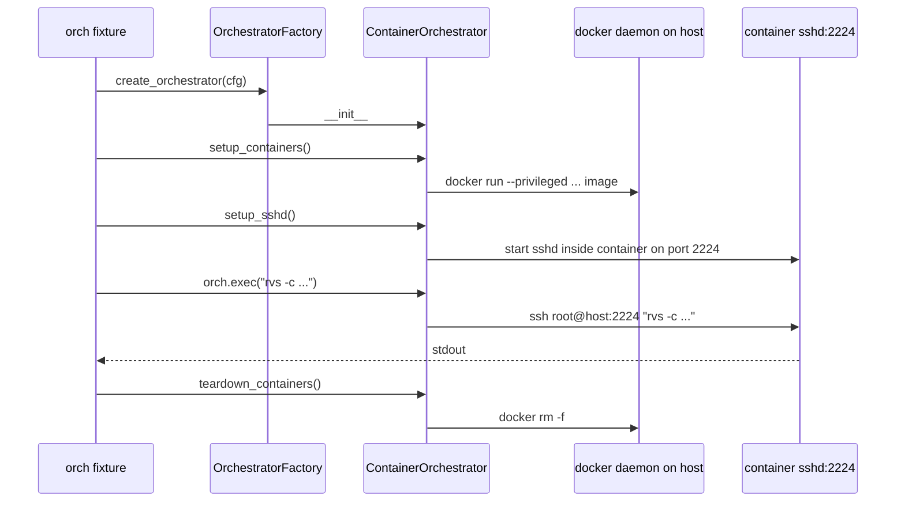
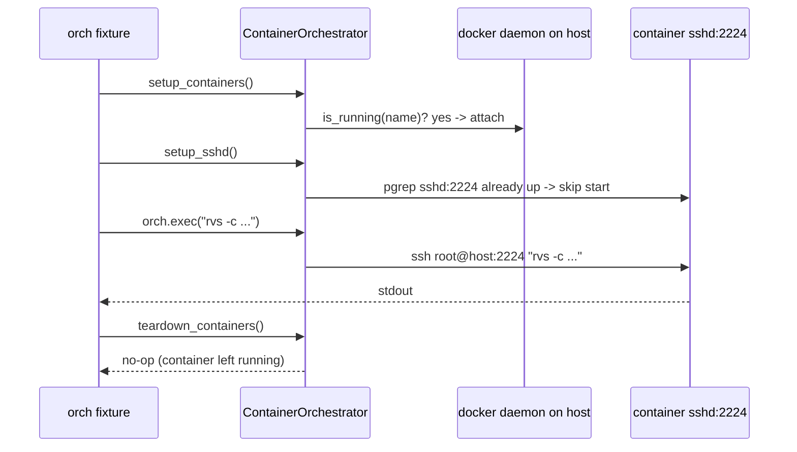

# Cluster files

Each CVS run is pointed at a cluster file via `--cluster_file <path>`. The
file declares the SSH credentials, the node list, and the **execution
backend** (`baremetal` or `container`). This directory ships two starter
templates; copy the one that matches your shape, edit the placeholders,
and pass the result to `cvs run`.

| File | Backend | Use when |
| --- | --- | --- |
| [`cluster.json`](cluster.json) | baremetal (default) | ROCm, RVS, RCCL, etc. are installed on the host filesystem; you want to validate the production environment as-is. |
| [`cluster_container.json`](cluster_container.json) | container | Workloads run inside a long-lived per-host container; the host only needs Docker, GPUs, and SSH. Best for reproducible release validation, CI, or validating the same image you ship to prod. |

The choice is made entirely in the cluster file. The `cvs run ...` invocation
does not change.

## When to use container mode

- Reproducibility: the test environment is the image, byte-for-byte across nodes
- CI: the same image used in CI is the one validated against the cluster
- "Validate what we ship": pin the workload to the release image
- Minimal host footprint: the host only needs Docker, the kernel driver, and SSH; ROCm/RVS live in the image

## Quick start (container mode)

```bash
cp cvs/input/cluster_file/cluster_container.json /tmp/my_cluster.json

# Edit the placeholders:
#   - {user-id}                  -> your SSH user
#   - /home/{user-id}/.ssh/...   -> path to your private key
#   - {xx.xx.xx.xx|hostname-N}   -> real public IPs or hostnames
#   - container.image            -> a pullable image with rvs preinstalled

cvs run rvs_cvs \
    --cluster_file /tmp/my_cluster.json \
    --config_file cvs/input/config_file/health/mi300_health_config.json
```

## The `container` block schema

Consumed by `ContainerOrchestrator` in [`cvs/core/orchestrators/container.py`](../../core/orchestrators/container.py); extracted from the cluster file by `OrchestratorConfig.from_configs` in [`cvs/core/orchestrators/factory.py`](../../core/orchestrators/factory.py).

| Key | Type | Default | Purpose |
| --- | --- | --- | --- |
| `lifetime` | str | `"per_run"` | Container lifecycle policy: `no_launch`, `per_run`, or `persistent`. See the truth table below. |
| `image` | str | (required) | Image with the test dependencies (rvs, etc.) pre-installed and an sshd you can start on port 2224. Must be present locally on each node OR pullable from a reachable registry. |
| `name` | str | (required) | Container name on each host. For parallel runs make this per-iteration unique (e.g. `cvs_iter_<run_id>`). |
| `runtime.name` | str | `"docker"` | Container runtime. Supported: `docker` (concrete), `enroot` (stub). |
| `runtime.args` | dict | `{}` | Backend-specific runtime arguments (see below). Defaults from `DEFAULT_CONTAINER_ARGS` in [`cvs/core/orchestrators/container.py`](../../core/orchestrators/container.py) apply for any key omitted here. |

CVS's own internal commands -- the Docker CLI calls made by `DockerRuntime` (`docker run`/`exec`/`rm`/`ps`/`load`) and the MPI hostfile cleanup in `BaremetalOrchestrator` -- automatically detect whether `sudo` is needed. Once per run, CVS probes each host with `sudo -n true` and caches whether passwordless sudo is available; every subsequent privileged command is then prefixed with `sudo -n ` or left unprefixed accordingly, for the lifetime of that run. No cluster-file configuration is required whether the SSH user has passwordless sudo, is already in the `docker` group, or has direct access to the resources it needs.

### `runtime.args` (docker) reference

List args (`volumes`, `devices`, `cap_add`, `security_opt`, `group_add`,
`ulimit`) **append to** the baked-in `DEFAULT_CONTAINER_ARGS`. Scalars
(`network`, `ipc`, `privileged`) **override** the default when set,
otherwise inherit it. An empty `args: {}` already yields a working
RDMA-ready container; the keys below are only needed to extend or override.

| Arg | Type | Default | Purpose |
| --- | --- | --- | --- |
| `network` | str | `"host"` | `--network` mode. `host` for clusters sharing the host net stack. |
| `ipc` | str | `"host"` | `--ipc` mode. `host` enables cross-process IPC required for RDMA. |
| `privileged` | bool | `true` | `--privileged`. Required for device passthrough and RDMA. |
| `volumes` | list | `[]` (appended) | `host:container[:ro]` mounts. The container always also receives `/home/$user/.ssh:/host_ssh` injected by the orchestrator. |
| `devices` | list | `["/dev/kfd","/dev/dri","/dev/infiniband"]` (appended) | Device passthroughs. Per-host `/dev/infiniband/*` is also discovered at runtime. |
| `cap_add` | list | `["SYS_PTRACE","IPC_LOCK","SYS_ADMIN"]` (appended) | Linux capabilities. |
| `security_opt` | list | `["seccomp=unconfined","apparmor=unconfined"]` (appended) | Security profile relaxations needed for RDMA + ptrace. |
| `group_add` | list | `["video"]` (appended) | Supplementary groups inside the container. |
| `ulimit` | list | `["memlock=-1"]` (appended) | Per-process resource limits. `memlock=-1` is required for RDMA. |

## `lifetime` truth table (setup + teardown semantics)

`setup_containers()` and `teardown_containers()` in [`cvs/core/orchestrators/container.py`](../../core/orchestrators/container.py) branch on `container.lifetime`. This is pinned by the per-lifetime tests in [`cvs/core/orchestrators/unittests/test_container.py`](../../core/orchestrators/unittests/test_container.py).

| `lifetime` | `setup_containers` | `teardown_containers` |
| --- | --- | --- |
| `no_launch` | Verify the container is already running on every host; set `container_id`. Never starts anything. | No-op. CVS does not own a container it did not launch. |
| `per_run` (default) | Start a fresh container on every host (force-removing any stale same-named container first). | Force-remove the container CVS started. |
| `persistent` | Attach if the container is already running on every host. Start fresh only if it is running on no host. Running on some hosts but not all is a hard error (CVS will not force-remove the still-running hosts and destroy their overlay). Idempotent across runs. | No-op. The container is left running for the next run; remove it yourself when done. |

## Prerequisites on each cluster node

- **Docker** installed. The SSH user needs either passwordless `sudo docker` or direct Docker access (e.g. membership in the `docker` group) -- CVS auto-detects which applies and falls back to `sudo -n` only if the plain command fails.
- **Host driver** loaded so `/dev/kfd` and `/dev/dri/*` (and `/dev/infiniband/*` if RDMA is in scope) are present for passthrough.
- **`~/.ssh/`** of the SSH user is reachable; the orchestrator mounts it as `/host_ssh` and copies keys into `/root/.ssh` inside the container so `setup_sshd` can start an in-container sshd on port 2224.
- **The image** is either pre-loaded on every node (`docker load`) or pullable from a reachable registry. Inside the image you need: `openssh-server` (for the in-container sshd), the workload binaries the suite invokes (e.g. `/opt/rocm/bin/rvs`), and any ROCm runtime libs the workload needs.

## What happens when you run a backend-blind suite

Default (`lifetime: per_run`) - start fresh, run, remove:



Second `cvs run` with `lifetime: persistent` - attach to the surviving container, skip sshd, leave it running:



The same `cvs run` command works against either backend; only the cluster
file changes. The `orch` fixture in [`cvs/tests/health/rvs_cvs.py`](../../tests/health/rvs_cvs.py) gates the lifecycle hooks on `cfg.orchestrator == "container"`, so the baremetal path stays a no-op for those calls.

## Common pitfalls

- **Image without `openssh-server`**. `setup_sshd` cannot start sshd on port 2224; `orch.exec` then fails to connect. Make sure your image installs `openssh-server` and exposes the binary at `/usr/sbin/sshd`.
- **Image without the workload binary**. `cvs run rvs_cvs` will execute `rvs` inside the container; if the image lacks `/opt/rocm/bin/rvs` the test fails with a `command not found` flavor error.
- **`lifetime: persistent` without a pinned `name`**. The default container name is `<user>_<sanitized_image>`, which shifts when you bump the image tag. A tag bump silently abandons the previous container's overlay (installs, clones) and starts fresh. Pin `container.name` explicitly when using `persistent`.
- **Port 2224 collision on the host**. With `network: host` the in-container sshd binds to 2224 in the host's network namespace. If something else on the host already listens on 2224 the bind fails. Stop the conflicting service or change the in-image sshd port (and update the orchestrator's port to match).

## See also

- [`cvs/core/orchestrators/factory.py`](../../core/orchestrators/factory.py) - canonical key list (`OrchestratorConfig.__init__` and `from_configs`).
- [`cvs/core/orchestrators/container.py`](../../core/orchestrators/container.py) - `ContainerOrchestrator` implementation, `DEFAULT_CONTAINER_ARGS`, the `setup_containers` / `setup_sshd` / `teardown_containers` lifecycle.
- [`cvs/tests/health/rvs_cvs.py`](../../tests/health/rvs_cvs.py) - the `orch` fixture that consumes this cluster file in test code.
- [`cvs/core/orchestrators/unittests/`](../../core/orchestrators/unittests/) - the test suite that pins the schema and lifecycle behaviors documented above (`test_factory.py`, `test_baremetal.py`, `test_container.py`).
