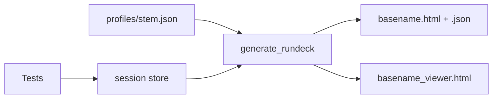

# Run Deck (`cvs.lib.report`)

CVS **Run Deck** is the HTML/JSON suite dashboard produced when tests run with
pytest `--html`. It is **not** the Rundeck job scheduler product.

Suite owners enable Run Deck by adding `profiles/<stem>.json` (matching the
`cvs run` stem) plus the session fixtures declared in the profile. Schema:
`profiles/schema.json`.

## How it works

1. Tests fill **session fixtures** (`cvs_results_dict`, `variant_config`, `lifecycle`, …).
2. Pytest auto-loads **`profiles/<stem>.json`** when present (matches `cvs run` stem).
3. At session finish, **`rundeck/generate_rundeck.py`** builds datasets, renders HTML/JSON,
   and optionally an interactive viewer for sweep suites.



| Layer | Location |
| ----- | -------- |
| Session store | `registry.py` |
| Profile schema | `profiles/schema.json` |
| Config resolution | `rundeck/config_adapter.py` |
| Dataset builders | `rundeck/dataset_builders/` — `sweep`, `series`, `matrix` |
| Card runtime | `rundeck/runtime/` |
| Publish entry | `rundeck/generate_rundeck.py` |

## Session contract

| Role | Standard key | Legacy alias |
| ---- | ------------ | -------------- |
| Results | `cvs_results_dict` | `inf_res_dict` |
| Config / thresholds | `variant_config` | — |
| Stage timings | `lifecycle` | — |
| Golden reference | `golden_results` | `reference_results` |

Root `cvs/conftest.py` binds fixtures from profile `sources` via `pytest_hooks.py`.

## Adding a Run Deck (suite owner checklist)

### 1. Choose a `dataset_builder`

| Builder | Results shape |
| ------- | --------------- |
| `sweep` | Cell-keyed dict → metric fields (ISL/OSL/concurrency sweeps) |
| `series` | Nested dict: collective → message size → metrics |
| `matrix` | Current results + golden reference for compare rows |

Use `testing/fixtures.generic_sweep_profile()` as a template when authoring a
sweep profile. Schema: `profiles/schema.json`.

### 2. Add `profiles/<stem>.json`

Filename must match the `cvs run` stem. Minimal skeleton:

```json
{
  "schema_version": 1,
  "profile_id": "my_suite_rundeck",
  "suite_id": "my_suite",
  "report_basename": "my_suite_run_deck",
  "title": "My Suite Run Deck",
  "dataset_builder": "sweep",
  "interactive_viewer": true,
  "sources": {
    "results": "cvs_results_dict",
    "variant": "variant_config",
    "lifecycle": "lifecycle"
  },
  "hooks": {
    "tier_metric_specs": "my.hooks:tier_metric_specs",
    "metric_units": "my.hooks:METRIC_UNITS"
  },
  "sweep": { "tier_order": ["throughput", "record"], "chart_series": [] },
  "cards": [
    {"type": "run_card", "id": "run-card", "title": "Run card", "bind": "run_card_display"},
    {"type": "table", "id": "results", "title": "Full results", "bind": "results_table"}
  ]
}
```

Optional `hooks` under `profiles/hooks/` customize metric tiers, units, run card
rows, and launch provenance.

### 3. Wire suite fixtures

Expose pytest fixtures named in profile `sources`. For matrix compare, also expose
`golden_results` and set `sources.reference`.

### 4. Verify

```bash
cvs run <stem> ... --html=~/cvs_results/run.html
make ut
python sample_reports/generate_sample_rundecks.py   # local smoke after adding profiles
```

Artifacts next to the pytest HTML report:

| File | When |
| ---- | ---- |
| `{report_basename}.html` + `.json` | Profile registered and results present |
| `{report_basename}_viewer.html` | Sweep + `interactive_viewer: true` |
| `{report_basename}_summary.html` | CI one-pager |

## Author tiers

| Tier | You add | Core adds |
| ---- | ------- | --------- |
| **A** | JSON profile + session fixtures | — |
| **B** | JSON + config hooks | — |
| **C** | New result shape | New `dataset_builder` |
| **D** | New panel type | New card in `rundeck/runtime/` |

Tier A is the default. Open a core PR only when data does not fit `sweep`, `series`,
or `matrix`, or you need a card type that does not exist.

## Code layout

```
cvs/lib/report/
  rundeck/
    generate_rundeck.py      # production publish entry
    publish_helpers.py       # artifact paths + provenance
    payload.py               # build_rundeck_payload, apply_summary_meta
    render.py                # static HTML
    config_adapter.py        # JSON profile → RunDeckConfig
    viewer_config.py         # interactive viewer config
    dataset_builders/        # sweep, series, matrix
    runtime/                 # card components + theme
  profiles/schema.json
  pytest_hooks.py            # session fixture binding
  registry.py                # session store + profile registration
  inference_payload.py       # sweep cell helpers (used by builders)
  inference.py               # write_report test helper only
```

## Tests

Library unit tests use `unittest` and live beside the module under test (see
`AGENTS.md`). `make ut` discovers them via `run_all_unittests.py`.

| Location | Covers |
| -------- | ------ |
| `report/unittests/` | registry, profile, cell_build, inference, provenance, … |
| `report/rundeck/unittests/` | payload, viewer_config, config_builder, parity |
| `report/render/unittests/` | cell card renderer |
| `report/viewer/unittests/` | interactive viewer scaffold |
| `report/panels/unittests/` | prev-run comparison panel |

Shared test fixtures: `report/testing/fixtures.py`.

Optional sweep pytest-html row extras may require suite-specific lifecycle helpers
when enabled in a profile. The core engine does not require `cvs.lib.inference`.
