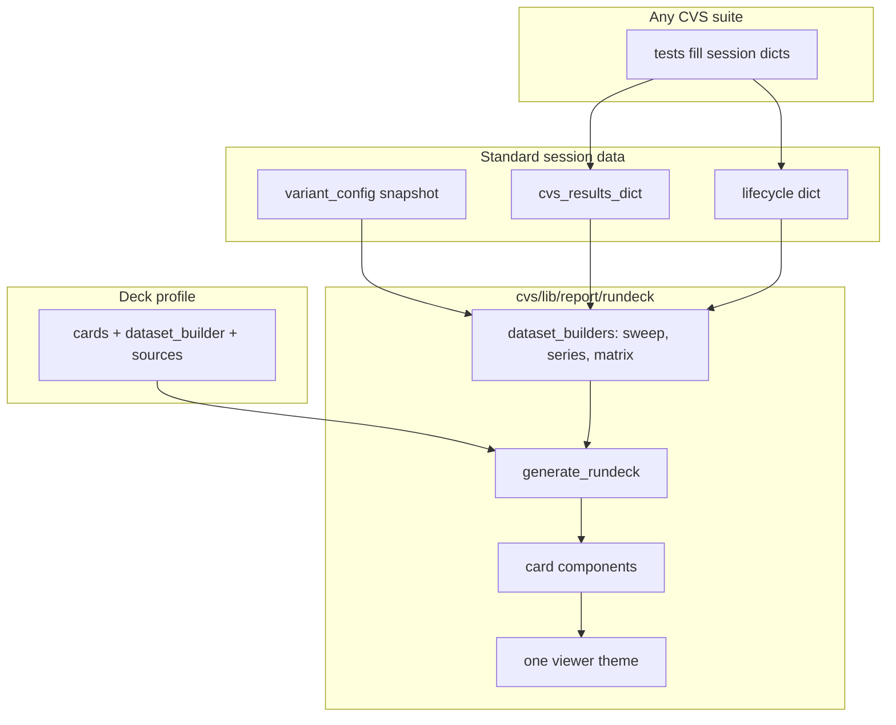
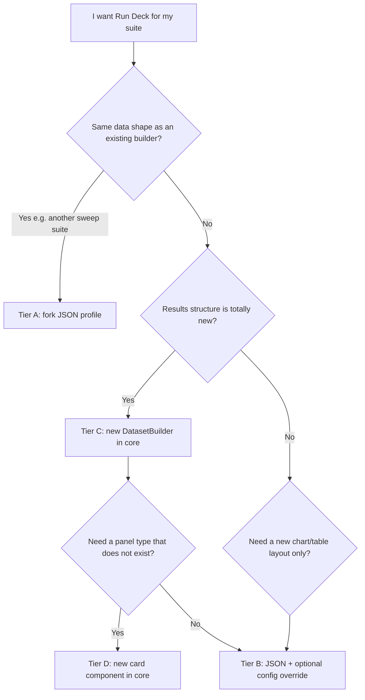

# Run Deck (`cvs.lib.report`)

CVS **Run Deck** is the HTML/JSON suite dashboard produced when tests run with
pytest `--html`. It is **not** the Rundeck job scheduler product.

Any CVS test suite publishes a consistent Run Deck by:

1. Filling **standardized session data** during the test run.
2. Registering a **deck profile** (JSON under `profiles/`).
3. Relying on the **rundeck core engine** to build datasets and render the shared viewer.

## Architecture



| Layer | Location | Role |
| ----- | -------- | ---- |
| Session data | pytest fixtures → `registry.py` | `cvs_results_dict`, `variant_config`, `lifecycle` |
| Deck profile | `profiles/<stem>.json` | cards, builder id, sources, hooks |
| Dataset builders | `rundeck/dataset_builders/` | `sweep`, `series`, `matrix` |
| Card runtime | `rundeck/runtime/` | `table`, `run_card`, `gate_matrix`, `line_chart`, … |
| Publish | `rundeck/generate_rundeck.py` | session finish entry point |

## Session contract

| Role | Standard key | Legacy name | Populated by |
| ---- | ------------ | ----------- | ------------ |
| Benchmark results | `cvs_results_dict` | `inf_res_dict` | Tests after parse |
| Config / thresholds | `variant_config` | same | `--config` loader |
| Stage timings | `lifecycle` | same | `lifecycle.record(...)` |
| Golden reference | `golden_results` | — | RCCL regression compare |

Root `cvs/conftest.py` binds fixtures from profile `sources` via `pytest_hooks.py`.

## Profile discovery

Auto-load order for `cvs run <stem>`:

1. `profiles/<stem>.json`
2. Legacy `presets/<stem>.py` (`*_REPORT_CONFIG`)
3. No Run Deck

## Reference profiles

| Profile | Builder | Suite | On this branch? |
| ------- | ------- | ----- | --------------- |
| `inferencex_atom_single.json` | `sweep` | InferenceX ATOM | Yes |
| `vllm.json` | `sweep` | vLLM | Yes |
| `rccl_perf.json` | `series` | RCCL bandwidth | Yes |
| `rccl_regression.json` | `matrix` | RCCL golden compare | Yes |
| SGLang (legacy preset) | `sweep` | `sglang_*` stems | **`dev/dtni` only** — no JSON profile yet |

Schema: `profiles/schema.json`

### Which suites get a Run Deck at session finish?

When you run with `--html`, auto-load tries ``profiles/<stem>.json`` then ``presets/<stem>.py``.
If a profile is registered **and** session fixtures contain results, ``generate_rundeck()``
writes ``{report_basename}.html`` + ``.json`` (and viewer for sweep suites).

| `cvs run` stem | Produced on this branch? | Mechanism |
| -------------- | ------------------------ | --------- |
| `inferencex_atom_single` | Yes | `profiles/inferencex_atom_single.json` |
| `vllm` | Yes | `profiles/vllm.json` (falls back to `presets/vllm.py`) |
| `rccl_perf` | Yes | `profiles/rccl_perf.json` |
| `rccl_regression` | Yes | `profiles/rccl_regression.json` |
| `sglang_single`, `sglang_distributed`, … | After `dev/dtni` merge | Legacy `presets/sglang_*.py` on that branch |

Sample artifacts (no cluster run): ``python -m cvs.lib.report.demo.generate_inferencex_atom_rundeck --out sample_reports`` (or run ``sample_reports/generate_sample_rundecks.py`` locally for all profiles)

## Author tiers

| Tier | You add | Core adds |
| ---- | ------- | --------- |
| **A** | JSON profile + session fixtures | Nothing |
| **B** | JSON + optional config override | Nothing (override hook planned) |
| **C** | JSON + new result shape | New `dataset_builder` |
| **D** | Profile stub + requirements | New card in `runtime/` |

### Which tier do I need?

Use this flowchart from the Run Deck plan to decide before opening a PR:



**Tier A is the common path.** Copy the closest reference profile, wire fixtures, run with
`--html`. Open a core PR only when your results do not fit `sweep`, `series`, or `matrix`,
or you need a card type that does not exist yet.

## Adding a Run Deck (Tier A checklist)

### 1. Pick a `dataset_builder`

| Builder | Use when results look like | Copy from |
| ------- | ------------------------- | --------- |
| `sweep` | Cell-keyed dict: `ISL=…,OSL=…,CONC=…` → metric fields | `profiles/inferencex_atom_single.json` or `vllm.json` |
| `series` | Nested dict: collective → message size → `{bus_bw, alg_bw, …}` | `profiles/rccl_perf.json` |
| `matrix` | Current results + golden reference for compare rows | `profiles/rccl_regression.json` |

### 2. Copy profile JSON

Filename must match the `cvs run` stem: `profiles/<stem>.json`.

Minimal skeleton (edit fields marked `…`):

```json
{
  "schema_version": 1,
  "profile_id": "my_suite_rundeck",
  "suite_id": "my_suite",
  "report_basename": "my_suite_run_deck",
  "title": "My Suite Run Deck",
  "subtitle": "…",
  "footer": "CVS my_suite · render-only",
  "link_name": "My Suite Run Deck",
  "dataset_builder": "sweep",
  "interactive_viewer": true,
  "sources": {
    "results": "cvs_results_dict",
    "variant": "variant_config",
    "lifecycle": "lifecycle"
  },
  "cards": [
    {"type": "run_card", "id": "run-card", "title": "Run card", "bind": "run_card_display"},
    {"type": "table", "id": "results", "title": "Full results", "bind": "results_table"}
  ]
}
```

For sweep suites, also copy the `sweep` block and card list from a reference profile.
For series/matrix, copy the `series` or `matrix` block instead and set
`interactive_viewer` to `false` unless you need the sweep viewer.

Optional `hooks` (module path strings) customize metric tiers, units, run card rows, or
launch provenance — see `profiles/inferencex_atom_single.json`.

### 3. Wire session fixtures

Expose pytest fixtures whose names match profile `sources`. Root `cvs/conftest.py` binds
them at module teardown via `pytest_hooks.py`.

RCCL-style minimal example (`tests/my_suite/conftest.py`):

```python
import pytest

@pytest.fixture(scope="module")
def cvs_results_dict():
    """Filled by tests after parse; bound into session store at module end."""
    return {}

@pytest.fixture(scope="module")
def variant_config(request):
    """Config snapshot for run card / provenance."""
    ...
```

Inference suites typically already expose `inf_res_dict` (legacy) or `cvs_results_dict`,
`variant_config`, and `lifecycle`.

For matrix compare, also expose `golden_results` and list it under `sources.reference`.

### 4. Run and verify

```bash
cvs run <stem> --cluster_file ... --config_file ... --html=~/cvs_results/run.html
python -m pytest cvs/lib/report/unittests/test_rundeck_foundation.py -q
python -m cvs.lib.report.demo.generate_inferencex_atom_rundeck --out sample_reports   # offline smoke
```

Expected artifacts next to the pytest HTML report:

| File | When |
| ---- | ---- |
| `{report_basename}.html` + `.json` | Always (when profile loads and results present) |
| `{report_basename}_viewer.html` | Sweep suites with `interactive_viewer: true` |
| `{report_basename}_summary.html` | CI one-pager |

### 5. PR checklist

- [ ] `profiles/<stem>.json` matches `cvs run <stem>` stem
- [ ] `sources` fixtures exist in suite `conftest.py`
- [ ] Results dict shape matches chosen `dataset_builder`
- [ ] Open static HTML locally; sweep suites also open `*_viewer.html`
- [ ] Add or extend a unit test if you introduce new hooks or a non-obvious binding

## Merging to `main` before `dev/dtni`

The Run Deck **platform** can land on `main` independently of the InferenceX ATOM test
suite. The profile ``profiles/inferencex_atom_single.json`` uses report-layer hooks
(``presets/inferencex_atom_metrics.py``) so it works without
``cvs/lib/inference/inferencex_atom/``.

| Proof level | Works on `main`? | How |
| ----------- | ---------------- | --- |
| Engine + parity | Yes | ``pytest cvs/lib/report/unittests/test_rundeck_parity.py`` |
| Sample artifacts | Yes | ``python -m cvs.lib.report.demo.generate_inferencex_atom_rundeck --out sample_reports`` |
| Live ``cvs run inferencex_atom_single`` | After suite merges | Full suite from ``dev/dtni`` + Run Deck |

Launch-command panel is omitted from the main-safe profile; add
``hooks.launch_provenance`` when the suite package is available.

## Quick start

See **Adding a Run Deck** above for the full checklist. Short version:

1. Copy a reference profile → `profiles/<cvs_run_stem>.json`.
2. Ensure suite `conftest.py` exposes fixtures named in `sources`.
3. Run with `--html`.

```bash
cvs run inferencex_atom_single --cluster_file ... --config_file ... --html=~/cvs_results/run.html
python -m pytest cvs/lib/report/unittests/ -q
```

## Outputs

| File | Contents |
| ---- | -------- |
| `{basename}.html` + `.json` | Static Run Deck + payload |
| `{basename}_viewer.html` | Interactive explorer (sweep suites) |
| `{basename}_summary.html` | CI one-pager |

## Code layout

```
cvs/lib/report/
  rundeck/
    generate_rundeck.py
    payload.py
    render.py
    config_adapter.py
    dataset_builders/   # sweep, series, matrix
    runtime/            # card components + theme
  profiles/             # JSON deck profiles
  pytest_hooks.py
  presets/              # legacy shims (transitional)
  registry.py
```

Legacy modules (`inference_html.py`, `inference_payload.py`) delegate to the unified
runtime; prefer JSON profiles for new suites.
