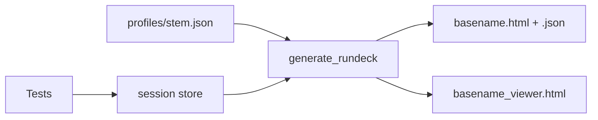

# Run Deck (`cvs.lib.report`)

CVS **Run Deck** is the HTML/JSON suite dashboard produced when tests run with
pytest `--html`. It is **not** the Rundeck job scheduler product.

Suite owners enable Run Deck by adding `profiles/<stem>.json` (matching the
`cvs run` stem) plus the session fixtures declared in the profile. Schema:
`profiles/schema.json`.

## How it works

1. Tests fill **session fixtures** (`cvs_results_dict` / `train_res_dict`, `variant_config`, `lifecycle`, …).
2. Pytest auto-loads **`profiles/<stem>.json`** when present (matches `cvs run` stem).
3. At session finish, **`rundeck/generate_rundeck.py`** builds datasets, renders HTML/JSON,
   and optionally an interactive viewer when `interactive_viewer` is true
   (`sweep`, `training_sweep`, or `status_matrix`).


```mermaid
flowchart LR
  Tests --> Session[session store]
  Profile[profiles/stem.json] --> Gen[generate_rundeck]
  Session --> Gen
  Gen --> HTML[basename.html + .json]
  Gen --> Viewer[basename_viewer.html]
```

| Layer | Location |
| ----- | -------- |
| Session store | `registry.py` |
| Profile schema | `profiles/schema.json` |
| Config resolution | `rundeck/config_adapter.py` |
| Dataset builders | `rundeck/dataset_builders/` — `sweep`, `series`, `matrix`, `status_matrix`, `training_sweep` |
| Card runtime | `rundeck/runtime/` |
| Publish entry | `rundeck/generate_rundeck.py` |

## Session contract

| Role | Standard key | Other fixture names |
| ---- | ------------ | ------------------- |
| Results | `cvs_results_dict` | `inf_res_dict` (inference), `train_res_dict` (Megatron) |
| Config / thresholds | `variant_config` | — |
| Stage timings | `lifecycle` | — |
| Golden reference | `golden_results` | `reference_results` |

Profile `sources.results` names the fixture. After module teardown, `pytest_hooks.py` copies it into the session store as `cvs_results_dict` so `generate_rundeck.py` always reads one key.

Root `cvs/conftest.py` binds fixtures from profile `sources` via `pytest_hooks.py`.

## Adding a Run Deck (suite owner checklist)

### 1. Choose a `dataset_builder`

| Builder | Results shape |
| ------- | --------------- |
| `sweep` | Cell-keyed dict → metric fields (ISL/OSL/concurrency sweeps) |
| `series` | Nested dict: collective → message size → metrics |
| `matrix` | Current results + golden reference for compare rows |
| `status_matrix` | Node × group pass/fail/na with per-item drill-down. Optional per-node `metrics`, `series`, and `heatmaps` roll up into `overview` and `metric_charts`. Contract: `dataset_builders/status_matrix.py`. Example: `profiles/anc_base.json` |
| `training_sweep` | String combo keys `MBS=…,GBS=…,PRECISION=…` → metric lists (`train_res_dict`) |

Use `testing/fixtures.generic_sweep_profile()` as a template when authoring a
sweep profile. Schema: `profiles/schema.json`.

### 2. Add `profiles/<stem>.json`

Filename must match the `cvs run` stem. Minimal skeleton:

```json
{
  "schema_version": 1,
  "profile_id": "my_suite_rundeck",
  "suite_id": "my_suite",
  "report_basename": "my_suite_run_deck",
  "title": "My Suite Run Deck",
  "dataset_builder": "sweep",
  "interactive_viewer": true,
  "sources": {
    "results": "cvs_results_dict",
    "variant": "variant_config",
    "lifecycle": "lifecycle"
  },
  "hooks": {
    "tier_metric_specs": "cvs.lib.inference.my_suite.my_parsing:tier_metric_specs",
    "metric_units": "cvs.lib.inference.my_suite.my_parsing:METRIC_UNITS"
  },
  "sweep": { "tier_order": ["throughput", "record"], "chart_series": [] },
  "cards": [
    {"type": "run_card", "id": "run-card", "title": "Run card", "bind": "run_card_display"},
    {"type": "table", "id": "results", "title": "Full results", "bind": "results_table"}
  ]
}
```

Optional `hooks` under `profiles/hooks/` customize run-card rows and launch
provenance when the default run card is not enough. Metric tiers and units should
reference the suite parsing module directly in profile JSON.

Shared layout across related stems uses ``PROFILE_STEM_ALIASES`` in
``profile.py`` when the deck is identical — ``sglang.json`` for SGLang suites,
``rccl.json`` for ``rccl_perf`` / ``rccl_regression`` / ``rccl_pairwise``,
``megatron.json`` for ``megatron_single`` / ``megatron_distributed``.

### 3. Wire suite fixtures

Expose pytest fixtures named in profile `sources`. For matrix compare, also expose
`golden_results` and set `sources.reference`.

### 4. Verify

```bash
cvs run <stem> ... --html=~/cvs_results/run.html
make ut
python sample_reports/generate_sample_rundecks.py   # local smoke after adding profiles
```

Artifacts next to the pytest HTML report:

| File | When |
| ---- | ---- |
| `{report_basename}.html` + `.json` | Profile registered and results present |
| `{report_basename}_viewer.html` | `interactive_viewer: true` and builder is `sweep`, `training_sweep`, or `status_matrix` |
| `{report_basename}_summary.html` | `sweep` CI one-pager |

The interactive viewer includes a **Token Throughput per GPU vs. Interactivity**
chart (InferenceX-style) for inference sweeps. Configure axis metrics under
`viewer.interactivity` in the profile JSON; open the viewer sidecar from the nav
link or sweep banner. **Megatron** (`training_sweep`) uses the same explorer
(MBS/GBS filters, heatmap, gates) with Interactivity and cross-shape Sweep charts
disabled (combo bars stay on the static deck, including p50 / p95 step time); when cells include sampled
``loss_curve`` / ``perplexity_curve`` / ``learning_rate_curve`` / ``grad_norm_curve`` /
``throughput_curve`` / ``tokens_curve`` points it also draws Chart.js overlays for
**lm_loss**, **perplexity** (``exp(lm_loss)``), **learning_rate**, **grad_norm**,
**TFLOP/s/GPU**, and **tokens/s/GPU** vs step. The viewer **Warmup** dropdown skips 0%, 5%, 7%, 10%, 15%, 20%, or 30% of
planned steps (each option shows the step that percent maps to; default is 10%)
and redraws those overlays when the skip changes. After that same default skip, Megatron also
derives scalar **p50 / p95 step time** (ms) from per-iteration elapsed time
(Primus instantaneous X, not running Y) for the Full results table — not extra charts.
Single-node (`megatron_single`, Megatron-LM or Primus) omits scaling efficiency from
the Full results table, cell highlights, and sweep charts; distributed keeps it.

`status_matrix` profiles with `interactive_viewer: true` use the same publisher
(`generate_rundeck.py`) and the same `{report_basename}.html`, `.json`, and
`{report_basename}_viewer.html` names. The viewer template is
`viewer/status_matrix.html` (node, group, and metric filters, threshold-aware
charts, heatmaps, and searchable item results). It is separate from
`viewer/interactive.html`. Static cards register on `DeckCardRenderer` in
`runtime/cards.py`: `status_overview` binds `datasets.status_matrix.overview`
and `metric_charts` binds `datasets.status_matrix.metric_charts` (`when_empty:
hide` drops the card when all three lists are empty). The `status_matrix` card
accepts an optional `hint` string; otherwise it shows generic item-breakdown
help. The deck nav links the viewer from `summary.viewer_html`, the same way
sweep decks do.

```json
{
  "dataset_builder": "status_matrix",
  "interactive_viewer": true,
  "sources": {"results": "cvs_results_dict"},
  "cards": [
    {
      "type": "run_card",
      "id": "run-card",
      "title": "Run card",
      "bind": "datasets.status_matrix.run_card_display"
    },
    {
      "type": "status_overview",
      "id": "overview",
      "title": "Health overview",
      "bind": "datasets.status_matrix.overview"
    },
    {
      "type": "metric_charts",
      "id": "metrics",
      "title": "Metrics",
      "bind": "datasets.status_matrix.metric_charts",
      "when_empty": "hide"
    },
    {
      "type": "status_matrix",
      "id": "results",
      "title": "Full results",
      "bind": "datasets.status_matrix",
      "hint": "Click a cell's items to expand that node × group's breakdown and artifact links."
    }
  ]
}
```

`profiles/transferbench_cvs.json` is a suite on this path. Its capture module
fills optional per-node `metrics`, `series`, and `heatmaps`. The deck order is
run card, health overview, bandwidth highlights, then the status matrix, and
`interactive_viewer` writes the health viewer beside the deck. The bandwidth
card uses `when_empty: hide`.

`profiles/rvs_cvs.json` uses executed CVS tests as matrix groups, not parsed RVS
modules. For RVS 1.3 or newer with a nonzero `rvs_test_level`, individual module
tests are skipped, so the matrix normally contains `gpu_enumeration` and one
`level_config` group. Metrics parsed from GST, IET, PEBB, PBQT, Babel, and MEM
stdout stay attached to that LEVEL cell. Level 0 and RVS versions before 1.3
instead record the individual test groups that run. Regex matching remains the
only pass/fail path; metric parsing is display-only. Failed-cell items show the
configured gate regex and the matching RVS output line.

## Author tiers

| Tier | You add | Core adds |
| ---- | ------- | --------- |
| **A** | JSON profile + session fixtures | — |
| **B** | JSON + config hooks | — |
| **C** | New result shape | New `dataset_builder` |
| **D** | New panel type | New card in `rundeck/runtime/` |

Tier A is the default. Open a core PR only when data does not fit `sweep`, `series`,
`matrix`, `status_matrix`, or `training_sweep`, or you need a card type that does not exist.

## Code layout

```
cvs/lib/report/
  rundeck/
    generate_rundeck.py      # production publish entry
    publish_helpers.py       # artifact paths + provenance
    payload.py               # build_rundeck_payload, apply_summary_meta
    render.py                # static HTML
    config_adapter.py        # JSON profile → RunDeckConfig
    viewer_config.py         # interactive viewer config
    dataset_builders/        # sweep, series, matrix, status_matrix, training_sweep
    runtime/                 # card components + theme (card types on DeckCardRenderer.card_renderers)
  viewer/
    interactive.html         # sweep and training_sweep explorer
    status_matrix.html       # status_matrix health explorer
    status_matrix.py         # write_status_matrix_viewer
  profiles/schema.json
  pytest_hooks.py            # session fixture binding
  registry.py                # session store + profile registration
  inference_payload.py       # sweep cell helpers (used by builders)
  inference.py               # write_report test helper only
```

## Tests

Library unit tests use `unittest` and live beside the module under test (see
`AGENTS.md`). `make ut` discovers them via `run_all_unittests.py`.

| Location | Covers |
| -------- | ------ |
| `report/unittests/` | registry, profile, cell_build, inference, provenance, … |
| `report/rundeck/unittests/` | payload, viewer_config, config_builder, parity, training_sweep, status_matrix |
| `report/render/unittests/` | cell card renderer |
| `report/viewer/unittests/` | interactive viewer scaffold and status-matrix viewer |
| `report/panels/unittests/` | prev-run comparison panel |

Shared test fixtures: `report/testing/fixtures.py`.

Optional sweep pytest-html row extras may require suite-specific lifecycle helpers
when enabled in a profile. The core engine does not require `cvs.lib.inference`.
