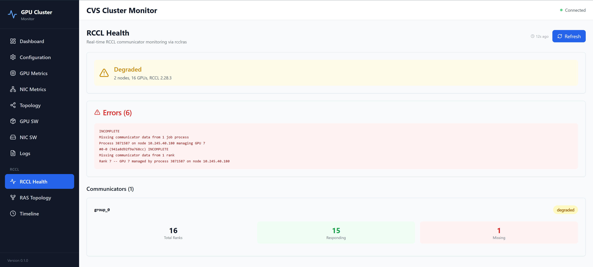
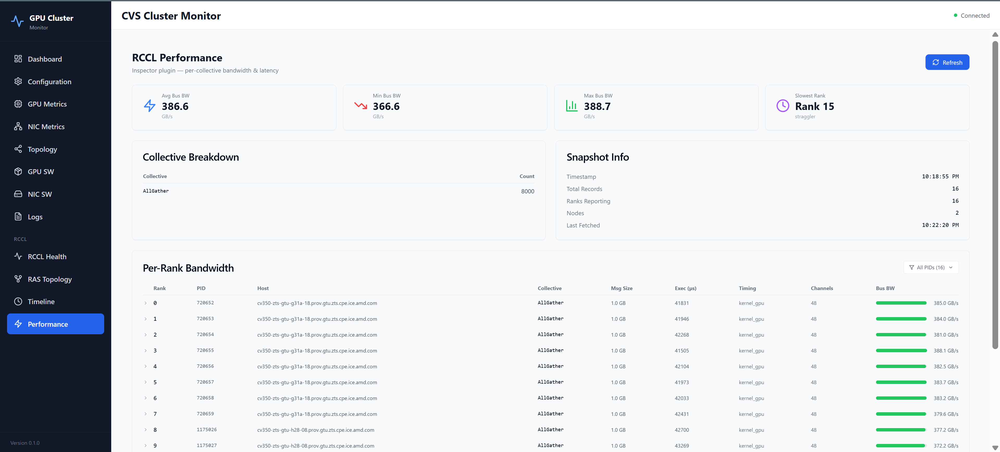
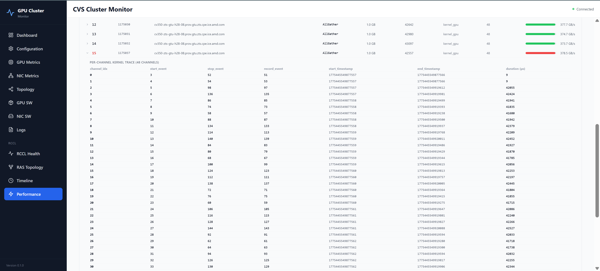

# CVS Cluster-Mon: RCCL Monitoring Extension

> **Date:** 2026-05-26  
> **Branch:** `users/nileshnegi/add-rcclras-inspector-support`  
> **Status:** rcclras health monitoring tested on Ruby MI350 cluster (1-node, 2-node)  
> **Status:** RCCL Inspector performance monitoring tested on CV350 MI350 cluster  
> **Status:** JSON RAS path (v2.28.7+ nodes), per-node capability map, version skew detection implemented and unit-tested

---

## Problem Statement

Large-scale distributed training and inference jobs using RCCL often suffer from opaque failure modes: hangs from communicator deadlocks, silent performance degradation from degraded network links, segfaults from GPU memory errors, and cascading failures when a single node becomes unresponsive. Today, users have no unified way to observe RCCL's internal state during a live job — they resort to ad-hoc debug log analysis after the fact, losing critical temporal context.

NCCL ships a built-in RAS (Reliability, Availability, Serviceability) subsystem that exposes communicator health, peer mesh connectivity, and lifecycle events through a dedicated TCP service (`ncclras`). RCCL inherits this subsystem as `rcclras`, but no tooling exists to leverage it for continuous monitoring, correlation with system-level metrics (GPU health, RDMA errors, kernel logs), or integration with application-level signals (training step progression, loss curves).

A second observability gap exists on the performance side. Even when a job is healthy — all ranks alive, no dead peers — it may still run slower than expected due to a single straggler rank bottlenecking the collective. NCCL ships a profiler plugin interface and a reference implementation called the Inspector plugin that records per-collective bandwidth and latency to disk as JSONL files. RCCL v2.28.3 ships the Inspector plugin as well. However, no tooling exists to continuously read these files, surface the per-rank bandwidth breakdown, and correlate it with health events from rcclras — users must manually inspect raw log files after the fact.

---

## What does this "CVS RCCL Monitoring Extension" do?

CVS `cluster-mon` can now monitor live RCCL jobs in real time across two complementary channels:

**Health monitoring via `rcclras`:** Connects directly to the `rcclras` TCP service embedded in every RCCL process. When a rank dies, hangs, or loses connectivity, the dashboard reflects it within one poll cycle — no log parsing, no application-level timeout required.

**Performance monitoring via the `RCCL Inspector plugin`:** Reads JSONL files produced by the RCCL Inspector profiler plugin to surface per-collective bus bandwidth, algorithm bandwidth, and latency — broken down by rank. Identifies stragglers (the slowest rank relative to peers) automatically.

These two channels are complementary, not competing:

| Capability | rcclras | Inspector |
|---|---|---|
| Rank alive / dead / missing | Yes | No |
| Dead peer detection | Yes | No |
| Per-collective bus bandwidth (GB/s) | No | Yes |
| Per-collective latency (µs) | No | Yes |
| Straggler rank identification | No | Yes |
| Message size per collective | No | Yes |

Based on a cursory search, this is the only open-source tool that uses the RAS interface for RCCL/NCCL monitoring. Industry practice relies on post-mortem log analysis and training-side watchdog timeouts. Neither gives users visibility into communicator state while the job is still running.

---

## Background: What is `rcclras`

`rcclras` is a TCP server embedded in every RCCL process (port 28028, IPv6 loopback only). It exposes the internal communicator state machine via a line-oriented ASCII protocol. The client sends a handshake, sets a collective timeout, then requests a VERBOSE STATUS dump. The server streams the response in two bursts: the header and job summary arrive immediately, then the server blocks until all ranks check in before sending the communicator table.

`rcclras` is not reachable directly from the CVS backend — it binds only to the loopback interface on each compute node. Access goes through an SSH port-forward tunnel.

---

## Background: What is the `RCCL Inspector Plugin`

The Inspector plugin ships with RCCL v2.28.3 and hooks into RCCL's profiler interface to record timing data for every completed collective operation.

**Activation** is entirely via environment variables — no changes to the training script or RCCL source are required:

```bash
NCCL_PROFILER_PLUGIN=inspector
NCCL_INSPECTOR_ENABLE=1
NCCL_INSPECTOR_DUMP_THREAD_INTERVAL_MICROSECONDS=1000000   # 1 s recommended
NCCL_INSPECTOR_DUMP_DIR=/path/to/shared/inspector-logs
```

**Output format:** one JSONL file per process, one JSON record per dump interval per communicator. Each record contains rank identity, collective type, message size, execution time, algorithm bandwidth, and bus bandwidth. The Inspector writes only the most recently completed collective per interval — it is a sampling model, not a complete event log.

**GPU clock note:** AMD GPU hardware timer runs at 100 MHz (10 ns per tick). The Inspector must convert ticks to µs as `ticks / 100`. An incorrect divisor of 1000 (treating ticks as nanoseconds) produces bandwidth figures 10× too large — this was one of the bugs fixed in the companion RCCL branch (see below).

**Graceful degradation:** Any Inspector init failure is caught by RCCL internally and the job continues without profiling.

#### Inspector plugin bugs fixed (branch `users/nileshnegi/rccl/inspector-fixes`)

Five bugs in the RCCL v2.28.3 Inspector plugin prevented it from producing valid output. All five were diagnosed and fixed:

| # | Symptom | Root Cause |
|---|---|---|
| 1 | Log files always empty | Channel count uninitialized at allocation; dump condition was never satisfiable |
| 2 | RCCL teardown hang | Proxy thread polled GPU counters indefinitely for channels never dispatched to GPU |
| 3 | Zero bandwidth / garbage exec time | Timing loop iterated over uninitialized channels due to same bad channel count |
| 4 | GPU bandwidth 10× too large | AMD GPU timer runs at 100 MHz, not 1 GHz; wrong divisor used for tick-to-µs conversion |
| 5 | Channels under-counted in dump | Dump fired on the first batch of channels before all had completed, freeing data prematurely |

---

## Behaviour by RCCL Version

CVS handles clusters running RCCL v2.28.3 and v2.28.7+ simultaneously, with no configuration changes required.

### RCCL v2.28.3 — text output

rcclras v2.28.3 speaks a plain-text protocol. CVS parses the text output to extract:

- Job summary (node count, process count, GPU count, RCCL version, HIP/driver versions)
- Communicator health: total ranks, responding ranks, missing ranks, error lines
- Dead peer list (IP:port of unreachable peers)

**What operators see:** rank present/missing counts per communicator group, dead peers, and the raw rcclras error section when ranks are lost.

**Limitations at this version:**
- Only the communicator group that rank 0 belongs to is visible; jobs with multiple independent communicator groups will show only one.
- No per-peer mesh connectivity data (RAS Topology page shows a compatibility notice).
- Rank health is binary (present or missing) — there is no per-rank status detail.

### RCCL v2.28.7+ — JSON output

rcclras v2.28.7 introduced a structured JSON output mode (`SET FORMAT json`). CVS probes each node at startup and after capability expiry to determine which output mode it supports. Nodes that accept JSON are queried with JSON; nodes that do not fall back to text. Mixed clusters — some nodes on v2.28.3, some on v2.28.7+ — are handled within the same poll cycle without any operator intervention.

**Additional data available with JSON output:**
- Per-rank status flags: initialization state, abort flag, async errors, collnet errors
- Exact PIDs for every active rank, used to scope Inspector log collection to the current job
- HIP runtime and AMD GPU driver versions as decoded human-readable strings, with a mismatch flag when the two differ (indicating a partial driver upgrade)

**Version skew detection:** CVS tracks the RCCL version each node reports. If nodes in the same cluster are running different versions simultaneously — common during rolling upgrades — a `version_skew` event is emitted and visible on the Timeline page.

### Inspector v5.0

A newer Inspector output format (v5.0) adds a `graphCaptured` field per collective, indicating whether the collective ran inside a CUDA graph capture. CVS detects this field by presence rather than by version number. If a node's Inspector logs contain v5 fields but its rcclras service is still text-only, CVS logs a warning — this is the expected signal of a node mid-upgrade.

---

## Architecture

```
rcclras :28028 (IPv6 loopback, each compute node)
    │
    │  SSH port-forward tunnel
    ▼
RCCLRasClient ──── probe: SET FORMAT json ──► per-node capability record
    │                                              │ (json supported? rccl version?)
    │ VERBOSE STATUS                               │
    ▼                                              ▼
    ├── v2.28.7+ (JSON) ──►  JSON parser      version skew detection
    └── v2.28.3  (text) ──►  text parser           │
                                │                  │
                           RCCLSnapshot  ───────────┴─────────────────────┐
                                │                                         │ active PIDs
                ┌───────────────┼───────────────────┐                     ▼
                ▼               ▼                   ▼          InspectorCollector
          Redis Streams    app_state            /ws/rccl        (SSH or NFS)
         (event history) latest snapshot       WebSocket               │
                │                                             InspectorParser (v4/v5)
          REST API ──► Frontend (4 pages)                              │
                                                              InspectorSnapshot
                                                                       │
                                                       ┌───────────────┤
                                                       ▼               ▼
                                                 Redis Streams   /api/rccl/
                                              (perf history)     performance
```

**Collector cadence:** 30-second poll interval for rcclras; 10-second poll interval for Inspector. The rcclras collector tries each healthy node in turn until it finds one with an active listener on port 28028. One successful response per cycle is sufficient — all ranks within a job report to the same rcclras instance.

**State machine:** The collector tracks job state across polls.

```
NO_JOB ──► HEALTHY ──► DEGRADED ──► NO_JOB
              │                         ▲
              └──────── NO_JOB ─────────┘
              │
         UNREACHABLE
              │
           ERROR
```

Every state transition emits a typed event (`job_start`, `job_end`, `job_degraded`, `job_recovered`, `node_unreachable`, etc.) stored in the event stream and visible on the Timeline page.

---

## Components

### Health monitoring (rcclras)

**RCCLRasClient** — async TCP client that speaks the rcclras wire protocol over an SSH port-forward tunnel. Negotiates protocol version with the server and uses only commands the server supports, so older rcclras instances are never sent unknown commands.

**Per-node capability tracking** — each node carries a lightweight record of what its rcclras service supports (text or JSON output, detected RCCL version). Records are refreshed periodically. This drives the JSON/text routing decision and feeds version skew detection.

**RCCLCollector** — polls on a 30-second cycle, tries each healthy node, routes the response to the correct parser, updates the state machine, and emits typed events on every state transition. Handles startup bootstrap (no spurious events on backend restart) and timeout recovery.

**RCCLJsonParser / RCCLTextParser** — parse rcclras output into a common snapshot model. The JSON parser extracts per-rank status flags; the text parser extracts rank counts and error lines. Both detect and surface the RCCL version string reported by the server.

**RCCLDataStore** — dual-mode storage: Redis Streams when Redis is available (1 000 snapshots, 10 000 events, persistent across restarts), in-memory ring buffer otherwise. The fallback activates automatically with no configuration change.

### Performance monitoring (Inspector)

**InspectorCollector** — polls on a 10-second cycle. Two collection modes: file mode reads Inspector log files directly from a locally-mounted NFS path (zero SSH overhead); SSH mode tails log files on each compute node remotely. When the rcclras snapshot is available, only log files belonging to active job PIDs are read — stale files from previous runs are skipped automatically.

**InspectorParser** — parses Inspector JSONL output. Handles both v4.0 (RCCL v2.28.3) and v5.0 (adds `graphCaptured` field) format versions. Computes avg/min/max bus bandwidth and identifies the straggler rank. Deduplicates to the latest record per rank before storing, keeping the frontend table bounded regardless of how long the job has been running.

### Frontend Pages

**RCCL Health** — job state banner (Healthy / Degraded / Unreachable / No Job), staleness indicator, rcclras error section, and a communicator card per group showing total/responding/missing rank counts.

**RAS Topology** — peer mesh visualization. Disabled for rcclras v2.28.3 nodes; shows a compatibility notice until per-peer connectivity data is available from the server.

**Timeline** — chronological event log with type filter and time-range selector. Shows state transitions, version skew events, and PyTorch training step/loss markers.

**RCCL Performance** — avg/min/max bus bandwidth summary, collective breakdown table (call count per collective type), per-rank bandwidth table with proportional bar chart. The slowest rank (straggler) is highlighted. Expandable rows show per-channel kernel timing when the Inspector verbose mode is enabled.

---

## REST API

| Endpoint | Description |
|----------|-------------|
| `GET /api/rccl/status` | Latest snapshot: state, job summary, communicators, errors. Includes human-readable HIP/driver version strings and driver/runtime mismatch flag |
| `GET /api/rccl/communicators` | Communicator list from latest snapshot |
| `GET /api/rccl/communicators/{hash}` | Single communicator detail |
| `GET /api/rccl/events?since=&until=&type=` | Time-filtered event log |
| `POST /api/rccl/markers` | PyTorch training step/loss callback |
| `GET /api/rccl/performance` | Latest Inspector snapshot: avg/min/max busBw, straggler rank, per-rank table, collective breakdown |
| `GET /api/rccl/performance/history?count=N` | Up to N recent Inspector snapshots for time-series charting (max 500) |
| `WebSocket /ws/rccl` | Real-time snapshot push on every collector cycle |

---

## RCCL Health — Live Screenshots

### Healthy State
All 16 ranks across 2 nodes responding. `group_0` communicator: 16/16 responding, 0 missing.


### Degraded State
One rank dropped mid-job. rcclras identifies the exact rank (Rank 7), GPU (GPU 7), PID (3871587), and node (10.245.40.180) in its Errors section. The communicator card reflects 15/16 responding, 1 missing.



---

## RCCL Performance — Live Screenshots

### Performance Overview
RCCL Performance Summary (min/max/avg bus_bandwidth, straggler rank(s), and collective breakdown)



### Channel Breakdown
When run with `NCCL_INSPECTOR_DUMP_VERBOSE=1`, the RCCL Inspector plugin records channel count and GPU timing events per channel.



---

## Known Limitations

### rcclras v2.28.3 nodes

- Only the communicator group that rank 0 belongs to is visible per poll cycle.
- No per-peer mesh connectivity data; RAS Topology page shows a compatibility notice.
- Rank health is binary (present or missing); per-rank abort/error state requires v2.28.7+.

### rcclras v2.28.7+ nodes

- Per-connection latency data (`RAS_COLL_CONNS`) is compiled out in the current RCCL upstream branch and is not available.
- Per-rank status flags (abort state, error codes) are collected and in the API response but not yet rendered in the frontend communicator cards.

### Inspector

- Activation requires job-side configuration. CVS reads the output files; it cannot enable the plugin retroactively.
- The Inspector writes only the latest collective per communicator per dump interval — it is a sampling rate, not a capture window. Collectives completing between dump wakeups are not recorded.
- Inspector v5 fields (`graphCaptured`) are detected by field presence. The exact RCCL version that introduced v5 has not been confirmed from the upstream diff.

### General

- Without Redis, events are held in an in-memory buffer (500 events) that does not survive backend restarts. Redis is not required for the core health dashboard.

---

## Future Work

| Phase | Scope |
|-------|-------|
| **2** | ✅ **Delivered** — JSON RAS output (rcclras v2.28.7+): JSON parser, per-node capability map, version skew detection, Inspector v5 field awareness |
| **3** | Persistent `MONITOR` mode (rcclras v2.29.2) for push-based event streaming (eliminates polling)<br>Per-rank structured error parsing surfaced in the frontend |
| **4** | `/api/rccl/preflight` for Slurm prolog health gate<br>Slurm job ID correlation<br>Grafana dashboard templates<br>Snapshot replay for post-mortem analysis |
| **Inspector** | Bandwidth time-series charts on the Performance page (history endpoint already exists)<br>Per-communicator breakdown when multiple communicators are active<br>Alert threshold when straggler busBw falls >50% below the mean |
