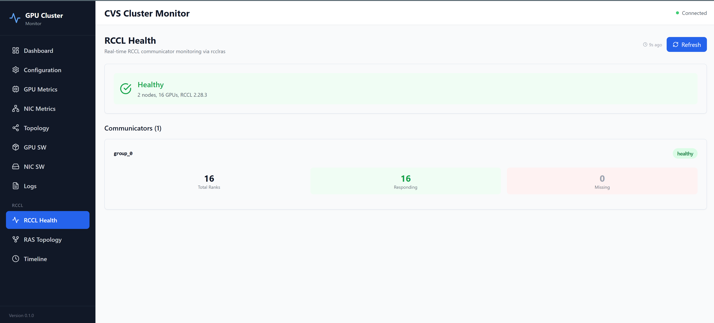

# CVS Cluster-Mon: RCCL Monitoring Extension

> **Date:** 2026-04-05  
> **Branch:** `users/nileshnegi/add-rcclras-inspector-support`  
> **Status:** rcclras health monitoring tested on Ruby MI350 cluster (1-node, 2-node)  
> **Status:** RCCL Inspector performance monitoring tested on CV350 MI350 cluster

---

## Problem Statement

Large-scale distributed training and inference jobs using RCCL often suffer from opaque failure modes: hangs from communicator deadlocks, silent performance degradation from degraded network links, segfaults from GPU memory errors, and cascading failures when a single node becomes unresponsive. Today, users have no unified way to observe RCCL's internal state during a live job — they resort to ad-hoc NCCL_DEBUG log analysis after the fact, losing critical temporal context.

NCCL ships a built-in RAS (Reliability, Availability, Serviceability) subsystem that exposes communicator health, peer mesh connectivity, and lifecycle events through a dedicated TCP service (`ncclras`). RCCL inherits this subsystem as `rcclras`, but no tooling exists to leverage it for continuous monitoring, correlation with system-level metrics (GPU health, RDMA errors, kernel logs), or integration with application-level signals (training step progression, loss curves).

A second observability gap exists on the performance side. Even when a job is healthy — all ranks alive, no dead peers — it may still run slower than expected due to a single straggler rank bottlenecking the collective. NCCL ships a profiler plugin interface (`nccl_profiler.h`) and a reference implementation called the Inspector plugin (`ext-profiler/inspector/`) that records per-collective bandwidth and latency to disk as JSONL files. RCCL v2.28.3 ships the Inspector plugin as well. However, no tooling exists to continuously read these files, surface the per-rank bandwidth breakdown, and correlate it with health events from rcclras — users must manually inspect raw log files after the fact.

---

## What does this "CVS RCCL Monitoring Extension" do?

CVS `cluster-mon` can now monitor live RCCL jobs in real time across two complementary channels:

**Health monitoring via `rcclras`:** Connects directly to the `rcclras` TCP service embedded in every RCCL process. When a rank dies, hangs, or loses connectivity, the dashboard reflects it within one poll cycle — no log parsing, no application-level timeout required.

**Performance monitoring via the `RCCL Inspector plugin`:** Reads JSONL files produced by the RCCL Inspector profiler plugin (`ext-profiler/inspector/`) to surface per-collective bus bandwidth, algorithm bandwidth, and latency — broken down by rank. Identifies stragglers (the slowest rank relative to peers) automatically.

These two channels are complementary, not competing:

| Capability | rcclras | Inspector |
|---|---|---|
| Rank alive / dead / missing | Yes | No |
| Dead peer detection | Yes | No |
| Per-collective bus bandwidth (GB/s) | No | Yes |
| Per-collective latency (µs) | No | Yes |
| Straggler rank identification | No | Yes |
| Message size per collective | No | Yes |

Based on a cursory search, this is the only open-source tool that uses the RAS interface for RCCL/NCCL monitoring. Industry practice relies on post-mortem log analysis and training-side watchdog timeouts. Neither gives users visibility into communicator state while the job is still running.

---

## Background: What is `rcclras`

`rcclras` is a TCP server embedded in every RCCL process (port 28028, IPv6 loopback `[::1]` only). It exposes the internal communicator state machine via a line-oriented ASCII protocol:

```
CLIENT PROTOCOL 2          →  handshake
SERVER PROTOCOL 2          ←
TIMEOUT 30                 →  set collective timeout
OK                         ←
VERBOSE STATUS             →  request full dump
<multi-line text dump>     ←  streams header, then waits for all ranks to
<EOF>                          check in before sending communicator table
```

The server streams the response in two bursts. It sends the header and job summary immediately, then blocks until all ranks report before appending the communicator table. The client must read until EOF to get the full response.

`rcclras` is not reachable directly from the CVS backend — it binds only to the IPv6 loopback interface on each compute node. Access goes through an SSH port-forward tunnel.

---

## Background: What is the `RCCL Inspector Plugin`

The Inspector plugin is a profiler plugin shipped with RCCL v2.28.3 at `ext-profiler/inspector/`. It hooks into RCCL's profiler interface (`nccl_profiler.h`, `ncclProfiler_v5`) and records timing data for every completed collective operation.

**Activation** is entirely via environment variables — no changes to the training script or RCCL source are required:

```bash
NCCL_PROFILER_PLUGIN=/path/to/librccl-profiler-inspector.so
(or) 
NCCL_PROFILER_PLUGIN=inspector
LD_LIBRARY_PATH=/path/to/dir/containing/librccl-profiler-inspector.so:$LD_LIBRARY_PATH

NCCL_INSPECTOR_ENABLE=1
NCCL_INSPECTOR_DUMP_THREAD_INTERVAL_MICROSECONDS=1000000   # 1 s recommended
NCCL_INSPECTOR_DUMP_DIR=/path/to/shared/inspector-logs
```

**Output format:** one JSONL file per process, named `<hostname>-pid<PID>.log`. Each line is one JSON object representing the most recently completed collective for a communicator during a dump interval ("latest snapshot" model — not a complete event log):

```json
{
  "header":   { "id": "0x7f8c496ae9f661", "rank": 0, "n_ranks": 16, "nnodes": 2 },
  "metadata": { "inspector_output_format_version": "v4.0", "dump_timestamp_us": 1711800000000000,
                "hostname": "gpu-node-01", "pid": 12345 },
  "coll_perf": {
    "coll": "AllReduce", "coll_sn": 4217, "coll_msg_size_bytes": 2097152,
    "coll_exec_time_us": 412, "coll_timing_source": "kernel_gpu",
    "coll_algobw_gbs": 193.6, "coll_busbw_gbs": 387.2
  }
}
```

**Bandwidth formulas** (verified against NCCL-tests documentation):

| Collective | algBw | busBw factor |
|---|---|---|
| AllReduce | `msgBytes / execTime` | `2*(n-1)/n` |
| AllGather, ReduceScatter | `msgBytes*nranks / execTime` | `(n-1)/n` |
| Reduce, Broadcast, Send, Recv | `msgBytes / execTime` | 1 |

**Timing source hierarchy:** GPU clock (`kernel_gpu`) > CPU kernel timing (`kernel_cpu`) > CPU collective timing (`collective_cpu`).

**GPU clock units:** AMD `wall_clock64()` / HIP `clock64()` runs at **100 MHz (10 ns per tick)**, not 1 GHz. The Inspector converts ticks to µs as `ticks / 100`. Using `/ 1000` (treating ticks as nanoseconds) would produce exec times 10× too small and bandwidth 10× too large.

**Graceful degradation:** RCCL's `src/plugin/profiler.cc` catches any Inspector init failure and continues without profiling — the job always proceeds regardless of Inspector state.

---

## Architecture

```
rcclras :28028 (IPv6 loopback, each compute node)
    │
    │  SSH port-forward tunnel  (Pssh / JumpHostPssh)
    ▼
RCCLRasClient  ──  VERBOSE STATUS  ──►  RCCLTextParser
                                              │
                                         RCCLSnapshot  ──────────────────────────────┐
                                              │                                      │ active PIDs
                          ┌───────────────────┼───────────────────┐                  ▼
                          ▼                   ▼                   ▼        InspectorCollector
                    Redis Streams       app_state             /ws/rccl     (SSH exec_async)
                   (ring buffer)   latest_rccl_snapshot      WebSocket           │
                          │                                                  InspectorParser
                    REST API ──► Frontend (4 pages)                               │
                                                                          InspectorSnapshot
                                                                                   │
                                                               ┌───────────────────┤
                                                               ▼                   ▼
                                                         Redis Streams       /api/rccl/
                                                      rccl:inspector:*       performance
```

**Collector cadence:** 30-second poll interval for rcclras; 10-second poll interval for Inspector. The rcclras collector tries each healthy node in turn until it finds one with an active listener on port 28028. One successful response per cycle is sufficient — all ranks within a job report to the same rcclras instance.

**State machine:** The collector tracks job state across polls.

```
NO_JOB ──► HEALTHY ──► DEGRADED ──► NO_JOB
              │                         ▲
              └──────── NO_JOB ─────────┘
              │
         UNREACHABLE
              │
           ERROR
```

Every state transition emits a typed event (`job_start`, `job_end`, `job_degraded`, `job_recovered`, `node_unreachable`, etc.) stored in the event stream and visible on the Timeline page.

---

## Components

### RCCLRasClient
Async TCP client for the rcclras wire protocol. Takes a pre-connected `asyncio.StreamReader/Writer` from the SSH port-forward context manager. Handles the handshake, timeout setting, and VERBOSE STATUS dump. Reads until EOF in a loop — a single `read(n)` returns only the first burst and misses the communicator table.

Includes protocol version guards for `SET FORMAT json` (protocol v3, rcclras v2.28.9) and `MONITOR` mode (protocol v4, rcclras v2.29.2) — these are not yet enabled but the client won't send unknown commands to older servers.

### RCCLTextParser
Regex parser for the rcclras v2.28.3 VERBOSE STATUS text format. Built and tested against real output captured from a live MI300X cluster. Extracts:

- **Job summary** — node count, process count, GPU count, RCCL version, HIP/driver versions
- **Communicator table** — group number, comm count, rank counts, status, error column
- **Dead peers** — IP:port of unreachable peers
- **Errors section** — raw error lines reported by rcclras

The parser determines job state from the parsed data: `NO_JOB` if no valid output, `DEGRADED` if any communicator has missing ranks, dead peers, or errors, `HEALTHY` otherwise.

### RCCLCollector
`BaseCollector` subclass running on a 30-second cycle. Key behaviours:

- **Leader selection:** tries all healthy nodes (from `node_health_status`) in order until one has an active rcclras listener on port 28028.
- **Bootstrap:** on first poll after startup, seeds `job_state` from the last stored snapshot to avoid emitting a spurious `job_start` event on backend restart.
- **State transfer on config reload:** when configuration is reloaded and the collector is restarted, the previous `job_state` is copied to the new instance — same reason.
- **Timeout handling:** if the outer `asyncio.wait_for` fires, `on_collect_timeout()` updates the state machine to UNREACHABLE so the next cycle doesn't start from a stale state.

### InspectorCollector

`BaseCollector` subclass polling on a 10-second cycle (`critical = False` — Inspector failure never affects the overall cluster health status). Two collection modes:

**File mode** (`mode: file`): reads `*.log` files directly from a locally-mounted NFS path. Zero SSH overhead. Requires the Inspector `dump_dir` to be visible from the CVS backend host.

**SSH mode** (`mode: ssh`): runs `tail -n <max_records>` on each compute node via `exec_async`. Used when NFS is not available. When the rcclras snapshot is present, only log files matching active PIDs are read — stale files from previous runs in the same `dump_dir` are ignored automatically. Falls back to reading all `*-pid*.log` files when no snapshot is available (e.g., before rcclras has connected).

The Inspector plugin names log files using the result of `gethostname()`, which is typically the FQDN (e.g., `cv350-zts-gtu-g31a-18.prov.gtu.zts.cpe.ice.amd.com-pid3404720.log`). The glob pattern uses `*-pid*.log` to avoid short-hostname vs. FQDN mismatches.

### InspectorParser

JSONL parser for the RCCL Inspector v4.0 output format. Reads the tail of each log file (bounded by `max_records_per_file`, default 500) and parses each line independently — malformed lines are skipped silently at DEBUG level. Produces `InspectorCollPerf` records.

`aggregate_snapshot()` computes bandwidth statistics (avg/min/max busBw, straggler rank) from the full tail window, then deduplicates the `records` field to the **latest entry per (rank, comm_hash)** by `sequence_num` before storing. This keeps the WebSocket payload and frontend table bounded to one row per rank regardless of tail window size.

#### Bugs fixed in Inspector v2.28.3 (branch `users/nileshnegi/rccl/inspector-fixes`)

Five bugs in the Inspector plugin prevented it from producing valid output on RCCL v2.28.3. All five were diagnosed and fixed:

| # | Bug | Root Cause | Fix |
|---|---|---|---|
| 1 | **Log files always empty** (`inspector_plugin.cc`) | `ncclTaskColl::nChannels` is uninitialized at allocation (`ncclMemoryPoolAlloc` does not zero memory). Garbage value (224) made the dump condition `nKernelChCompleted == nChannels` unsatisfiable — no collective ever completed. | Add `collStopFired` flag to `inspectorCollInfo`. Trigger dump when `collStopFired && nKernelChCompleted == nKernelChStarted == nChannels`. Initialize `nChannels = 0` at allocation in `enqueue.cc` so `scheduleCollTasksToPlan` overwrites it with the correct value before the profiler reads it. |
| 2 | **Teardown hang** (`src/transport/profiler.cc`) | `profilerProxyProgress` polled GPU counters indefinitely during teardown for channels that were never dispatched to GPU. The proxy thread never marked those channels done, blocking RCCL teardown. | Detect teardown (`proxyState->progressState.stop`) and drain: skip Start+Stop for channels whose GPU start counter was never written; skip Stop for channels whose GPU stop counter was never written. |
| 3 | **Zero bandwidth / garbage exec time** (`inspector.cc`) | `calculateMaxKernelExecTimeUsecs` iterated `for (i = 0; i < nChannels; i++)` using the same garbage `nChannels = 224`. Channels 57–223 had uninitialized `tsStartUsec` / `tsCompletedUsec` (random memory values), producing a spuriously large max exec time. | Normalize `collInfo->nChannels = collInfo->nKernelChStarted` and `collEvtTrk.nChannels = nKernelChStarted` before calling `inspectorUpdateCollPerf`, so the timing loop and JSON dump loop iterate only over channels that actually fired. |
| 4 | **GPU bandwidth 10× too large** (`inspector.cc`) | `calculateKernelGpuExecTimeUsecs` computed `execTimeNanosecs / 1000` treating AMD `wall_clock64()` ticks as 1 GHz nanoseconds. AMD GPU hardware timer runs at **100 MHz (10 ns/tick)**, so the correct divisor is 100, not 1000. | Change `execTimeNanosecs / 1000` to `ticks / 100`. Verified: reported busBw (387–388 GB/s) matches rccl-tests output (386 GB/s) within noise. |
| 5 | **Channels under-counted in dump** (`inspector_plugin.cc` + `enqueue.cc`) | The dump fired when `nKernelChCompleted == nKernelChStarted`, but some channels' GPU start counters are written to host memory slightly later than others. The dump fired on the first batch (e.g. 43 of 48), freeing `collInfo`. Remaining channels found a freed (zeroed) `parentObj` and became no-ops. | Fix 1's `enqueue.cc` change restores the correct `nChannels = 48` so the dump condition correctly waits for all channels. `collStopFired` ensures the dump never fires before CollStop is recorded. |

#### Remaining known bugs (not fixed — low impact for CVS use)

| Bug | Impact |
|---|---|
| ReduceScatter `trafficSize` may be inflated by `nranks` | busBw for ReduceScatter may be wrong; verify on cluster before alerting |
| Unsigned underflow in collective CPU fallback: no guard on `tsCompletedUsec < tsStartUsec` | Very unlikely (requires clock going backwards); produces garbage large value if it occurs |

### RCCLDataStore
Dual-mode storage backend:

| Mode | When | Storage | Capacity |
|------|------|---------|----------|
| **Redis Streams** | Redis available | `rccl:snapshots`, `rccl:events`, `rccl:inspector:snapshots` | 1 000 snapshots, 10 000 events each |
| **In-memory deque** | No Redis / Redis error | `collections.deque` | 500 events, 100 snapshots, 100 Inspector snapshots |

Redis mode uses `XADD ... MAXLEN` — atomic append and cap in a single command. Time-range event queries use Redis Stream entry IDs (millisecond timestamps embedded). The in-memory fallback activates automatically if Redis is unavailable or throws an exception mid-operation.

### REST API

| Endpoint | Description |
|----------|-------------|
| `GET /api/rccl/status` | Latest snapshot: state, job summary, communicators, errors |
| `GET /api/rccl/communicators` | Communicator list from latest snapshot |
| `GET /api/rccl/communicators/{hash}` | Single communicator detail |
| `GET /api/rccl/events?since=&until=&type=` | Time-filtered event log. Returns `{events, truncated}` — `truncated: true` when the in-memory buffer is at capacity and older events may be missing |
| `POST /api/rccl/markers` | PyTorch training step/loss callback. Stores as `training_marker` event |
| `GET /api/rccl/performance` | Latest Inspector snapshot: avg/min/max busBw, straggler rank, per-rank table, collective breakdown. Returns 503 when Inspector is disabled or no data yet |
| `GET /api/rccl/performance/history?count=N` | Up to N recent Inspector snapshots for time-series charting (max 500) |
| `WebSocket /ws/rccl` | Real-time snapshot push on every collector cycle |

### Frontend Pages

**RCCL Health** — primary view. Shows job state banner (Healthy / Degraded / Unreachable / No Job), a staleness indicator when the snapshot is more than 75 seconds old (2.5× the poll interval), the raw rcclras Errors section when present, and a communicator card per group showing total/responding/missing rank counts.

**RAS Topology** — peer mesh visualization. Disabled for rcclras v2.28.3, which does not include per-peer connectivity in its text output. A compatibility note is shown; peer data is expected in a future rcclras version.

**Timeline** — chronological event log with type filter (job_start, job_end, degraded, recovered, etc.) and time-range selector. Shows `from_state → to_state` for state-change events and step/loss for training markers.

**RCCL Performance** — Inspector data view. Shows avg/min/max bus bandwidth summary cards, collective breakdown table (call count per collective type), and a per-rank bandwidth table with a proportional bar chart. The slowest rank (straggler) is highlighted in red. Polls `/api/rccl/performance` every 15 seconds. Shows a descriptive 503 message when Inspector is not active.

Each rank row is expandable to show the **per-channel kernel trace** (requires `NCCL_INSPECTOR_DUMP_VERBOSE=1`). Columns: `channel_idx`, `start_event` / `stop_event` / `record_event` (monotonic sequence numbers across all profiler events for the collective, showing relative ordering), `start_timestamp` / `end_timestamp` (CPU epoch µs from `gettimeofday`, recorded when the proxy thread observed the GPU counter), and `duration (µs)` (end − start, already in µs — no clock-tick conversion applied).

Note on min busBw: the summary card min and slowest-rank are computed over **all records in the tail window**, not just the latest per rank. Warmup collectives (cold GPU on first iteration) typically appear in the tail and produce a low min — this is expected and does not indicate a genuine straggler.

---

## RCCL Health — Live Screenshots

### Healthy State
All 16 ranks across 2 nodes responding. `group_0` communicator: 16/16 responding, 0 missing.



### Degraded State
One rank dropped mid-job. rcclras identifies the exact rank (Rank 7), GPU (GPU 7), PID (3871587), and node (10.245.40.180) in its Errors section. The communicator card reflects 15/16 responding, 1 missing.


---

## RCCL Performance — Live Screenshots

### Performance Overiew
RCCL Performance Summary (min/max/avg bus_bandwidth, straggler rank(s), and collective breakdown) 


### Channel Breakdown
When run with `NCCL_INSPECTOR_DUMP_VERBOSE=1`, RCCL Inspector plugin can record channel count and GPU timing events per channel.


---

## Known Limitations — rcclras v2.28.3

**Single communicator group visible.** rcclras v2.28.3 exposes only the communicator group that rank 0 belongs to. A job using 8 independent communicator groups across 16 GPUs will show only one group. Full multi-group visibility is expected in a later rcclras version.

**No per-peer connectivity data.** The v2.28.3 text format does not include peer-level mesh data. The RAS Topology page is present but shows a compatibility notice until the data is available.

**In-memory events do not survive restarts.** Without Redis, events are held in a bounded in-memory buffer (500 events). Restarting the backend clears this history. Redis is not required for the core health dashboard — only for event history retention across restarts.

---

## Known Limitations — RCCL Inspector v2.28.3

**Activation requires job-side configuration.** The Inspector plugin must be built from RCCL source (`make` in `ext-profiler/inspector/`) and enabled via env vars in the job submission script (`NCCL_PROFILER_PLUGIN=inspector`, `NCCL_INSPECTOR_ENABLE=1`, `NCCL_INSPECTOR_DUMP_DIR=<path>`). CVS reads the output files; it cannot enable the plugin retroactively.

**Latest-snapshot sampling model.** The Inspector writes only the most recently completed collective per communicator per dump interval — not a complete event log. Collectives that finish between two dump wakeups are overwritten and lost. The dump interval is a sampling rate, not a capture window. A 1 s interval (1 000 000 µs) gives one fresh record per second per rank, which is sufficient for bandwidth trending in a 30 s CVS poll cycle.

**dump_dir accumulates stale files.** Files from previous runs persist in the same `dump_dir` until manually cleaned. CVS mitigates this by filtering to PIDs known from the current rcclras snapshot; when rcclras is unavailable, all files are read and deduplicated by `sequence_num`.

---

## Testing

Tested cluster-mon with long-running RCCL-Tests on 1-node and 2-nodes of Ruby MI350 cluster and introducing artificial chaos (e.g. killing a rccl-tests process). CVS backend/frontend app running on local laptop could directly connect to Ruby cluster compute nodes running RCCL.

Unit-Tests: 103 tests across 10 files. Coverage includes: BaseCollector lifecycle (timeout, crash, ConnectionError, supervisor restart), Pydantic config defaults and environment variable overrides, SSH bridge (bidirectional data, EOF propagation), collectors/status API, RAS protocol client against a mock TCP server, text parser against 4 fixture files (healthy, single-node degraded, 2-node degraded with heterogeneous `7-8` ranks-per-node range, connection reset), RCCL collector state machine (all 20 transitions, bootstrap, no-duplicate-event on unchanged state), WebSocket ConnectionManager, config reload diff detection, and Inspector parser (JSONL parsing, malformed-line skipping, timestamp conversion, tail limiting, `aggregate_snapshot` avg/min/max/straggler/deduplication/collective breakdown).

---

## Future Work

| Phase | Scope |
|-------|-------|
| **2** | Switch rcclras to JSON output (rcclras v2.28.9)<br>Prometheus `/metrics` endpoint<br>InfluxDB long-term storage (structured data pipeline) |
| **3** | Persistent `MONITOR` mode (rcclras v2.29.2) for push-based event streaming (eliminates polling)<br>Per-rank structured error parsing |
| **4** | `/api/rccl/preflight` for Slurm prolog health gate<br>Slurm job ID correlation<br>Grafana dashboard templates<br>Snapshot replay for post-mortem analysis |
| **Inspector** | Bandwidth time-series charts on the Performance page (history endpoint already exists)<br>Per-communicator breakdown when multiple communicators are active<br>Alert threshold when straggler busBw falls >50% below the mean |
