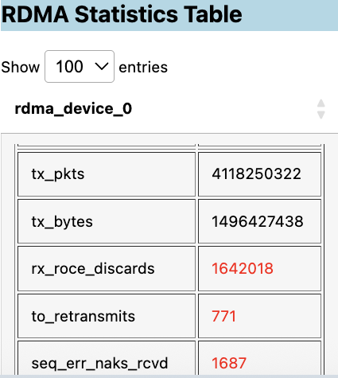
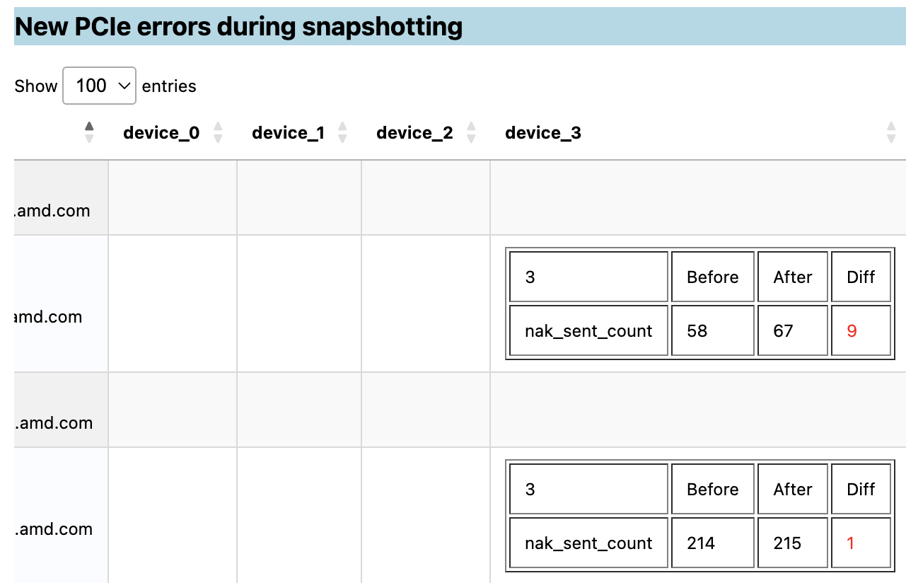
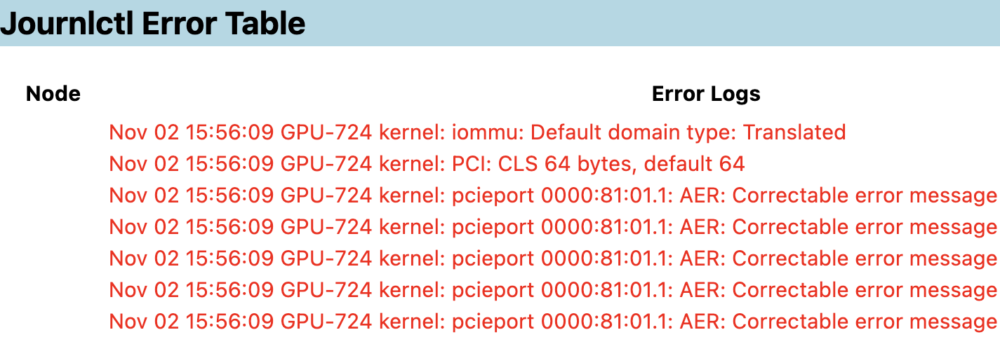

.. meta::
  :description: Generate cluster health reports with CVS
  :keywords: CVS, monitor, check_cluster_health, health report

***************
Health reports
***************

Health reports run ``cvs monitor check_cluster_health`` from the head node. CVS SSHs to each compute node, collects GPU/NIC counters and logs, and writes a self-contained HTML report. No agents or exporters are installed on the cluster.

The monitor identifies hardware degradation (RAS, PCIe/XGMI, RDMA counters via AMD SMI) and software failures (``dmesg`` and ``journalctl`` signatures). Use it before a test campaign, after a change, or to snapshot counters while workloads run and compare deltas across nodes.

Generate a health report
========================

1. Complete :doc:`Install </getting-started/install>` and :doc:`Set up cluster file </how-to/configure/cluster-config>`.
2. List available monitors:

   .. code:: bash

     cvs monitor

3. View help:

   .. code:: bash

     cvs monitor check_cluster_health --help

4. Run the monitor:

   .. list-table::
      :header-rows: 1
      :widths: 28 72

      * - Option
        - Description
      * - ``--cluster_file PATH``
        - Cluster JSON (same file as ``cvs run`` / ``cvs exec``). Takes precedence over ``CLUSTER_FILE``.
      * - ``--iterations N``
        - Number of sampling iterations
      * - ``--time_between_iters SECONDS``
        - Sleep between iterations
      * - ``--report_file PATH``
        - Output HTML path (default: ``cluster_report.html`` in the current directory)

   Example:

   .. code:: bash

     cvs monitor check_cluster_health \
       --cluster_file ~/cvs_workspace/cluster.json \
       --iterations 2

   Or set ``CLUSTER_FILE`` once:

   .. code:: bash

     export CLUSTER_FILE=~/cvs_workspace/cluster.json
     cvs monitor check_cluster_health --iterations 2

   .. note::

     Deprecated flags ``--hosts_file``, ``--username``, ``--key_file``, and ``--password`` still work; prefer ``--cluster_file`` for consistency with other CVS commands.

5. Open ``cluster_report.html`` in a browser.

Review the health report
========================

The report includes GPU and NIC snapshots, historic error logs, and per-iteration deltas for triage. Anomalies are highlighted in tables (PCIe, RDMA, GPU errors, cable issues, kernel logs).

Metrics are collected with AMD SMI, ``ethtool``, and ``rdma`` utilities on each node. See the `AMD SMI CLI reference <https://rocm.docs.amd.com/projects/amdsmi/en/latest/how-to/amdsmi-cli-tool.html#commands>`_ for field definitions.

For live dashboards instead of one-off HTML reports, see :doc:`/how-to/monitor/live-dashboards/index`.
