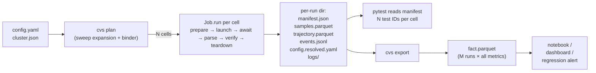
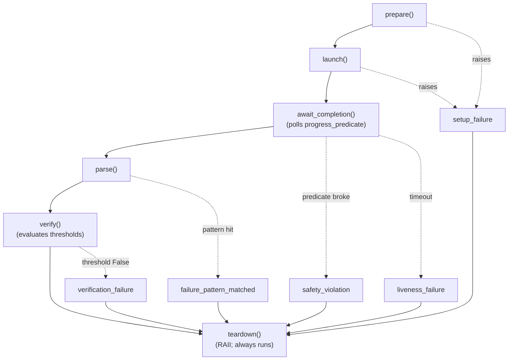
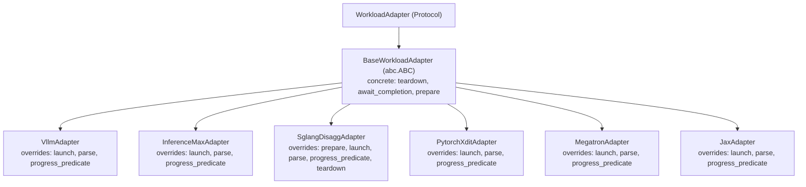
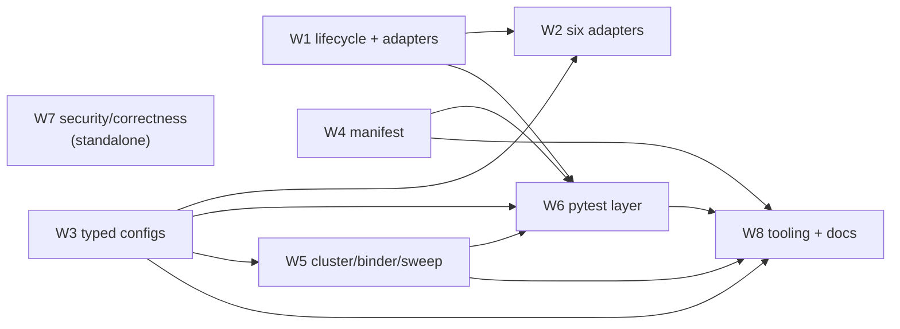

# CVS DTNI v1 — implementation spec (digestible)

**Status:** Draft for team review. Full prose lives in [`cvs-dtni-v1-spec.md`](cvs-dtni-v1-spec.md); this file is the PR body and the entry point.

---

## TLDR

Two of CVS's real sglang test wrappers are **429 lines each**. They differ by **one line** — `'llama-70b'` vs `'deepseek-r1'` on line 297. v1 collapses both into one parametrized test consuming two YAMLs, deletes `cvs/lib/sglang_disagg_lib.py` (1261 LOC), and stops the HF token from being logged in `phdl.exec` debug output on every multi-node run. Net change: ~**−5000 LOC** across `cvs/lib/` and `cvs/tests/`, **+1** lifecycle driver, **+6** adapters, **+6** typed threshold predicates, **+1** content-addressable manifest tree that pandas / DuckDB read directly.

The matrix is the artifact: pick any axis a benchmark engineer cares about — framework, model, knob (`aiter`, `fa`, `fp4`, `mooncake`), threshold, git SHA, cluster — and `pytest -m "..."` slices it on day one.

**Reading order if you only have N minutes:**

- **5 min:** §1 data flow → §2 sglang before/after → §13 W7 security fixes (independently shippable)
- **15 min:** add §3 one config → N pytest IDs → §8 manifest + cross-run query → §11 failure walkthrough
- **Full:** §1–§16 below, with anchors into [`cvs-dtni-v1-spec.md`](cvs-dtni-v1-spec.md) for the long form

---

## §1. End-to-end data flow

One picture covers the whole thing.



The persistent artifacts are everything under the per-run dir. `cvs plan` and pytest invocation are ephemeral. `cvs export` is the data-science seam — flatten N runs into one Parquet fact table; pandas/DuckDB consume it without a service.

Full prose: [W4 in spec](cvs-dtni-v1-spec.md#w4-manifest-sidecars-and-cross-run-export), [W5 in spec](cvs-dtni-v1-spec.md#w5-cluster-pool-deterministic-binder-sweep-expansion).

---

## §2. The sglang before/after

The single most persuasive change in the PR.

**Before** (`cvs/tests/inference/sglang/`):

```text
sglang_llama_70b_distributed.py        429 LOC
sglang_deepseek_r1_671b_distributed.py 429 LOC
                                       ─────────
                                       858 LOC
```

These two files are **byte-identical except for line 297**:

```python
# sglang_llama_70b_distributed.py:297
bp_dict = benchmark_params_dict['llama-70b']

# sglang_deepseek_r1_671b_distributed.py:297
bp_dict = benchmark_params_dict['deepseek-r1']
```

Plus the library they both consume: `cvs/lib/sglang_disagg_lib.py` at **1261 LOC** — a single monolithic class that cannot be partially reused.

**After:**

```text
cvs/tests/inference/test_inference.py                          (one parametrized test)
cvs/input/config_file/inference/sglang/llama_70b_disagg.yaml   (~80 LOC YAML)
cvs/input/config_file/inference/sglang/deepseek_r1_disagg.yaml (~80 LOC YAML)
cvs/lib/adapters/sglang_disagg.py                              (~400 LOC adapter)
```

**Net delta:** −2119 LOC of duplicated Python and monolithic library; +1 reusable adapter; +N typed configs (one per model). The same shape applies to the other 14 wrappers (see §5).

Full prose: [W2 in spec](cvs-dtni-v1-spec.md#w2-six-concrete-adapters).

---

## §3. One config → N pytest IDs

The matrix story, end-to-end.

### 3a. The config

```yaml
# cvs/input/config_file/inference/vllm/gpt-oss-120b_mi355x_aiter.yaml
schema_version: "2"
test_id: vllm_gpt_oss_120b_mi355x_aiter
target_gpu: mi355x

framework: vllm
workload_kind: inference
topology:
  roles:
    server: {count: 1, gpus_per_node: 8, selector: "mi355x"}

model: gpt-oss-120b
knobs:
  attention: aiter
  quant: fp4
  backend: vllm-native

params:
  tensor_parallelism: 1
  max_model_length: 9216
  num_prompts: 3200

sweep:
  concurrency: [16, 32, 64]
  isl_osl:
    - {isl: 1024, osl: 1024, name: balanced}
    - {isl: 4096, osl: 128,  name: prefill_heavy}

benchmarks: [throughput, ttft_p99, tpot_p99]

thresholds:
  - {kind: Rate,       metric: throughput, per_unit: sec, op: ">=", min_rate: 1200}
  - {kind: Percentile, metric: ttft_ms,    percentile: 99, op: "<=", value: 50}
  - {kind: Percentile, metric: tpot_ms,    percentile: 99, op: "<=", value: 25}
```

### 3b. `cvs plan` output

```text
$ cvs plan --cluster cluster.json --config gpt-oss-120b_mi355x_aiter.yaml

6 cells (concurrency × isl_osl, cartesian):

Cell                                    Bindings         Tests   Markers
──────────────────────────────────────  ───────────────  ──────  ─────────────────────────────────────────
[balanced-conc16]                       server=[n1]      13      framework_vllm, model_gpt_oss_120b,
[balanced-conc32]                       server=[n1]      13        knob_attention_aiter, knob_quant_fp4,
[balanced-conc64]                       server=[n1]      13        topology_single, workload_inference,
[prefill_heavy-conc16]                  server=[n1]      13        gpu_mi355x, benchmark_throughput,
[prefill_heavy-conc32]                  server=[n1]      13        benchmark_ttft_p99, benchmark_tpot_p99,
[prefill_heavy-conc64]                  server=[n1]      13        tier_1, tier_3, tier_4, tier_5

Tests collected per cell (after collect-skip):
  logistics/test_prepare.py::test_image_pullable
  logistics/test_launch.py::test_container_up
  logistics/test_launch.py::test_role_ready
  logistics/test_teardown.py::test_no_orphans
  logistics/test_teardown.py::test_dmesg_clean
  inference/test_serving.py::test_server_health
  inference/test_serving.py::test_request_success_rate
  frameworks/test_vllm.py::test_aiter_flags_active
  frameworks/test_vllm.py::test_attention_backend_matches[aiter]
  benchmarks/test_throughput.py::test_throughput_min
  benchmarks/test_latency.py::test_ttft_p99
  benchmarks/test_latency.py::test_tpot_p99
  models/test_gpt_oss.py::test_quant_conversion_consistent

Total: 78 pytest IDs (6 cells × 13 tests).
Estimated wall time: ~24 min (based on 3 prior matching runs).
```

### 3c. CLI slicing — three real queries

```bash
# All vLLM + AITER cells across every model and concurrency
cvs run -m "framework_vllm and knob_attention_aiter"

# Just the P99 TTFT claim across the whole nightly sweep
cvs run -m "tier_5 and benchmark_ttft_p99"

# Distributed training cells only, just convergence claims, FP8 quant only
cvs run -m "workload_training and topology_distributed and knob_quant_fp8 and benchmark_convergence"
```

Each query lowers to standard `pytest -m` (markers auto-applied at collection from config fields — see §6 derivation table). Slicing along framework, model, knob, topology, benchmark, GPU, or tier all work on day one.

Full prose: [W6 in spec](cvs-dtni-v1-spec.md#w6-pytest-layer-and-test-taxonomy).

---

## §4. The lifecycle and its driver



The `Job` driver runs the same six-step body for every workload — no `if mode == "training"` branching. The five failure categories are classified at the boundary where they originate, not by post-hoc stack-trace inspection.

### The Protocol

```python
# cvs/lib/adapter_protocol.py
class WorkloadAdapter(Protocol):
    def prepare(self, ctx: Context) -> None: ...
    def launch(self, ctx: Context) -> AdapterRun: ...
    def await_completion(self, run: AdapterRun) -> None: ...
    def progress_predicate(self, run: AdapterRun) -> ProgressStatus: ...
    def parse(self, run: AdapterRun, manifest: Manifest) -> WorkloadResult: ...
    def verify(self, result: WorkloadResult, thresholds: list[Threshold]) -> list[Verdict]: ...
    def teardown(self, run: AdapterRun) -> None: ...
```

### The driver

```python
# cvs/lib/job.py
class Job:
    def run(self) -> Manifest:
        run = None
        try:
            self.adapter.prepare(self.ctx)              # raises -> setup_failure
            run = self.adapter.launch(self.ctx)         # raises -> setup_failure
            self._await_with_progress(run)              # raises -> safety / liveness
            result = self.adapter.parse(run, self.manifest)
            verdicts = self.adapter.verify(result, self.ctx.cfg.thresholds)
            self.manifest.record_verdicts(verdicts)     # status -> pass | verification_failure
        except SetupFailure as e:
            self.manifest.record_failure("setup_failure", e.evidence)
        except SafetyViolation as e:
            self.manifest.record_failure("safety_violation", e.predicate, e.evidence)
        except LivenessFailure as e:
            self.manifest.record_failure("liveness_failure", e.evidence)
        except FailurePatternMatched as e:
            self.manifest.record_failure("failure_pattern_matched", e.pattern_id, e.line)
        finally:
            if run is not None:
                self.adapter.teardown(run)              # RAII: always runs
            self.manifest.flush()
        return self.manifest
```

Full prose: [W1 in spec](cvs-dtni-v1-spec.md#w1-core-lifecycle-and-adapter-framework).

---

## §5. What changes in the repo

### `cvs/lib/` before vs after

```text
BEFORE                                              LOC          AFTER                                          LOC
─────────────────────────────────────────────────   ─────        ──────────────────────────────────────────     ─────
cvs/lib/sglang_disagg_lib.py                       1261          cvs/lib/adapter_protocol.py                      ~30
cvs/lib/megatron_training_lib.py                    ~830         cvs/lib/base_adapter.py                          ~150
cvs/lib/jax_training_lib.py                         ~830         cvs/lib/job.py                                   ~120
cvs/lib/inference/base.py                           ~720         cvs/lib/failure_taxonomy.py                       ~40
cvs/lib/inference/vllm.py                            ~60         cvs/lib/registry.py                               ~30
cvs/lib/inference/inference_max.py                   ~60         cvs/lib/adapters/vllm.py                         ~250
cvs/lib/inference_lib.py    (orphan; broken)         ~80         cvs/lib/adapters/inferencemax.py                 ~200
                                                                 cvs/lib/adapters/sglang_disagg.py                ~400
                                                                 cvs/lib/adapters/pytorch_xdit.py                 ~250
                                                                 cvs/lib/adapters/megatron.py                     ~350
                                                                 cvs/lib/adapters/jax.py                          ~350
                                                                 cvs/lib/config/ (Pydantic schemas, params)       ~400
                                                                 cvs/lib/handles/secret.py + container.py         ~150
                                                                 cvs/lib/manifest.py                              ~300
                                                                 cvs/lib/binder.py                                ~200
─────────────────────────────────────────────────   ─────        ──────────────────────────────────────────     ─────
                                                  ~3841                                                          ~3220
```

`cvs/tests/{training,inference}/` collapses from **16 wrappers** (7 training + 9 inference, ~3800 LOC of which ~1120 is byte-identical fixture boilerplate) into **~6 parametrized test files** (~300 LOC total) plus the per-suite `conftest.py`.

### Class hierarchy



Most adapters override 3 of 7 methods. `SglangDisaggAdapter` overrides 5 because it manages multi-role orchestration internally. If a future adapter needs to override all 7, the abstraction is failing — refactor to a Composite (deferred to a later release; one multi-role workload doesn't justify it yet).

### `cvs/tests/` tier tree

```text
cvs/tests/
├── conftest.py                       # session: workload_run fixture, marker registration, collect-skip
├── logistics/                        # TIER 1 — every config runs
│   ├── test_prepare.py
│   ├── test_launch.py
│   └── test_teardown.py
├── training/                         # TIER 2 — workload_kind=training only
│   ├── conftest.py
│   ├── test_trajectory.py
│   └── test_distributed.py
├── inference/                        # TIER 3 — workload_kind=inference only
│   ├── conftest.py
│   ├── test_serving.py
│   ├── test_disagg.py
│   └── test_distributed.py
├── frameworks/                       # TIER 4 — one file per framework
│   ├── test_vllm.py
│   ├── test_sglang.py
│   ├── test_inferencemax.py
│   ├── test_pytorch_xdit.py
│   ├── test_megatron.py
│   └── test_jax.py
├── benchmarks/                       # TIER 5 — opt-in via config benchmarks: [...]
│   ├── test_throughput.py
│   ├── test_latency.py
│   ├── test_accuracy.py
│   └── test_convergence.py
└── models/                           # TIER 6 — model-family edge cases (often empty)
    ├── test_gpt_oss.py
    └── test_llama.py
```

Tier = directory. Claim = test function. One workload run feeds many independent assertions.

Full prose: [W2](cvs-dtni-v1-spec.md#w2-six-concrete-adapters), [W6](cvs-dtni-v1-spec.md#w6-pytest-layer-and-test-taxonomy).

---

## §6. Markers — derivation rules

| Config field | Marker pattern | Example value → marker | Scope |
|---|---|---|---|
| `framework` | `framework_<name>` | `vllm` → `framework_vllm` | always |
| `model` | `model_<name>` (underscores normalized) | `gpt-oss-120b` → `model_gpt_oss_120b` | always |
| `workload_kind` | `workload_<kind>` | `inference` → `workload_inference` | always |
| `topology` (single/distributed/disagg) | `topology_<kind>` | `disagg` → `topology_disagg` | always |
| `target_gpu` | `gpu_<family>` | `mi355x` → `gpu_mi355x` | always |
| `knobs.<key>` (scalar) | `knob_<key>_<value>` | `attention: aiter` → `knob_attention_aiter` | always |
| `benchmarks: [...]` (list) | `benchmark_<name>` per entry | `[throughput, ttft_p99]` → `benchmark_throughput`, `benchmark_ttft_p99` | opt-in |
| tier (from directory) | `tier_N` | `cvs/tests/benchmarks/` → `tier_5` | always |
| skip reason (from binder) | `skipped_<reason>` | `insufficient_nodes` → `skipped_insufficient_nodes` | conditional |

Registered via `pytest_configure` so `-m` queries don't warn. List-valued config fields fan out into multiple markers. Nested dict knobs flatten with one underscore.

Full prose: [W6](cvs-dtni-v1-spec.md#w6-pytest-layer-and-test-taxonomy).

---

## §7. Cluster + binder walkthrough

### Cluster file (pool only — no role assignments)

```yaml
# cluster.json
nodes:
  n1: {ip: 10.0.0.11, user: atnair, ssh_key: ~/.ssh/id, gpus: 8, labels: [mi355x]}
  n2: {ip: 10.0.0.12, user: atnair, ssh_key: ~/.ssh/id, gpus: 8, labels: [mi355x]}
  n3: {ip: 10.0.0.13, user: atnair, ssh_key: ~/.ssh/id, gpus: 8, labels: [mi355x]}
  n4: {ip: 10.0.0.14, user: atnair, ssh_key: ~/.ssh/id, gpus: 0, labels: [mi355x, cpu_only]}
```

### Config role requirements (in the test config)

```yaml
topology:
  roles:
    prefill: {count: 2, gpus_per_node: 8, selector: "mi355x"}
    decode:  {count: 1, gpus_per_node: 8, selector: "mi355x"}
    router:  {count: 1, gpus_per_node: 0}
```

### Binder behavior — small dev cluster (3 GPU nodes, 1 CPU node)

```text
$ cvs plan --cluster small_cluster.json --config sglang_2p1d.yaml

Cell           Bindings                                       Status
─────────────  ─────────────────────────────────────────────  ────────────────────────────────────
[conc32]       prefill=[n1,n2]  decode=[n3]  router=[n4]      OK
[conc64]       prefill=[n1,n2]  decode=[n3]  router=[n4]      OK

Plan summary: 2 cells will execute, 0 will skip
```

Now swap in a config that needs 4 GPU nodes:

```text
$ cvs plan --cluster small_cluster.json --config sglang_2p2d.yaml

Cell           Bindings                                       Status
─────────────  ─────────────────────────────────────────────  ────────────────────────────────────
[conc32]       —                                              SKIP: insufficient GPU nodes (need 4, have 3)
[conc64]       —                                              SKIP: insufficient GPU nodes (need 4, have 3)

Plan summary: 0 cells will execute, 2 will skip
Hint: cells require a 4-node topology this cluster cannot satisfy.
```

Skipped cells still produce manifests (with `status: skipped`, `reason: "insufficient_nodes ..."`), still appear in `pytest --collect-only` with a `skipped_insufficient_nodes` marker, and remain queryable in dashboards. Partial coverage on a small cluster is a feature, not an error.

The binder is **deterministic** (first-fit by cluster-file declaration order): same cluster + same config → same bindings, always. This is load-bearing for future caching features.

Full prose: [W5](cvs-dtni-v1-spec.md#w5-cluster-pool-deterministic-binder-sweep-expansion).

---

## §8. Manifest + sidecars + cross-run analysis

### Per-run directory layout

```text
<artifact_dir>/vllm_gpt_oss_120b_mi355x_aiter/balanced-conc64/sha7d3a/0193a8e2-71c1.../
├── manifest.json              # 5-50 KB; metadata + verdicts + scalars + sidecar pointers
├── events.jsonl               # append-only; closed vocab events
├── samples.parquet            # per-request rows (long format)
├── trajectory.parquet         # per-step rows (long format)
├── config.resolved.yaml       # full resolved config for reproducibility
└── logs/
    ├── stdout.log
    ├── stderr.log
    ├── dmesg.n2.pre.txt
    ├── dmesg.n2.post.txt
    ├── gpu_state.n2.pre.json
    └── gpu_state.n2.post.json
```

### Sample `manifest.json` (abbreviated, real values)

```json
{
  "schema_version": "1.0",
  "manifest_kind": "workload_run",
  "run_id": "0193a8e2-71c1-7e0f-9c1a-7d5e8e1f4a02",
  "test_id": "vllm_gpt_oss_120b_mi355x_aiter",
  "cell_id": "balanced-conc64",
  "config_hash": "sha256:91a2...e44b",
  "workload_hash": "sha256:7d3a...b21f",
  "verification_hash": "sha256:9c1e...8f12",
  "experiment_id": "vllm/gpt-oss-120b/fp4+aiter+vllm-native/mi355x",
  "cvs_version": "2.4.0",
  "cvs_git_sha": "a4f1e2c",
  "framework_image_digest": "sha256:7d3a...b21f",
  "framework_versions": {"vllm": "0.10.2", "torch": "2.7.1", "rocm": "6.4.0"},
  "timestamp_start": "2026-05-28T20:01:08Z",
  "timestamp_end":   "2026-05-28T20:14:52Z",
  "hosts": [{"hostname": "n1", "ip": "10.0.0.11", "role": "server", "role_index": 0}],
  "model_descriptor": {"hf_repo": "openai/gpt-oss-120b", "revision": "main", "precision": "fp4"},
  "phases": {
    "prepare":  {"duration_s":   4.3, "status": "ok"},
    "launch":   {"duration_s":  41.7, "status": "ok"},
    "await":    {"duration_s": 720.0, "status": "ok"},
    "parse":    {"duration_s":   1.8, "status": "ok"},
    "verify":   {"duration_s":   0.1, "status": "failed"},
    "teardown": {"duration_s":   6.9, "status": "ok"}
  },
  "status": "failed_verification",
  "failure": {
    "category": "verification_failure",
    "originated_in_phase": "verify",
    "message": "P99 TTFT 73.4ms exceeds threshold 50.0ms"
  },
  "verdicts": [
    {"kind": "Percentile", "metric": "ttft_ms", "percentile": 99, "op": "<=",
     "expected": 50.0, "actual": 73.4, "passed": false, "margin": -23.4},
    {"kind": "Percentile", "metric": "tpot_ms", "percentile": 99, "op": "<=",
     "expected": 25.0, "actual": 14.2, "passed": true,  "margin":  10.8},
    {"kind": "Rate", "metric": "throughput", "per_unit": "sec", "op": ">=",
     "expected": 1200.0, "actual": 1318.0, "passed": true, "margin": 118.0}
  ],
  "result": {
    "scalars": {"ttft_p99_ms": 73.4, "tpot_p99_ms": 14.2, "throughput_tps": 1318.0}
  },
  "resource_summary": {"n1": {"gpu_util_mean": 78.1, "hbm_used_max_gb": 142.0, "oom_killed": false}},
  "samples_path":     "samples.parquet",
  "trajectory_path":  "trajectory.parquet",
  "events_path":      "events.jsonl"
}
```

### `samples.parquet` schema (long format)

| Column | Type | Semantics | Example |
|---|---|---|---|
| `request_id` | string | unique per request | `"req-00042"` |
| `ts` | timestamp | request arrival time | `2026-05-28T20:02:14.110Z` |
| `ttft_ms` | float64 | time to first token | `43.2` |
| `tpot_ms` | float64 | time per output token | `8.1` |
| `itl_ms` | float64 | inter-token latency | `7.9` |
| `e2el_ms` | float64 | end-to-end latency | `1124.0` |
| `output_tokens` | int32 | output token count | `128` |
| `role` | string | role that handled (for composites) | `"decode"` |
| `host` | string | hostname | `"n1"` |

Long format means new metrics (`memory_pressure`, `kv_cache_util`) become new rows, not new columns — no schema migration.

### `trajectory.parquet` schema

| Column | Type | Example |
|---|---|---|
| `step` | int64 | `100` |
| `ts` | timestamp | `2026-05-28T20:05:00Z` |
| `metric` | string | `"loss"`, `"throughput_tps"`, `"grad_norm"`, `"router_queue"` |
| `value` | float64 | `4.21` |
| `role` | string | `"worker"`, `"router"` |
| `host` | string | `"n1"` |

### `events.jsonl` — closed vocabulary

| Event | Emitted by | Example payload (besides `ts`) |
|---|---|---|
| `prepare.start` | Job | `{}` |
| `prepare.done` | Job | `{phase_duration_s: 4.3}` |
| `launch.container_up` | Adapter | `{role: "server", host: "n1"}` |
| `launch.role_ready` | Adapter | `{role: "server", host: "n1"}` |
| `step` | Adapter (training) | `{step: 100, loss: 4.21, throughput: 1342}` |
| `request` | Adapter (inference) | `{request_id: "...", ttft_ms: 43.2}` |
| `safety.violated` | Job | `{predicate: "loss_is_finite", detail: "NaN at step 412"}` |
| `pattern.matched` | FailurePatternScanner | `{pattern_id: "oom_kill", source: "dmesg", line: "..."}` |
| `parse.done` | Job | `{samples_rows: 3200, trajectory_rows: 412}` |
| `verify.failed` | Job | `{metric: "ttft_ms", actual: 73.4, expected_max: 50.0}` |
| `teardown.done` | Job | `{}` |

Adding an event name is a schema change reviewed in PR, not a free-for-all `log.info`.

### Cross-run regression query (the data-science seam)

```bash
# Flatten N runs into one fact table
cvs export --artifact-dir ./runs --since 30d -o fact.parquet
```

```python
# notebook
import pandas as pd
import matplotlib.pyplot as plt

fact = pd.read_parquet("fact.parquet")

# P99 TTFT trend for vLLM gpt-oss-120b with AITER + FP4 on mi355x, by CVS commit
sub = fact.query(
    "framework == 'vllm' and model == 'gpt_oss_120b' "
    "and knob_attention == 'aiter' and knob_quant == 'fp4' "
    "and gpu == 'mi355x' and cell_id == 'balanced-conc64'"
)
sub.groupby("cvs_git_sha")["ttft_p99_ms"].median().plot(
    marker="o", title="P99 TTFT regression (gpt-oss-120b)"
)
plt.axhline(50.0, color="red", linestyle="--", label="threshold")
plt.show()
```

Three lines of pandas catches a regression. No service, no dashboard infra required. A real dashboard (Grafana / Streamlit) reads the same Parquet.

Full prose: [W4](cvs-dtni-v1-spec.md#w4-manifest-sidecars-and-cross-run-export), [W8](cvs-dtni-v1-spec.md#w8-tooling-and-documentation).

---

## §9. Sweep semantics — three walkthroughs

### Cartesian (the common case)

```yaml
sweep:
  concurrency: [16, 32, 64]
  isl_osl:
    - {isl: 1024, osl: 1024, name: balanced}
    - {isl: 4096, osl: 128,  name: prefill_heavy}
```

→ **6 cells:** `[balanced-conc16]`, `[balanced-conc32]`, `[balanced-conc64]`, `[prefill_heavy-conc16]`, `[prefill_heavy-conc32]`, `[prefill_heavy-conc64]`.

### Paired with topology change (sglang P/D split)

```yaml
sweep:
  pd_splits:
    - name: 2p2d
      topology:
        roles:
          prefill: {count: 2, gpus_per_node: 8, selector: "mi300x"}
          decode:  {count: 2, gpus_per_node: 8, selector: "mi300x"}
    - name: 1p3d
      topology:
        roles:
          prefill: {count: 1, gpus_per_node: 8, selector: "mi300x"}
          decode:  {count: 3, gpus_per_node: 8, selector: "mi300x"}
  concurrency: [32, 64]
```

→ **4 cells**, binder re-evaluates per cell (different node assignments for 2p2d vs 1p3d). `cvs plan` shows the bindings before any container starts.

### Constraint-validated (megatron parallelism)

```yaml
topology:
  roles:
    worker: {count: 4, gpus_per_node: 8, selector: "mi300x"}   # 32 GPUs total

sweep:
  parallelism_combos:
    - {tp: 8, pp: 1, dp: 4, fsdp: 1, name: tp8_dp4}     # 8*1*4*1 = 32 ✓
    - {tp: 4, pp: 2, dp: 4, fsdp: 1, name: tp4_pp2_dp4} # 4*2*4*1 = 32 ✓
    - {tp: 1, pp: 1, dp: 1, fsdp: 32, name: fsdp_only}  # 1*1*1*32 = 32 ✓
    # {tp: 8, pp: 2, dp: 4, fsdp: 1, name: bad}         # 8*2*4*1 = 64 ✗ — Pydantic validator rejects at parse
  micro_batch_size: [1, 2]
```

→ **6 cells.** The `product(parallelism) == total_gpus` constraint is a Pydantic validator on `MegatronSweepParams`; nonsense combos fail at `model_validate()`, not 20 minutes into the run.

Full prose: [W3](cvs-dtni-v1-spec.md#w3-typed-config-schema), [W5](cvs-dtni-v1-spec.md#w5-cluster-pool-deterministic-binder-sweep-expansion).

---

## §10. Threshold predicates

Six kinds; explicit `op:` (never inferred from metric name):

```yaml
# 1. Percentile (over samples)
- {kind: Percentile, metric: ttft_ms, percentile: 99, op: "<=", value: 50}

# 2. Monotonicity (over trajectory)
- {kind: Monotonicity, metric: loss, window: last_quarter,
   direction: non_increasing, tolerance: 0.02}

# 3. Convergence (over trajectory)
- {kind: Convergence, metric: loss, target: 2.1, epsilon: 0.1,
   by_wallclock_sec: 14400}

# 4. Stability (rolling variance, samples or trajectory)
- {kind: Stability, metric: step_time_ms, window_size: 50, max_variance: 25.0}

# 5. Rate (derived rate)
- {kind: Rate, metric: throughput, per_unit: sec, op: ">=", min_rate: 1200}

# 6. Goodput (filtered rate — the MLPerf headline)
- {kind: Goodput,
   metric_pair: {ttft: ttft_ms, tpot: tpot_ms},
   ttft_max_ms: 450, tpot_max_ms: 40,
   op: ">=", min_qps: 600}
```

Each evaluates against the manifest's `samples` or `trajectory` carriers and emits a `Verdict` row with `expected`, `actual`, `passed`, `margin`. The `margin` field powers regression alerts ("p99 TTFT margin shrank from +12 ms to +2 ms over the last 10 runs" is one DuckDB query away).

Full prose: [W3](cvs-dtni-v1-spec.md#w3-typed-config-schema).

---

## §11. Failure walkthrough — `safety_violation` end-to-end

A training run hits `NaN` loss at step 412. Here's the trail.

**1. Adapter's `progress_predicate` returns ProgressStatus(ok=False, predicate_name="loss_is_finite", evidence="NaN at step 412").**

**2. `Job._await_with_progress` raises `SafetyViolation`. `Job.run`'s `except` clause classifies and records:**

```python
except SafetyViolation as e:
    self.manifest.record_failure("safety_violation",
                                 predicate=e.predicate,
                                 evidence=e.evidence)
```

**3. `events.jsonl` gets a row:**

```json
{"ts": "2026-05-28T20:08:33.012Z", "event": "safety.violated",
 "predicate": "loss_is_finite", "detail": "NaN at step 412"}
```

**4. `manifest.json` reflects:**

```json
"status": "failed_safety",
"failure": {
  "category": "safety_violation",
  "originated_in_phase": "await_completion",
  "originated_at_ts": "2026-05-28T20:08:33.012Z",
  "message": "loss_is_finite broke: NaN at step 412"
}
```

**5. `finally` block runs `adapter.teardown(run)` — containers `docker rm`'d by label, logs + dmesg captured.**

**6. pytest terminal summary, end of session:**

```text
FAILED training/test_trajectory.py::test_loss_finite[megatron-llama_70b-tp8_dp4-mbs2]
   safety_violation: loss_is_finite broke at step 412
   manifest: runs/megatron_llama_70b/tp8_dp4-mbs2/.../manifest.json
```

The pytest-html report carries the same line plus the manifest path; from there, the notebook query in §8 finds whether this is a one-off or a regression.

Full prose: [W1](cvs-dtni-v1-spec.md#w1-core-lifecycle-and-adapter-framework), [W8](cvs-dtni-v1-spec.md#w8-tooling-and-documentation).

---

## §12. Security and correctness fixes (W7)

Eight independently-shippable fixes. None depend on the rest of the architecture; can land as a standalone PR series.

| Defect today | Fix in v1 |
|---|---|
| HF token logged plaintext in `phdl.exec` debug output on every multi-node run | `SecretValue` wrapper; `repr`/`str` redact; `.reveal()` only at env-file write; sentinel-leak CI test |
| `docker run --privileged` + `seccomp=unconfined` default | `ContainerHandle` non-privileged default; readiness probe in `__enter__`; label-scoped cleanup |
| `docker system prune --force` wipes other users' containers on shared hosts | `docker rm` by `run_id` label only |
| `fail_test()` appends to `globals.error_list` and returns; multi-step tests march past first failure | `fail_test()` calls `pytest.fail` |
| Threshold direction inferred from substring `"ms"` in metric name (any `latency_seconds` flips comparison) | explicit `op:` field in every `Threshold` |
| Inferencemax silently passes when threshold is missing from config | `InferenceMaxAdapter.verify` raises on missing threshold |
| `UnboundLocalError` in HF-token fixture on missing token file | clean `pytest.skip(reason="...")` |
| `mi355` vs `mi355x` literal inconsistency across 4 files | single `GpuPlatform.detect()` source of truth |
| `sudo rm -rf $log_dir` unquoted (user-controlled paths) | quoted everywhere; lint check in CI |

Full prose: [W7](cvs-dtni-v1-spec.md#w7-security-and-correctness-fixes).

---

## §13. Workstream DAG



W7 ships first (no upstream). W8 ships last. W3 is the most depended-on.

---

## §14. Adoption

- **One-shot:** `cvs migrate-config` rewrites every existing JSON under `cvs/input/config_file/{training,inference}/` to v2 YAML. No backwards-compat reader.
- **Wrappers deleted:** all 16 (7 training + 9 inference) replaced by ~6 parametrized test files.
- **CLI unchanged:** `cvs run --cluster_file=... --config_file=...` works identically. Existing automation unaffected.
- **Markers additive:** new `pytest -m "..."` queries become possible; nothing previously possible breaks.

Full prose: [Migration story in spec](cvs-dtni-v1-spec.md#migration-story).

---

## §15. Decision wanted

**W7 as a standalone PR series, or merged with the rest?** The eight security/correctness fixes (§12) have zero upstream dependencies in the redesign. Reviewer preference welcome on:

- **Land first, standalone:** smaller PRs, faster review, fixes ship before the architecture work completes. Recommended.
- **Land bundled with v1:** one cohesive review, but blocks security fixes behind architecture review cycle.

---

## §16. Pointers

- Full spec (long-form prose): [`docs/prd/cvs-dtni-v1-spec.md`](cvs-dtni-v1-spec.md)
- Original architecture PRD (superseded): preserved at commit [`0d0dd1a`](https://github.com/ROCm/cvs/blob/0d0dd1a/docs/prd/cvs-dtni-suite-expansion-prd.md) on this branch
- Per-workstream history: see commits `625c8f2`, `f6c84ba`, `0d0dd1a`, and HEAD on `atnair/prd-dtni-refactor`
