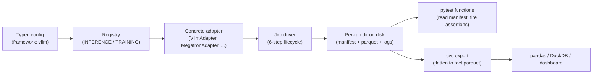
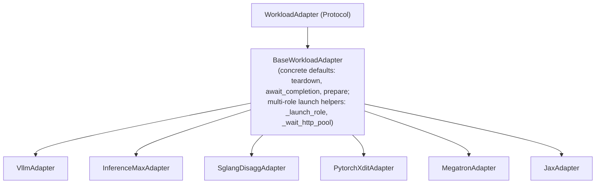
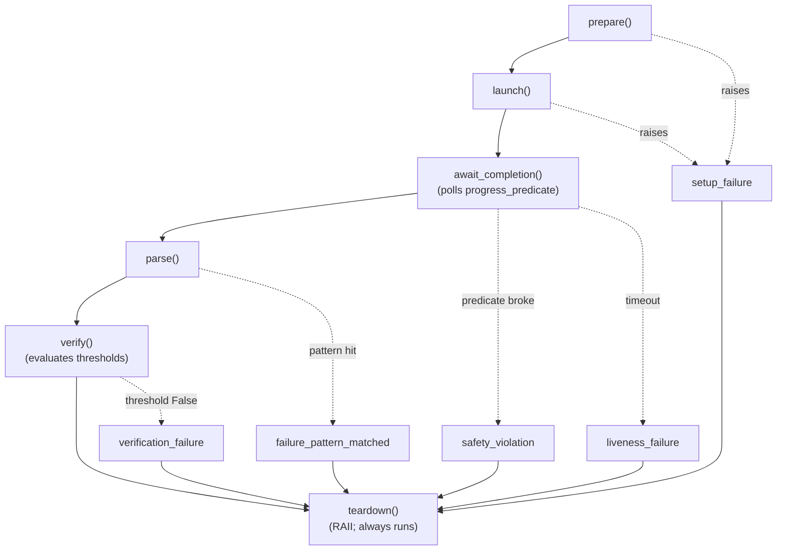

# CVS DTNI v1 — refactor overview

**Status:** Draft for team review. Full prose lives in [`cvs-dtni-v1-spec.md`](cvs-dtni-v1-spec.md); this file is the PR body and the entry point.

This PR is a refactor of the DTNI (data-center training and inference) suite — turning a fork-per-workload structure (one Python wrapper per `(framework, model, single/distributed)` tuple, one monolithic library per framework) into a **uniform lifecycle-driven workload runner**. The goal of this overview is to show what the redesign *enables*, not to enumerate every line that moves. Four capabilities are the headline:

- **Typed declarative configs** — one YAML per `(framework, model)`, Pydantic-validated, fail-fast on typos.
- **Pytest-as-first-class matrix slicing** — every axis a benchmark engineer cares about (framework, model, dataset, benchmark, metric, hyperparameter, backend knob like Mooncake or AITER) is a sliceable pytest marker on day one.
- **Durable on-disk artifacts** — per-cell content-addressable directory with a manifest + Parquet sidecars + raw logs, queryable directly from pandas / DuckDB. No regression-analysis service required.
- **Clean separation** between framework-agnostic orchestration (one Job driver, one lifecycle) and per-framework specifics (one adapter per framework, registered via a factory).

**Reading guide** — seven sections, ~15 min end-to-end:

1. Code structure and design philosophy
2. Tiered tests — what they are and why
3. Pytest invocation and lifecycle — the matrix story
4. Config files — categories of dials
5. Sweeps — how the matrix expands
6. Metrics and benchmarks supported per framework
7. Manifest and sidecars — durable runs and regression analysis

An appendix covers adoption, security/correctness fixes (W7), and the open reviewer decision.

---

## §1. Code structure and design philosophy

The redesign rests on three primitives.

### Three primitives

1. **A uniform lifecycle.** Every workload — training or inference, single-role or multi-role — executes the same six phases: `prepare → launch → await_completion → parse → verify → teardown`. The `Job` driver runs this lifecycle the same way for every workload; per-framework specialization lives entirely inside the adapter that implements those six methods.

2. **A factory + registry.** A typed config selects which adapter handles it. `INFERENCE_REGISTRY` and `TRAINING_REGISTRY` map `framework: vllm` (or `megatron`, `sglang_disagg`, etc.) to the concrete adapter class. The `Job` driver never branches on framework name; adding a new framework is one new adapter + one registry line.

3. **State on disk, not in memory.** Every cell of a run produces a content-addressable directory containing `manifest.json` + Parquet sidecars + raw logs. Tests, dashboards, and CI consumers all read from that directory. Nothing depends on module-level Python state surviving a process exit.

### The flow



The dashed arrows from `dir` indicate that the manifest tree is the single source of truth: pytest functions, cross-run exports, and any future dashboard all read the same artifacts.

### The adapter contract

The factory hands a registered class to the Job driver, which depends on these seven lifecycle methods. Every method takes the same `ctx` (the `RunContext`) and communicates through it — there is no separate run object threaded between methods: `parse` writes carriers onto the manifest via `ctx`, and `await_completion` polls `progress_predicate`.

```python
# cvs/lib/adapter_protocol.py
@runtime_checkable
class WorkloadAdapter(Protocol):
    framework: str

    def prepare(self, ctx: Any) -> None: ...
    def launch(self, ctx: Any) -> None: ...
    def progress_predicate(self, ctx: Any) -> Progress: ...
    def await_completion(self, ctx: Any) -> None: ...
    def parse(self, ctx: Any) -> None: ...
    def verify(self, ctx: Any) -> List: ...
    def teardown(self, ctx: Any) -> None: ...
```

`BaseWorkloadAdapter` provides concrete defaults for `teardown` (always capture logs + dmesg + GPU state, then `docker rm` by label), `await_completion` (poll the predicate with timeout), and `prepare` (no-op). It also owns the shared **multi-role launch/readiness plumbing** — `_launch_role` (fan out one container per host bound to a role, each scoped to its per-host runner) and `_wait_http_pool` (concurrent HTTP readiness across every handle of a role) — so single-role (vLLM) and multi-role disagg (`SglangDisaggAdapter`) adapters share one launch path. Most adapters override 3 of the 7 lifecycle methods.



### Design philosophy

Two principles drove the choices above.

**Framework emits → CVS retains.** Today the frameworks already emit rich data — per-request JSONL (vLLM), per-step trajectories (Megatron, JAX), Prometheus metrics (vLLM, sglang), per-batch JSON (InferenceMAX), per-step latency tracelogs (xDiT). Today CVS tail-greps the console and discards everything else. The redesign routes the framework's native emission directly into Parquet sidecars; nothing is invented and nothing is lost. Adding a metric is a `parse()` change, not a new pipeline.

**One workload run → many sliceable claims.** A single cell of a sweep produces one manifest. Many pytest test functions (logistics, framework-specific, benchmark-specific, model-specific) read that one manifest and assert independent properties. Failure of one assertion doesn't invalidate the run; the manifest is durable; rerunning a subset of claims against an existing manifest becomes one CLI flag (see §7).

The abstraction is intentionally shallow. If a hypothetical future workload needs to override all seven adapter methods, the abstraction has failed for that workload and the right move is to refactor at that point — not build for it speculatively now.

Full prose: [W1](cvs-dtni-v1-spec.md#w1-core-lifecycle-and-adapter-framework), [W2](cvs-dtni-v1-spec.md#w2-six-concrete-adapters).

---

## §2. Tiered tests — what they are and why

A "test" in v1 isn't "did the workload run end-to-end and produce one pass/fail line." It's a layered stack of independent claims about the same workload run. Tier = directory under `cvs/tests/` = abstraction layer of the claim.

| Tier | What it claims | Applies to | Example test functions |
|---|---|---|---|
| 1. Logistics | The workload started, ran, and cleaned up | Every config | `test_image_pullable`, `test_container_up`, `test_role_ready`, `test_no_orphans`, `test_dmesg_clean` |
| 2. Workload-kind | Training/inference invariants | training or inference configs respectively | `test_loss_finite`, `test_request_success_rate`, `test_no_5xx_burst` |
| 3. Topology | Distribution/disagg invariants | only distributed or disagg configs | `test_per_rank_step_sync`, `test_no_straggler`, `test_router_balance` |
| 4. Framework | Framework knobs were applied correctly | only the matching framework | `test_aiter_flags_active`, `test_xla_flags_applied`, `test_attention_backend_matches` |
| 5. Benchmark | The perf claims declared in `benchmarks:` | opt-in per config | `test_throughput_min`, `test_ttft_p99`, `test_convergence`, `test_goodput` |
| 6. Model | Known model-family edge cases | only the matching model | `test_quant_conversion_consistent` (gpt-oss-120b) |

```text
cvs/tests/
├── conftest.py
├── logistics/        # tier 1
├── training/         # tier 2 + 3 (distributed subset)
├── inference/        # tier 2 + 3 (disagg / distributed subsets)
├── frameworks/       # tier 4 — one file per framework
├── benchmarks/       # tier 5 — opt-in via config benchmarks: [...]
└── models/           # tier 6 — rarely used; documents quirks
```

### How tiers are collected

The framework collects tier 1 for every config. Tiers 2–4 are gated by a `collect-skip` hook in `pytest_collection_modifyitems` that compares each test's tier predicate against the cell's config (`workload_kind`, `topology`, `framework`) and **deselects** mismatched items (not skipped — deselected, so the report stays clean). Tier 5 is opt-in via the config's `benchmarks: [...]` list and a `@requires_benchmark("name")` decorator. Tier 6 is rare and routes by `model:`.

A typical inference cell collects ~13 test IDs (5 logistics + 2 inference-kind + 2 framework + 3 benchmark + 1 model). A typical training cell collects ~10.

### Why tier structure matters

Slicing. A reviewer who wants only "did training loss diverge anywhere last night?" runs `pytest -m "tier_2 and benchmark_loss_finite"` and gets exactly those claims, without needing to know which configs declared `loss_finite` as a check. A user investigating an HF token leak runs `pytest -m "tier_1 and not skipped_insufficient_nodes"` to see only logistics across the whole nightly sweep. Tiers are the structure that makes the test matrix queryable rather than monolithic.

Full prose: [W6](cvs-dtni-v1-spec.md#w6-pytest-layer-and-test-taxonomy).

---

## §3. Pytest invocation and lifecycle — the matrix story

### What happens when a user runs `cvs run`

The user types:

```bash
cvs run --cluster cluster.json --config configs/inference/vllm/gpt-oss-120b.yaml
```

Internally:

1. The config is parsed and Pydantic-validated (`extra = "forbid"`, so typos fail here).
2. The sweep block expands into N cells (§5).
3. The binder assigns physical nodes from the cluster pool to each cell's role requirements (per-cell, deterministic; §4 covers the topology dial).
4. Pytest collects test functions for each cell, applies markers derived from config fields (§2's tier predicate determines which functions actually run for that cell), runs the lifecycle once per cell via the `workload_run` session-scoped fixture, and fires the collected test functions against the resulting manifest.
5. A `pytest_terminal_summary` hook aggregates verdicts across all cells.

### The lifecycle



The 6-step body is identical for every workload — no `if mode == "training"` branching in the driver. Failures are classified at the boundary where they originate; `teardown` always runs in `finally`. The five failure categories map to actionable next steps: `setup_failure` means your config or environment is wrong; `safety_violation` means the workload broke its own invariants mid-run (NaN loss, server health probe failing, etc.); `verification_failure` means it ran cleanly but missed a threshold.

```python
# cvs/lib/job.py (skeleton)
class Job:
    def run(self) -> Manifest:
        run = None
        try:
            self.adapter.prepare(self.ctx)
            run = self.adapter.launch(self.ctx)            # raises -> setup_failure
            self._await_with_progress(run)                 # raises -> safety / liveness
            result = self.adapter.parse(run, self.manifest)
            verdicts = self.adapter.verify(result, self.ctx.cfg.thresholds)
            self.manifest.record_verdicts(verdicts)        # status: pass | verification_failure
        except SetupFailure as e:
            self.manifest.record_failure("setup_failure", e.evidence)
        except SafetyViolation as e:
            self.manifest.record_failure("safety_violation", e.predicate, e.evidence)
        except LivenessFailure as e:
            self.manifest.record_failure("liveness_failure", e.evidence)
        except FailurePatternMatched as e:
            self.manifest.record_failure("failure_pattern_matched", e.pattern_id, e.line)
        finally:
            if run is not None:
                self.adapter.teardown(run)                 # always runs
            self.manifest.flush()
        return self.manifest
```

### Markers — the matrix surface

Pytest markers are auto-derived from config fields at collection time. This is the surface a user actually queries:

| Config field | Marker pattern | Example value → marker |
|---|---|---|
| `framework` | `framework_<name>` | `vllm` → `framework_vllm` |
| `model` | `model_<name>` (underscores normalized) | `gpt-oss-120b` → `model_gpt_oss_120b` |
| `workload_kind` | `workload_<kind>` | `inference` → `workload_inference` |
| `topology` | `topology_<kind>` | `disagg` → `topology_disagg` |
| `target_gpu` | `gpu_<family>` | `mi355x` → `gpu_mi355x` |
| `knobs.<key>` (scalar) | `knob_<key>_<value>` | `attention: aiter` → `knob_attention_aiter` |
| `benchmarks: [...]` (list) | `benchmark_<name>` per entry | `[throughput, ttft_p99]` → `benchmark_throughput`, `benchmark_ttft_p99` |
| tier (from directory) | `tier_N` | `cvs/tests/benchmarks/` → `tier_5` |
| skip reason (binder) | `skipped_<reason>` | `insufficient_nodes` → `skipped_insufficient_nodes` |

Registered via `pytest_configure` so `-m` queries don't emit unknown-marker warnings. List-valued config fields fan out into multiple markers.

### What a test ID looks like

```text
benchmarks/test_latency.py::test_ttft_p99[vllm-gpt_oss_120b-mi355x-aiter-fp4-balanced-conc64]
```

Every axis a benchmark engineer might want to slice on — framework, model, GPU, attention knob, quant knob, sweep cell (`balanced-conc64`) — appears in the parametrize bracket. The test function name (`test_ttft_p99`) names the claim. The marker set on this item includes `framework_vllm`, `model_gpt_oss_120b`, `gpu_mi355x`, `knob_attention_aiter`, `knob_quant_fp4`, `workload_inference`, `topology_single`, `benchmark_ttft_p99`, `tier_5`.

### Three real CLI queries

```bash
# All vLLM + AITER cells across every model and concurrency
cvs run -m "framework_vllm and knob_attention_aiter"

# Just the P99 TTFT claim across the whole nightly sweep, all frameworks
cvs run -m "benchmark_ttft_p99"

# Distributed training cells only, FP8 quant, just convergence claims
cvs run -m "workload_training and topology_distributed and knob_quant_fp8 and benchmark_convergence"
```

### One workload run, many independent claims

The `workload_run` fixture in `cvs/tests/conftest.py` is session-scoped. For each cell, it instantiates the adapter (via the registry), runs `Job.run()` once, and yields the resulting manifest. Every test function for that cell then consumes the same manifest object:

```python
# cvs/tests/conftest.py (sketch)
@pytest.fixture(scope="session")
def workload_run(config_cell, cluster):
    adapter_cls = REGISTRY[config_cell.framework]
    adapter = adapter_cls(config_cell, cluster, gpu, secrets)
    manifest = Job(adapter, config_cell, cluster, gpu, secrets).run()
    return manifest
```

Thirteen test IDs per cell does not mean thirteen workload launches — it means one launch and thirteen independent verdicts. Most tests are pure manifest-reads (`assert manifest.scalars["ttft_p99_ms"] <= threshold.value`), so post-launch verification adds milliseconds per assertion.

Full prose: [W1](cvs-dtni-v1-spec.md#w1-core-lifecycle-and-adapter-framework), [W6](cvs-dtni-v1-spec.md#w6-pytest-layer-and-test-taxonomy).

---

## §4. Config files — categories of dials

Today's config story is fragmented: cluster JSON declares hostnames, the test wrapper hard-codes role lists, the per-framework library applies defaults via `dict.setdefault`, threshold values live in a stringified-key dict (`"ISL=1024,OSL=1024,TP=8,CONC=64"`), and typos silently fall through to defaults. v1 collapses all of this into **one Pydantic-validated YAML per `(framework, model)`**. The schema is `extra = "forbid"`, so any unknown field is a `model_validate()` error at parse time.

### Anatomy of a config

```yaml
# cvs/input/config_file/inference/vllm/gpt-oss-120b_mi355x_aiter.yaml

# ---- Identity ----
schema_version: "2"
test_id: vllm_gpt_oss_120b_mi355x_aiter
target_gpu: mi355x

# ---- Workload kind & framework ----
framework: vllm
workload_kind: inference
topology:
  roles:
    server: {count: 1, gpus_per_node: 8, selector: "mi355x"}

# ---- Model ----
model: gpt-oss-120b

# ---- Knobs (first-class; become pytest markers) ----
knobs:
  attention: aiter
  quant: fp4
  backend: vllm-native
  fused_moe: aiter_a16w4

# ---- Framework-specific params ----
params:
  tensor_parallelism: 1
  max_model_length: 9216
  num_prompts: 3200

# ---- Sweep (see §5) ----
sweep:
  concurrency: [16, 32, 64]
  isl_osl:
    - {isl: 1024, osl: 1024, name: balanced}
    - {isl: 4096, osl: 128,  name: prefill_heavy}

# ---- Tier-5 benchmark opt-in ----
benchmarks: [throughput, ttft_p99, tpot_p99]

# ---- Typed thresholds ----
thresholds:
  - {kind: Rate,       metric: throughput, per_unit: sec, op: ">=", min_rate: 1200}
  - {kind: Percentile, metric: ttft_ms,    percentile: 99, op: "<=", value: 50}
  - {kind: Percentile, metric: tpot_ms,    percentile: 99, op: "<=", value: 25}

# ---- Secrets (type-redacted) ----
secrets:
  hf_token: {kind: SecretValue, source: env, env_var: HF_TOKEN}
```

### Each category, one paragraph

**Identity** — `schema_version`, `test_id`, `target_gpu`. `target_gpu` is asserted against `GpuPlatform.detect()` at config load; running a `mi355x`-targeted config on an `mi300x` cluster is a fail-fast at config load, not a 20-minute crash.

**Workload** — `framework`, `workload_kind`, `topology`. The framework Literal routes through `INFERENCE_REGISTRY` or `TRAINING_REGISTRY`. `topology.roles` declares what the workload needs (count, GPUs per node, optional label selector); the binder maps roles onto cluster nodes at run time. The same config runs on any cluster that has enough nodes matching the selector — no hostname is ever baked into the config.

**Model** — single string. Becomes the `model_<name>` marker; routes tier-6 model-specific tests.

**Knobs** — first-class dict for backend-stack details that benchmark engineers care to slice on. Currently used: `attention` (`aiter` / `fa` / `te`), `quant` (`fp4` / `fp8` / `bf16`), `backend` (engine variant such as `vllm-native` vs `mooncake` vs `sglang-native`), `fused_moe` (kernel variant). Each becomes a `knob_<key>_<value>` marker; slicing the matrix on "all Mooncake configs" is one `-m "knob_backend_mooncake"` query.

**Params** — framework-specific scalars. Inference: `tensor_parallelism`, `max_model_length`, `num_prompts`. Training: `tp` / `pp` / `dp` / `fsdp` parallelism degrees, `micro_batch_size`, `sequence_length`. Per-framework Pydantic classes (`VllmParams`, `MegatronParams`, …) own validation; Megatron has a validator that asserts `product(parallelism) == total_gpus`, so an invalid combo is caught at parse.

**Sweep** — declarative axis expansion; full coverage in §5.

**Benchmarks** — opt-in list naming which tier-5 claim families this config asks for. Configs that don't list `convergence` won't have the `test_convergence` function collected for them, even though the function exists in the test tree.

**Thresholds** — list of typed predicates that name a metric, an operator, and a target value or window. Six kinds: `Percentile`, `Monotonicity`, `Convergence`, `Stability`, `Rate`, `Goodput`. Direction always comes from the explicit `op:` field — never inferred from the metric name (today, the substring `"ms"` flips the comparison; a future `latency_seconds` field would invert).

**Topology requirements** — covered above under Workload. Worth saying again: the cluster file is a pool of nodes only (hostnames, GPUs, labels). All role assignment happens at run time in the binder, per cell.

**Secrets** — `SecretValue` wrapper. Stringification redacts (`<SecretValue label=hf_token>`); `.reveal()` is only invoked at env-file write time inside the container. HF token never appears in command-line logs.

Full prose: [W3](cvs-dtni-v1-spec.md#w3-typed-config-schema), [W5](cvs-dtni-v1-spec.md#w5-cluster-pool-deterministic-binder-sweep-expansion).

---

## §5. Sweeps — how the matrix expands

A sweep declares one config that expands into N cells. Three semantics, all YAML-driven:

- **Cartesian** (default): scalar lists cross with each other.
- **Paired** (no cross): a single list-of-objects, where each object is one cell. Each entry can include a `name:` that becomes the parametrize ID.
- **Constraint-validated**: per-framework `SweepParams` Pydantic classes enforce invariants (e.g. parallelism product must equal GPU count).

Topology-changing axes (P/D split, node count, parallelism degrees) carry a per-cell `topology` block; the binder re-evaluates node assignments per cell.

### Example A — Cartesian (the common case)

```yaml
sweep:
  concurrency: [16, 32, 64]
  isl_osl:
    - {isl: 1024, osl: 1024, name: balanced}
    - {isl: 4096, osl: 128,  name: prefill_heavy}
```

→ **6 cells:** `[balanced-conc16]`, `[balanced-conc32]`, `[balanced-conc64]`, `[prefill_heavy-conc16]`, `[prefill_heavy-conc32]`, `[prefill_heavy-conc64]`.

### Example B — Paired with topology change (sglang P/D split)

```yaml
sweep:
  pd_splits:
    - name: 2p2d
      topology:
        roles:
          prefill: {count: 2, gpus_per_node: 8, selector: "mi300x"}
          decode:  {count: 2, gpus_per_node: 8, selector: "mi300x"}
    - name: 1p3d
      topology:
        roles:
          prefill: {count: 1, gpus_per_node: 8, selector: "mi300x"}
          decode:  {count: 3, gpus_per_node: 8, selector: "mi300x"}
  concurrency: [32, 64]
```

→ **4 cells**; binder re-evaluates per cell because each `pd_split` carries its own topology block.

### Example C — Constraint-validated (Megatron parallelism)

```yaml
topology:
  roles:
    worker: {count: 4, gpus_per_node: 8, selector: "mi300x"}   # 32 GPUs total

sweep:
  parallelism_combos:
    - {tp: 8, pp: 1, dp: 4, fsdp: 1, name: tp8_dp4}     # 8*1*4*1 = 32 ✓
    - {tp: 4, pp: 2, dp: 4, fsdp: 1, name: tp4_pp2_dp4} # 4*2*4*1 = 32 ✓
    - {tp: 1, pp: 1, dp: 1, fsdp: 32, name: fsdp_only}  # 1*1*1*32 = 32 ✓
    # {tp: 8, pp: 2, dp: 4, fsdp: 1, name: bad}         # 8*2*4*1 = 64 ✗ — rejected at parse
  micro_batch_size: [1, 2]
```

→ **6 cells.** The `product(parallelism) == total_gpus` constraint is a Pydantic validator on `MegatronSweepParams`; nonsense combos fail at `model_validate()`, not 20 minutes into the run.

### How sweeps propagate into pytest

Each cell becomes a pytest parametrize ID via its `name:` field (or an auto-derived name from scalar values). The full pipeline:

```text
config sweep block
   ↓ (sweep expansion)
N cells, each with its own resolved params + topology
   ↓ (binder)
N cells, each with role → host bindings (or "skipped: insufficient_nodes")
   ↓ (pytest_generate_tests)
N parametrize IDs per applicable test function
   ↓ (workload_run fixture, session-scoped per cell)
N workload runs, one manifest each
   ↓ (test functions read manifests)
N × M test verdicts (M = collected test functions per cell)
```

A cell that the cluster can't satisfy gets a manifest with `status: skipped` and a `skipped_<reason>` marker on its pytest items. The cell still appears in `cvs plan` output and remains queryable in `pytest -m`. The matrix degrades gracefully on under-resourced clusters — useful for dev boxes.

### Dry-running the matrix

`cvs plan --cluster cluster.json --config foo.yaml` is the matrix-preview command. Same code path as `cvs run` up to the point where the `Job` driver would call `adapter.prepare()`, then prints what would happen and exits. Output includes: cells, per-cell role-to-host bindings, selected test functions per cell, skip reasons, estimated wall time. Useful to catch "config doesn't fit cluster" in 2 seconds rather than 30 minutes.

Full prose: [W5](cvs-dtni-v1-spec.md#w5-cluster-pool-deterministic-binder-sweep-expansion), [W8](cvs-dtni-v1-spec.md#w8-tooling-and-documentation).

---

## §6. Metrics and benchmarks supported per framework

The "framework emits → CVS retains" principle (§1) means each framework's native telemetry routes directly into the manifest's Parquet sidecars. The contract is uniform across adapters: `samples.parquet` is request-grained or sample-grained (inference); `trajectory.parquet` is time-grained (training, or inference time-series). Benchmarks (tier-5 claims) opt in per config.

### Captured metrics per framework

| Framework | `samples.parquet` columns | `trajectory.parquet` series |
|---|---|---|
| **vllm** | `request_id`, `ttft_ms`, `tpot_ms`, `itl_ms`, `e2el_ms`, `output_tokens` | `queue_depth`, `memory_pressure`, `gpu_util` |
| **sglang_disagg** | (above) + `kv_transfer_ms` (P→D handoff), `prefill_done_ns`, `decode_start_ns` | (above) + `router_queue`, `decode_kv_cache_util`, `per_role_startup_ms` |
| **inferencemax** | per-batch `latency_ms`, `tokens`, `throughput_tps` | per-batch series |
| **pytorch_xdit (Flux)** | per-image `generation_ms`, `prompt_id`, `seed`, `num_inference_steps` | per-step `latency_ms` |
| **pytorch_xdit (Wan)** | per-frame `latency_ms`, `frame_idx`, `bitrate_kbps` | `fps`, `aggregate_bitrate` |
| **megatron** | (training: trajectory only) | `loss`, `throughput`, `step_time_ms`, `grad_norm`, `mem_used_gb` (per-rank) |
| **jax** | (training: trajectory only) | `loss`, `throughput`, `step_time_ms`, per-host metrics from coordinator |

Long-format Parquet means adding a new metric is a new row, not a new column — no schema migration on existing manifests. A new field that's already in the framework's emission costs one line in `parse()` and zero elsewhere.

### Benchmarks (tier-5 claims) supported per framework

| Benchmark | Threshold kind | Frameworks supported |
|---|---|---|
| `throughput` | `Rate` | vllm, sglang, inferencemax, xdit, megatron, jax |
| `ttft_p99` | `Percentile` | vllm, sglang, inferencemax |
| `tpot_p99` | `Percentile` | vllm, sglang, inferencemax |
| `itl_p99` | `Percentile` | vllm, sglang |
| `goodput` | `Goodput` | vllm, sglang |
| `handoff_latency` | `Percentile` | sglang_disagg |
| `router_balance` | (progress predicate) | sglang_disagg |
| `image_throughput` | `Rate` | xdit (Flux) |
| `step_time_p99` | `Percentile` | xdit |
| `video_throughput` | `Rate` | xdit (Wan) |
| `convergence` | `Convergence` | megatron, jax |
| `loss_finite` | (progress predicate) | megatron, jax |
| `monotonic_loss` | `Monotonicity` | megatron, jax |
| `step_time_stability` | `Stability` | megatron, jax |
| `no_straggler` | (progress predicate, distributed only) | megatron, jax (distributed) |

### Threshold predicates

All six kinds, as they appear in config:

```yaml
# 1. Percentile (over samples)
- {kind: Percentile, metric: ttft_ms, percentile: 99, op: "<=", value: 50}

# 2. Monotonicity (over trajectory)
- {kind: Monotonicity, metric: loss, window: last_quarter,
   direction: non_increasing, tolerance: 0.02}

# 3. Convergence (over trajectory)
- {kind: Convergence, metric: loss, target: 2.1, epsilon: 0.1,
   by_wallclock_sec: 14400}

# 4. Stability (rolling variance, samples or trajectory)
- {kind: Stability, metric: step_time_ms, window_size: 50, max_variance: 25.0}

# 5. Rate (derived rate)
- {kind: Rate, metric: throughput, per_unit: sec, op: ">=", min_rate: 1200}

# 6. Goodput (filtered rate — the MLPerf headline)
- {kind: Goodput, metric_pair: {ttft: ttft_ms, tpot: tpot_ms},
   ttft_max_ms: 450, tpot_max_ms: 40, op: ">=", min_qps: 600}
```

Each evaluates against the manifest's `samples` or `trajectory` carriers and emits a `Verdict` row with `expected`, `actual`, `passed`, `margin`. The `margin` field powers regression alerts — "P99 TTFT margin shrank from +12 ms to +2 ms over the last 10 runs" is one DuckDB query away (§7).

### Adding new coverage

The three common add-flows are intentionally cheap:

- **New metric on an existing framework** — one extra column write in `parse()`. No schema migration. Existing manifests don't know about the new metric; new manifests do.
- **New benchmark on an existing config** — append the name to `benchmarks: [...]` in the YAML. The matching tier-5 test function collects automatically.
- **New threshold predicate kind** — new Pydantic class + an evaluator function. Doesn't invalidate existing manifests (they don't reference the new kind).

Full prose: [W2](cvs-dtni-v1-spec.md#w2-six-concrete-adapters), [W3](cvs-dtni-v1-spec.md#w3-typed-config-schema).

---

## §7. Manifest and sidecars — durable runs and regression analysis

The manifest is the contract between "the workload ran" and every downstream consumer (tests, dashboards, regression analysis). It exists on disk at a content-addressable path, survives pytest's process, and is the single artifact every test function reads. Today, a CVS run prints results to stdout and forgets them; v1 makes the run a queryable record.

### Per-run directory layout

```text
<artifact_dir>/<test_id>/<cell_id>/<short_hash>/<run_id>/
├── manifest.json           # 5-50 KB; metadata + verdicts + scalars + sidecar pointers
├── events.jsonl            # append-only; closed-vocab events
├── samples.parquet         # per-request rows (long format)
├── trajectory.parquet      # per-step rows (long format)
├── config.resolved.yaml    # full resolved config for reproducibility
└── logs/
    ├── stdout.log
    ├── stderr.log
    ├── dmesg.<host>.pre.txt
    ├── dmesg.<host>.post.txt
    └── gpu_state.<host>.pre.json
    └── gpu_state.<host>.post.json
```

Content-addressable directory key = `<short_hash>` of (workload-defining inputs + framework image digest + bindings). Same config + same cluster always lands at the same path.

### Sample `manifest.json` (abbreviated, real values)

```json
{
  "schema_version": "1.0",
  "run_id": "0193a8e2-71c1-7e0f-9c1a-7d5e8e1f4a02",
  "test_id": "vllm_gpt_oss_120b_mi355x_aiter",
  "cell_id": "balanced-conc64",
  "config_hash": "sha256:91a2...e44b",
  "workload_hash": "sha256:7d3a...b21f",
  "verification_hash": "sha256:9c1e...8f12",
  "experiment_id": "vllm/gpt-oss-120b/fp4+aiter+vllm-native/mi355x",
  "cvs_git_sha": "a4f1e2c",
  "framework_image_digest": "sha256:7d3a...b21f",
  "framework_versions": {"vllm": "0.10.2", "torch": "2.7.1", "rocm": "6.4.0"},
  "timestamp_start": "2026-05-28T20:01:08Z",
  "timestamp_end":   "2026-05-28T20:14:52Z",
  "hosts": [{"hostname": "n1", "ip": "10.0.0.11", "role": "server"}],
  "model_descriptor": {"hf_repo": "openai/gpt-oss-120b", "precision": "fp4"},
  "phases": {
    "prepare":  {"duration_s":   4.3, "status": "ok"},
    "launch":   {"duration_s":  41.7, "status": "ok"},
    "await":    {"duration_s": 720.0, "status": "ok"},
    "parse":    {"duration_s":   1.8, "status": "ok"},
    "verify":   {"duration_s":   0.1, "status": "failed"},
    "teardown": {"duration_s":   6.9, "status": "ok"}
  },
  "status": "failed_verification",
  "failure": {
    "category": "verification_failure",
    "originated_in_phase": "verify",
    "message": "P99 TTFT 73.4ms exceeds threshold 50.0ms"
  },
  "verdicts": [
    {"kind": "Percentile", "metric": "ttft_ms", "op": "<=",
     "expected": 50.0, "actual": 73.4, "passed": false, "margin": -23.4},
    {"kind": "Percentile", "metric": "tpot_ms", "op": "<=",
     "expected": 25.0, "actual": 14.2, "passed": true,  "margin":  10.8},
    {"kind": "Rate", "metric": "throughput", "op": ">=",
     "expected": 1200.0, "actual": 1318.0, "passed": true, "margin": 118.0}
  ],
  "result": {"scalars": {"ttft_p99_ms": 73.4, "tpot_p99_ms": 14.2, "throughput_tps": 1318.0}},
  "samples_path": "samples.parquet",
  "trajectory_path": "trajectory.parquet",
  "events_path": "events.jsonl"
}
```

### Sidecar schemas

**`samples.parquet`** (long-format — one row per request/sample):

| Column | Type | Semantics |
|---|---|---|
| `request_id` | string | unique per request |
| `ts` | timestamp | request arrival |
| `ttft_ms` | float64 | time to first token |
| `tpot_ms` | float64 | time per output token |
| `itl_ms` | float64 | inter-token latency |
| `e2el_ms` | float64 | end-to-end latency |
| `output_tokens` | int32 | output token count |
| `role` | string | role that handled (for composites) |
| `host` | string | hostname |

**`trajectory.parquet`** (long-format — one row per (step, metric)):

| Column | Type | Example |
|---|---|---|
| `step` | int64 | `100` |
| `ts` | timestamp | `2026-05-28T20:05:00Z` |
| `metric` | string | `"loss"`, `"throughput_tps"`, `"router_queue"` |
| `value` | float64 | `4.21` |
| `role` | string | `"worker"`, `"router"` |
| `host` | string | `"n1"` |

**`events.jsonl`** — closed vocabulary, one line per event:

| Event | Emitted by | Payload (besides `ts`) |
|---|---|---|
| `prepare.start` / `prepare.done` | Job | `phase_duration_s` |
| `launch.container_up` / `launch.role_ready` | Adapter | `role`, `host` |
| `step` | Adapter (training) | `step`, `loss`, `throughput` |
| `request` | Adapter (inference) | `request_id`, `ttft_ms`, … |
| `safety.violated` | Job | `predicate`, `detail` |
| `pattern.matched` | FailurePatternScanner | `pattern_id`, `source`, `line` |
| `parse.done` | Job | `samples_rows`, `trajectory_rows` |
| `verify.failed` | Job | `metric`, `actual`, `expected_max` |
| `teardown.done` | Job | (empty) |

Adding an event is a schema change reviewed in PR, not a free-for-all `log.info`.

### Cross-run regression analysis (the data-science seam)

```bash
# Flatten N runs into one fact table
cvs export --artifact-dir ./runs --since 30d -o fact.parquet
```

```python
# notebook
import pandas as pd, matplotlib.pyplot as plt
fact = pd.read_parquet("fact.parquet")

# P99 TTFT trend for vLLM gpt-oss-120b with AITER + FP4 on mi355x, by CVS commit
sub = fact.query(
    "framework == 'vllm' and model == 'gpt_oss_120b' "
    "and knob_attention == 'aiter' and knob_quant == 'fp4' "
    "and gpu == 'mi355x' and cell_id == 'balanced-conc64'"
)
sub.groupby("cvs_git_sha")["ttft_p99_ms"].median().plot(
    marker="o", title="P99 TTFT regression (gpt-oss-120b)"
)
plt.axhline(50.0, color="red", linestyle="--", label="threshold")
plt.show()
```

Three lines of pandas catches a regression. Same Parquet file feeds a Grafana panel, a Streamlit dashboard, or a nightly alert script. No CVS service required.

### Why the manifest design makes future capabilities cheap

Three things fall out of this schema for free:

1. **Re-verify without re-running.** The manifest splits `workload_hash` (workload-defining inputs: framework, image digest, model, dataset, knobs, params, bindings, seed) from `verification_hash` (thresholds + pattern catalog). If only thresholds change, a future `--reuse-manifests` flag can re-evaluate verdicts against cached `samples.parquet` and rewrite the verdicts block — no workload launch. The hashes are recorded from day one even though the flag isn't shipped in v1, so the feature lands later as ~100 LOC with no historical-manifest migration.

2. **Re-parse logs into new metrics.** Raw logs persist in `logs/`. If a new metric becomes valuable post-hoc (e.g. a tail-latency percentile we forgot to capture), a `--reparse` flag can re-run the current parser against the saved logs and rewrite `samples.parquet`. Same content-addressable path; same manifest gets a new parse-time verdict block.

3. **Dashboards consume Parquet directly.** Long-format columnar layout means a new metric becomes a new row group, not a schema migration. Cross-run aggregations are DuckDB one-liners. No bespoke ingestion pipeline needs to be built before the data is queryable.

Full prose: [W4](cvs-dtni-v1-spec.md#w4-manifest-sidecars-and-cross-run-export), [W8](cvs-dtni-v1-spec.md#w8-tooling-and-documentation).

---

## Appendix

### Adoption

- **One-shot config migration.** `cvs migrate-config` rewrites every existing JSON under `cvs/input/config_file/{training,inference}/` to v2 YAML in a single pass. The new schema is the only schema; no backwards-compat reader path.
- **Wrappers deleted.** The 16 existing wrappers under `cvs/tests/{training,inference}/` (7 training + 9 inference) are replaced by ~6 parametrized test files. Adding a new model is a new YAML, not a new Python file.
- **CLI unchanged.** `cvs run --cluster_file=... --config_file=...` works identically. Existing automation continues to work.
- **Markers are additive.** New `pytest -m "..."` queries become possible; nothing previously possible breaks.

### Security and correctness fixes (W7)

W7 is a set of eight latent-defect fixes that ride alongside the redesign but have no architectural dependency on it. They can ship as a standalone PR series before the rest of v1 lands. Highlights:

- `SecretValue` wrapper for HF tokens — type-level redaction; `.reveal()` only at env-file write time; sentinel-leak CI test.
- `ContainerHandle` — non-privileged default; readiness probe in `__enter__`; label-scoped cleanup; **no more `docker system prune --force`** wiping other users' containers on shared nodes.
- `fail_test()` actually calls `pytest.fail` (today it appends to `globals.error_list` and returns).
- Explicit `op:` field in every `Threshold` — kills the substring-`"ms"` direction inference.
- `InferenceMaxAdapter.verify` raises on missing threshold instead of silently passing.
- `mi355` / `mi355x` literal normalization via a single GPU-family detection path.
- Quoted `$log_dir` in every `sudo rm -rf` call.

### Open decision for reviewers

**W7 as a standalone PR series, or merged with the rest?** Recommended: standalone first. Smaller PRs, faster review, security fixes ship without waiting on the architecture work.

### Pointers

- Full spec (long-form prose): [`docs/prd/cvs-dtni-v1-spec.md`](cvs-dtni-v1-spec.md)
- Original architecture PRD (superseded): commit [`0d0dd1a`](https://github.com/ROCm/cvs/blob/0d0dd1a/docs/prd/cvs-dtni-suite-expansion-prd.md) on this branch
