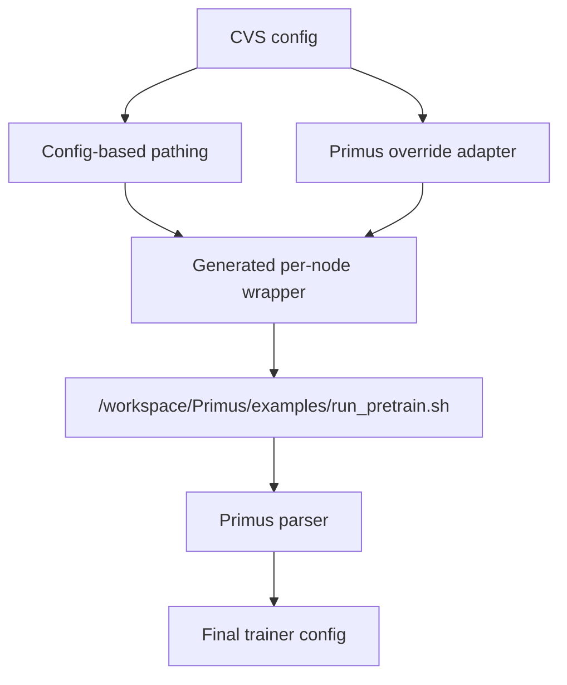

# PRD: Stage 1 Megatron Training Refactor

Status: Proposal
Owner: atnair
Stage: 1 of N

## Problem Statement

CVS Megatron tests currently assume the legacy Megatron-LM container layout:

- workdir: `/workspace/Megatron-LM`
- script: `/workspace/Megatron-LM/examples/llama/train_llama3.sh`
- logging: mutate a `TRAIN_LOG=` line inside that script
- overrides: pass Megatron-specific shell/env values such as `MBS`, `BS`, `TP`, `PP`, and `TOTAL_ITERS`

The Primus image uses a different contract:

- workdir: `/workspace/Primus`
- script: `/workspace/Primus/examples/run_pretrain.sh`
- config: `/workspace/Primus/examples/megatron/configs/MI300X/llama3_8B-FP8-pretrain.yaml`
- logging: accepts `TRAIN_LOG` as an environment variable and writes through `tee`
- overrides: final values are supplied as CLI args appended to `run_pretrain.sh`

The product requirement is that **CVS config remains the user-facing source of truth**. Users should not need to edit bundled Primus YAML files to change basic run parameters.

## Approach



This proposal introduces two opt-in capabilities to [`cvs/lib/megatron_training_lib.py`](../../cvs/lib/megatron_training_lib.py):

1. **Config-based pathing** so CVS can launch non-legacy training images.
2. **A Primus override adapter** so CVS config values remain the final authority over Primus recipe defaults.

Both capabilities are opt-in. Existing Megatron-LM tests and configs continue to behave exactly as today.

### 1. Add config-based pathing

**Why this is needed:** CVS currently cannot run containers that do not expose `/workspace/Megatron-LM`. Primus is structurally different, so we need a way to tell CVS where to `cd`, which script to execute, and which backend-specific config file drives the run. This keeps path/layout assumptions in config instead of hardcoding them into the Megatron library.

Update [`cvs/lib/megatron_training_lib.py`](../../cvs/lib/megatron_training_lib.py) to support optional config keys under `config`:

- `training_backend`, default `megatron`
- `training_workdir`, default `/workspace/Megatron-LM`
- `training_script`, default inferred from `tokenizer_model` as today
- `training_exp`, required only for `training_backend=primus`
- `training_log_mode`, default `train_log_variable`

Preserve existing defaults. Today the script path is derived only from `tokenizer_model`:

```python
if re.search('llama-3', self.tokenizer_model, re.I):
    self.training_script = '/workspace/Megatron-LM/examples/llama/train_llama3.sh'
elif re.search('llama-2', self.tokenizer_model, re.I):
    self.training_script = '/workspace/Megatron-LM/examples/llama/train_llama2.sh'
```

Replace hardcoded workdir usages with the configured value. This matters because an absolute script path alone is not enough: training scripts often assume their current working directory for relative config, package, and output paths. The current code hardcodes `cd /workspace/Megatron-LM` in command construction:

```python
cmd = (
    cmd
    + 'cd /workspace/Megatron-LM; export MOCK_DATA=1; '
    + f'export IMAGE={self.container_image}; '
    + f'export HF_TOKEN="{self.hf_token}"; '
    ...
)
```

### 2. Add Primus-compatible override adapter

When `training_backend=primus`, build Primus CLI override args from CVS config fields and append them to `run_pretrain.sh`.

**Why this is needed:** CVS users expect CVS config values to override the underlying training recipe. Primus has its own override hierarchy, and the final/highest-priority layer is CLI args appended to `run_pretrain.sh`. If CVS only points at a bundled Primus YAML file, then Primus recipe defaults win and CVS config stops being authoritative. The adapter preserves the CVS user experience while using Primus's native override model.

Initial safe mapping:

- `training_iterations` -> `--train_iters`
- `batch_size` -> `--global_batch_size`
- `micro_batch_size` -> `--micro_batch_size`
- `sequence_length` -> `--seq_length`
- `tensor_parallelism` -> `--tensor_model_parallel_size`
- `pipeline_parallelism` -> `--pipeline_model_parallel_size`
- `mock_data` -> `--mock_data`

Runtime env mapping:

- `nnodes` -> `NNODES`
- per-node rank -> `NODE_RANK`
- `master_address` -> `MASTER_ADDR`
- `master_port` -> `MASTER_PORT`
- detected/local GPU count -> `GPUS_PER_NODE`
- per-node CVS log path -> `TRAIN_LOG`
- `data_cache_dir` -> `DATA_PATH` and `HF_HOME`

Generated Primus command shape:

```bash
cd /workspace/Primus
EXP=/workspace/Primus/examples/megatron/configs/MI300X/llama3_8B-FP8-pretrain.yaml \
NNODES=2 NODE_RANK=<rank> MASTER_ADDR=<master> GPUS_PER_NODE=8 \
TRAIN_LOG=<per-node-log> \
bash /workspace/Primus/examples/run_pretrain.sh \
  --train_iters <from CVS> \
  --global_batch_size <from CVS> \
  --micro_batch_size <from CVS> \
  --seq_length <from CVS> \
  --tensor_model_parallel_size <from CVS> \
  --pipeline_model_parallel_size <from CVS>
```

The overrides must be appended as arguments to `run_pretrain.sh` so CVS remains the final authority in Primus's hierarchy:

```text
Primus base presets
  -> Primus model preset
    -> Primus experiment YAML overrides
      -> prepare_experiment patch args
        -> CVS-derived CLI overrides   (final)
```

Empirical check inside the Primus image (`amdaccelcloud/primus:7.13.0-1246-gfx942`) confirmed this precedence:

- Base `llama3_8B-FP8-pretrain.yaml` resolves to `train_iters=50`, `global_batch_size=16`, `mock_data=True`.
- Passing `--train_iters 5 --global_batch_size 32 --mock_data true` produces final parsed values `train_iters=5`, `global_batch_size=32`, `mock_data=True`.
- Duplicate CLI args are last-write-wins, so CVS-derived overrides must be generated last.

### 3. Split log behavior by backend

For legacy Megatron-LM, keep existing `TRAIN_LOG=` script mutation behavior. For Primus, use `TRAIN_LOG` as an env var and skip script mutation.

**Why this is needed:** The legacy Megatron script expects CVS to patch a `TRAIN_LOG=` line in place. Primus already supports `TRAIN_LOG` as a runtime environment variable and writes via `tee`. Mutating Primus's script would be unnecessary and brittle. A backend-specific log mode keeps current Megatron-LM behavior intact while using Primus's supported interface.

Today this is hardcoded for the Megatron-LM script path:

```python
result_training_log = f'{self.log_dir}/megatron-logs/out-node{i}/training.log'
cmd = (
    f"docker exec {self.container_name} /bin/bash -c "
    f"'sed -i  \"/^TRAIN_LOG=/c\\TRAIN_LOG={result_training_log}\" "
    f"/workspace/Megatron-LM/examples/llama/train_llama3.sh'"
)
```

Primus behavior should instead be:

```bash
TRAIN_LOG=<per-node-log-path> bash /workspace/Primus/examples/run_pretrain.sh ...
```

### 4. Add preflight compatibility checks

**Why this is needed:** Once pathing becomes config-driven, invalid config values can otherwise fail only after a distributed launch starts. That is expensive and hard to debug because rank failures often surface as torchrun timeouts. Preflight makes layout/config mistakes fail early with explicit diagnostics.

Before launch, check inside the container:

- `training_workdir` exists.
- `training_script` exists.
- `training_exp` exists for Primus.
- If `training_log_mode=train_log_variable`, target script contains a `TRAIN_LOG=` line.
- If `training_log_mode=env_train_log`, no script mutation is attempted.

### 5. Add 2-node Primus validation config

**Why this is needed:** The 2-node 8B FP8 run validates the two new capabilities without consuming the full 32-node cluster. It proves that CVS can launch Primus with the right paths and that CVS config values land as final Primus overrides. The bundled config uses `mock_data=True`, so validation focuses on integration correctness rather than dataset preparation.

Create a dedicated validation config for:

- Image: `amdaccelcloud/primus:7.13.0-1246-gfx942`
- Script: `/workspace/Primus/examples/run_pretrain.sh`
- Exp: `/workspace/Primus/examples/megatron/configs/MI300X/llama3_8B-FP8-pretrain.yaml`
- `nnodes=2`
- `mock_data=True`

## Compatibility / Blast Radius

- Main code file: [`cvs/lib/megatron_training_lib.py`](../../cvs/lib/megatron_training_lib.py)
- Existing callers should not change:
  - [`cvs/tests/training/megatron/megatron_llama3_1_8b_distributed.py`](../../cvs/tests/training/megatron/megatron_llama3_1_8b_distributed.py)
  - [`cvs/tests/training/megatron/megatron_llama3_1_8b_single.py`](../../cvs/tests/training/megatron/megatron_llama3_1_8b_single.py)
  - [`cvs/tests/training/megatron/megatron_llama3_1_70b_distributed.py`](../../cvs/tests/training/megatron/megatron_llama3_1_70b_distributed.py)
  - [`cvs/tests/training/megatron/megatron_llama3_1_70b_single.py`](../../cvs/tests/training/megatron/megatron_llama3_1_70b_single.py)
- Existing Megatron-LM configs remain valid because all new fields are optional and default to current behavior.
- Primus behavior is opt-in through `training_backend=primus`.

## User-Facing Contract

Existing Megatron users keep using current configs. Primus users opt in with explicit backend/pathing fields while continuing to use familiar CVS model params.

Example Primus-facing config shape:

```json
{
  "config": {
    "container_image": "amdaccelcloud/primus:7.13.0-1246-gfx942",
    "container_name": "megatron_primus_2n_8b",
    "distributed_training": "True",
    "nnodes": "2",
    "master_address": "<master-ip>",
    "training_iterations": "5",
    "training_backend": "primus",
    "training_workdir": "/workspace/Primus",
    "training_script": "/workspace/Primus/examples/run_pretrain.sh",
    "training_exp": "/workspace/Primus/examples/megatron/configs/MI300X/llama3_8B-FP8-pretrain.yaml",
    "training_log_mode": "env_train_log",
    "mock_data": "True"
  }
}
```

The generated Primus launch should preserve CVS final authority:

```bash
bash /workspace/Primus/examples/run_pretrain.sh \
  --train_iters 5 \
  --global_batch_size 16 \
  --micro_batch_size 2 \
  --seq_length 8192 \
  --tensor_model_parallel_size 1 \
  --pipeline_model_parallel_size 1 \
  --mock_data true
```

## Out of scope / Future additions

- No 32-node run in this stage.
- No real dataset support beyond what Primus already provides; the first validation uses `mock_data=True`.
- No result parser overhaul unless Primus logs differ from existing CVS Megatron metrics.
- No broad Docker orchestration refactor.
- No performance threshold calibration; `result_dict` can be calibrated after first successful run.
- No unrelated fix for `cvs exec` `log=None` behavior.

## Verification

### Static / default compatibility

- Existing Megatron-LM config resolves to:
  - `training_workdir=/workspace/Megatron-LM`
  - `training_script=/workspace/Megatron-LM/examples/llama/train_llama3.sh`
  - `training_log_mode=train_log_variable`
- Existing Megatron-LM generated commands remain equivalent to current commands.

### Primus override precedence

- With Primus config, confirm generated command appends CVS-derived CLI overrides after `run_pretrain.sh`.
- Verify final Primus parsed config values show CVS has final say:
  - CVS `training_iterations=5` -> Primus `train_iters=5`
  - CVS `batch_size=16` -> Primus `global_batch_size=16`
  - CVS `micro_batch_size=2` -> Primus `micro_batch_size=2`
  - CVS `sequence_length=8192` -> Primus `seq_length=8192`
  - CVS `tensor_parallelism=1` -> Primus `tensor_model_parallel_size=1`

### Preflight proof of detection

- Broken `training_workdir` fails before launch with explicit error.
- Broken `training_script` fails before launch with explicit error.
- Broken `training_exp` fails before launch with explicit error.
- `train_log_variable` mode with no `TRAIN_LOG=` line fails before launch.
- `env_train_log` mode skips script mutation.

### Runtime validation

- Transfer/load Primus image on the two validation nodes.
- Run device/RDMA discovery and fill config values.
- Run `cvs run megatron_llama3_1_8b_distributed` with the 2-node Primus validation config under `screen`.
- Confirm:
  - Both nodes launch containers.
  - `run_pretrain.sh` receives correct `NNODES`, `NODE_RANK`, `MASTER_ADDR`, `GPUS_PER_NODE`, `TRAIN_LOG`, and CVS-derived CLI overrides.
  - Logs are captured for both nodes.
  - If training fails, failure is explicit and logs are complete.
