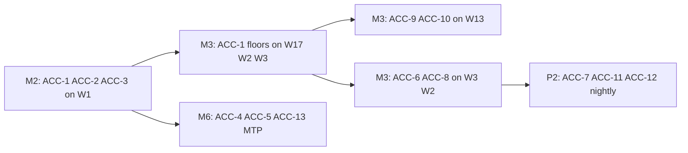

# ATOM accuracy tests — catalog and implementation plan

Branch: `hnimrama/atom-accuracy`

Inventory of accuracy/quality tests to add to the ATOM suite, reconciled with
[atom-cvs-automation-plan.md](atom-cvs-automation-plan.md) (Section 5 / 12.2) and
current CVS code.

**Repo state (2026-08-11, branch `hnimrama/atom-accuracy`):**

- Atom accuracy is **wired**: `test_accuracy_eval`, `test_atom_long_context_accuracy`, `test_atom_mtp_quality`, FUNC-1/2 smoke/health in [`atom.py`](../cvs/tests/inference/atom/atom.py).
- Phase C **perf stems** shipped for W2/W3/W13/W17; M4 W1 `_vllm_single` / `_sglang_single` parity stems shipped.
- See [`atom/README.md`](../cvs/input/config_file/inference/atom/README.md) **Variant suffix guide** and parent plan Section 12.1.1.

**Metric naming:** The automation plan proposes `accuracy.gsm8k_exact_match`. The landed harness
emits **lm-eval-native keys** like `gsm8k.exact_match__flexible-extract` (see
[`lm_eval_parsing.project`](../cvs/lib/inference/utils/lm_eval_parsing.py)). Thresholds go under
`threshold.json` → `"accuracy": { "<task_id>": { "<metric_key>": { "kind": "min", "value": … } } }`.

---

## Implementation todos

- [x] Add `AccuracyConfig` to `atom_config_loader` + accuracy threshold key support
- [x] Import `test_accuracy_eval` in `atom.py`; parametrize `accuracy_task`; update `LIFECYCLE_RANK`
- [x] Ship `mi300x_atom_deepseek-r1_fp8_accuracy` config + threshold (ACC-1 gate ≥ 0.94 flexible-extract)
- [x] Add ACC-2 strict-match and ACC-3 stderr as record-only tasks in same variant
- [x] W2/W3/W13/W17 accuracy scaffolds + Phase C perf stems (lab gates pending)
- [x] ACC-4/5/13 via `atom_mtp_quality.py`; FUNC-1 API smoke; FUNC-2 health check; ACC-12 NIAH
- [ ] M2 lab confirm on MI300X; flip M3 perf/accuracy `enforce_thresholds` after lab

---

## Tier 1 — P1 gates (M2, start here)

| ID | Test | Benchmark / method | Workloads | Gate policy | Threshold floor (tracker) |
|----|------|-------------------|-----------|-------------|---------------------------|
| **ACC-1** | GSM8K flexible-extract | lm-eval `gsm8k`, 5-shot, `flexible-extract` filter | W1 FP8, W17 MXFP4, W2 MXFP4, W3 BF16 | **Gate** | FP8/BF16 ≥ **0.94**; MXFP4 ≥ **0.93** |
| **ACC-2** | GSM8K strict-match | Same run, second metric | W1+ (all reasoning paths) | Record-only | Reference ~0.954 (W1 lab) |
| **ACC-3** | GSM8K stderr bound | lm-eval stderr on exact_match | W1 | Record → optional nightly flag if stderr > 0.02 | — |

**Reference baseline (W1, 8×GPU FP8):** flexible-extract **0.9553**, strict-match **0.9538**.

**Variant shape:** Dedicated stems such as `mi300x_atom_deepseek-r1_fp8_accuracy` (no perf sweep cells) with:

```json
"accuracy": {
  "tasks": [
    { "id": "gsm8k_flex", "task": "gsm8k", "num_fewshot": 5 },
    { "id": "gsm8k_strict", "task": "gsm8k", "num_fewshot": 5, "metadata": { "filter": "strict-match" } }
  ]
}
```

(Exact filter wiring depends on lm-eval task args — mirror SGLang's `exact_match,flexible-extract` vs
`strict-match` keys from [`sglang_common.LM_EVAL_SPECS`](../cvs/lib/inference/sglang/sglang_common.py).)

**CI split:** perf job (long) vs accuracy job (medium); accuracy does not belong in `test_cell_metrics` sweep rows.

---

## Tier 2 — Workload-specific accuracy (M3, when P1 workloads land)

| ID | Test | Benchmark | Workloads | Gate phase | Metric keys |
|----|------|-----------|-----------|------------|-------------|
| **ACC-8** | Long-context GSM8K slice | lm-eval with length filter | **W2** (8K ISL MXFP4) | Record → gate when W2 lands | lm-eval task metric |
| **ACC-9** | HumanEval | lm-eval `humaneval` | **W13** (code) | **Gate W13** | `humaneval.pass@1` |
| **ACC-10** | MBPP | lm-eval `mbpp` | **W13** | **Gate W13** | `mbpp.pass@1` |
| **ACC-6** | MMLU subset | lm-eval `mmlu`, 5-shot | **W3**, W10/W12 | Record → gate later | `mmlu.acc__none` |
| **ACC-11** | MATH-500 subset | lm-eval | **W7** (thinking) | Record-only P2 | task-specific acc key |
| **ACC-12** | Needle / RULER | Custom NIAH or lm-eval RULER group | **W5/W6** (long-context MoE) | Record-only P2 | per-length recall metrics |

**Variant naming:** `<workload>_mi300x_atom_accuracy` for gsm8k; suffix `_code_accuracy`, `_longctx_accuracy`
when a workload needs multiple ACC stages.

---

## Tier 3 — MTP / speculative-decode quality (M6 / post-M1 MTP lab)

| ID | Test | Source | Workloads | Gate? |
|----|------|--------|-----------|-------|
| **ACC-4** | MTP acceptance rate | ATOM MTP stats / log scrape | W1 `*_mtp3`, other MTP variants | P2 min floor (TBD) |
| **ACC-5** | Degenerate decode check | Log / eval (`empty_or_repeat_ratio`) | W1 MTP3+ | P2 max ceiling |
| **ACC-13** | Chat template smoke | Fixed prompt → golden hash | MTP variants (`apply_chat_template: true`) | P2 |

These are **not lm-eval** — they need AtomJob log/telemetry parsing (`mtp.acceptance_rate`,
`mtp.empty_or_repeat_ratio`, `accuracy.chat_template_ok`).

---

## Tier 4 — P2 optional / nightly

| ID | Test | Purpose | Workloads |
|----|------|---------|-----------|
| **ACC-7** | Quant logit parity vs BF16 reference | Catch catastrophic quant regressions | FP8/MXFP4 paths |
| **HellaSwag** | lm-eval `hellaswag` | General commonsense sanity | Any chat model — record-only |
| **compare.prev_run.gsm8k_delta** | Regression vs last green run | CI drift detection | All gated gsm8k variants |

---

## Functional / API checks (quality-adjacent, not lm-eval)

| ID | Test | What it validates |
|----|------|-------------------|
| **FUNC-1** | `_api_smoke` | Single chat + completion curl after `wait_ready`; chat template / OpenAI API contract |
| **FUNC-2** | `_health` | `/health`, model list, `max_tokens=1` liveness |

SGLang already runs **HellaSwag + GSM8K** as separate pytest stages
([`sglang_single.py`](../cvs/tests/inference/sglang/sglang_single.py)); atom could add HellaSwag the same way.

---

## Long-context accuracy (alternative to ACC-8/12)

SGLang disagg has a **NIAH** path ([`run_long_context_niah_accuracy`](../cvs/lib/inference/sglang/sglang_disagg_lib.py)
+ [`model_query_lib`](../cvs/lib/utils/model_query_lib.py)) — relevant for W2/W5/W6 if you want
needle-in-haystack at tracker ISL rather than a truncated gsm8k slice.

---

## Recommended rollout order



---

## Implementation delta (minimal, ACC-1..3 on W1)

To land **ACC-1..3 on W1**, atom needs the same wiring vLLM already has — not a bespoke accuracy job:

1. Add `accuracy: AccuracyConfig` to [`AtomVariantConfig`](../cvs/lib/inference/atom/atom_config_loader.py)
   (mirror [`vllm_config_loader`](../cvs/lib/inference/utils/vllm_config_loader.py)).
2. Import `test_accuracy_eval` in [`atom.py`](../cvs/tests/inference/atom/atom.py) and parametrize
   `accuracy_task` in `pytest_generate_tests` (mirror [`vllm.py`](../cvs/tests/inference/vllm/vllm.py)).
3. Insert `test_accuracy_eval` in [`LIFECYCLE_RANK`](../cvs/tests/inference/atom/conftest.py) **after perf,
   before teardown** (after `test_cell_metrics`, before `test_print_results_table`).
4. **Server reuse:** accuracy stage needs a live server — either chain after last perf cell with
   `reuse_server_across_sweep`, or accuracy-only variant that starts server once ( `*_accuracy` stem).
5. Ship `mi300x_atom_deepseek-r1_fp8_accuracy.json` + threshold with `"accuracy"` block and
   `enforce_thresholds: true`.

No new pytest per benchmark type beyond config — **each `AccuracyTask` in config becomes one HTML row**
via existing `test_accuracy_eval`.

---

## Out of scope for early accuracy work

- **Perf sweep metrics** (`client.*`, `scaling.*`) — already in atom; keep separate from accuracy.
- **Framework parity gsm8k** — M4 compares engines; accuracy runs per driver stem, not inside `compare.*` perf ratios.
- **Multinode PP accuracy** — defer until single-node gsm8k is green on MI300X.
