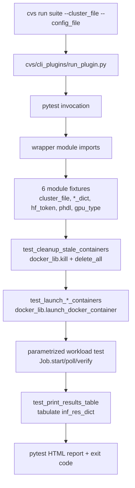
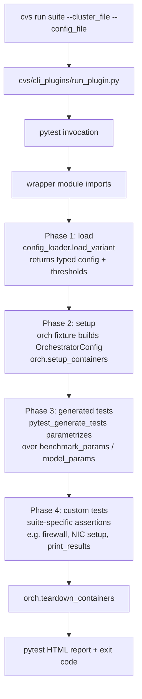

# DTNI suite developer guide

> **⚠️ SUPERSEDED — design doc, not current state.** This guide predates the
> restructure that shipped. It still references the old `cvs/lib/dtni/` and
> `cvs/input/dtni/` paths (now `cvs/lib/utils/` + `cvs/lib/inference/utils/`),
> the `concurrency_levels × sequence_combinations` cartesian (now named combos +
> a `runs[]` selector), the top-level `image` block (now `container.image`),
> `OrchestratorConfig.from_dicts` / `container.enabled|launch`, and other
> pre-merge shapes. For the as-built architecture, read
> `plans/building-a-cvs-test-suite.md` and each package's `AGENTS.md`. Kept for
> the design rationale (the §5–§7 *why* behind the seam, the Job split, and the
> config/threshold split), which is still accurate.

## 1. Intro and scope

This guide is for CVS developers who already run `cvs run` regularly and have edited a test wrapper or a lib helper, but who haven't worked under the new DTNI (data-center training and inference) layout. The goal is to give you the mental model and the concrete skeleton needed to port an existing suite or author a new one.

The framing: today every suite is a hand-written pytest module that ships its own container lifecycle, its own config parsing, and its own threshold checks inline. Under DTNI, those concerns move out of the test module into shared machinery — a typed config loader, an `orch` (orchestrator) fixture that owns the container, and a per-framework Job class that bundles the framework-specific verbs — so the test module shrinks to a few phases: load → setup → generated tests → custom tests.

`vllm_single` (inference) and `megatron_*` (training) appear as running examples. The same shape applies to sglang, inferencemax, pytorch_xdit, jax.

## 2. Old lifecycle: `cvs run` to HTML report



Concrete trace using `cvs/tests/inference/vllm/vllm_qwen3_80b_single.py` (480 LOC) and `cvs/tests/training/megatron/megatron_llama3_1_8b_single.py` (315 LOC):

1. **CLI entry.** `cvs/cli_plugins/run_plugin.py` parses args and invokes pytest against the resolved test module. `cvs list <suite>` uses `cli_plugins/list_plugin.py` (which calls `pytest --collect-only -q`).
2. **Fixtures.** Each wrapper declares ~6 module-scoped fixtures that re-implement the same shape: `cluster_file`, `<x>_config_file`, `cluster_dict`, `<workload>_dict`, helper dicts (`benchmark_params_dict` for inference, `model_params_dict` for training), `hf_token`, and a Pssh handle (`s_phdl`/`c_phdl` for inference, `phdl` for training). Dicts are loaded via raw `json.load` and run through `resolve_test_config_placeholders`. The training wrapper also probes `rocm-smi -a` live to derive `gpu_type`.
3. **Container lifecycle as ordered pytest functions.** `test_cleanup_stale_containers` calls `cvs/lib/docker_lib.py` (`kill_docker_container`, `delete_all_containers_and_volumes`). `test_launch_<x>_containers` calls `docker_lib.launch_docker_container` with device/volume/env/shm-size pulled from the loaded dict. Distributed training wrappers add a third lifecycle test (`test_disable_firewall`) that shells out via `phdl.exec('sudo service ufw stop')` to work around torchrun rendezvous timeouts. Inference wrappers add an autouse `cleanup_on_exit` fixture that kills the container again on module teardown.
4. **Workload.** Inference: parametrized `test_<framework>_inference[<seq>-conc<N>]` builds a `VllmJob` (`cvs/lib/inference/vllm.py`, subclass of `InferenceBaseJob` in `cvs/lib/inference/base.py`, 711 LOC), mutates a shared `benchmark_params_dict` with the current cell's params, calls `build_server_inference_job_cmd → start_inference_server_job → wait_for_health → start_inference_client_job → verify_inference_results`, parses into module-level `inf_res_dict`. Training: a single non-parametrized test builds a `MegatronLlamaTrainingJob` (`cvs/lib/megatron_training_lib.py`, 834 LOC, no shared base) and calls `exec_nic_setup_scripts → build_training_job_cmd → start_training_job → poll_for_training_completion → verify_training_results`. Both flows accumulate errors into the global `globals.error_list` and call `update_test_result()` at the end.
5. **Output.** Inference: `test_print_results_table` tabulates `inf_res_dict`. Training: no separate printer; verification is inline. Both emit the pytest HTML report and exit with the pytest exit code.

The seams that hurt:

- 4 wrappers per suite, byte-similar with one knob different (model id for inference, `distributed_training=False/True` for training). Any cluster-config schema change must be reapplied 4 times per suite.
- Container lifecycle encoded as ordered pytest functions plus an autouse fixture. Test ordering matters; shared state in `inf_res_dict`/`globals.error_list` is implicit.
- 700-800 LOC Job classes that mix command building, remote execution, output parsing, and pass/fail thresholds. `InferenceBaseJob` has vllm-shaped env vars leaked into the base, a dead distributed branch, the `random_range_ration` typo, and a silent skip in `verify_inference_results`. New suites that subclass it inherit the bugs.
- Cluster probes (`rocm-smi`, firewall status) live inside fixtures or workaround tests, called directly through `phdl.exec`. No consistent way to "ask the cluster something."
- Configuration is a single JSON blob mixing "what to run" with "did it pass." No typing, no schema, no separable lifecycle.

## 3. New lifecycle under DTNI

The CLI surface and pytest invocation are unchanged. What changes is what the test module looks like and where the work lives.



Phase-by-phase:

1. **Load.** `cvs/lib/dtni/config_loader.py` reads `cvs/input/dtni/<suite>/<variant>/config.json` and `threshold.json`, validates through Pydantic models (`extra="forbid"` everywhere except the runtime args passthrough), runs placeholder substitution in fixed order (cluster → self-reference → cross-block), and returns typed objects. One wrapper per suite, parametrized across all variant directories.
2. **Setup.** A pytest fixture builds an `OrchestratorConfig` (`cvs/core/orchestrators/factory.py`) from the loaded config and yields an `orch`. The fixture calls `orch.setup_containers()` on entry and `orch.teardown_containers()` on exit. No `test_cleanup_stale_containers` or `test_launch_*_containers` in suite code — those concerns are gone.
3. **Generated tests.** `pytest_generate_tests` (in the suite's `conftest.py`) reads sweep dimensions from the typed config — `benchmark_params.concurrency_levels × sequence_combinations` for inference, `model_params` presets for training — and parametrizes the workload test. Each parametrize cell constructs a Job, calls its verbs, gets back a flat `actuals` dict, and runs `evaluate_all(actuals, thresholds)`.
4. **Custom tests.** Suite-specific assertions that aren't part of the sweep grid: firewall disable, NIC setup probe, results-table printer, smoke checks. These live in the wrapper as plain `def test_*` functions and use `orch.exec`/`orch.exec_on_head` to talk to the cluster — never `phdl.exec` or `docker_lib` directly.

Output: same pytest HTML report, same exit code. Reportable rows are built from `actuals`, not from a global dict mutated by ordered tests.

## 4. Test file skeleton (the phases, concretely)

This is the base layout. Copy and replace the framework-specific bits.

```python
# cvs/tests/<domain>/<framework>/<suite>.py
"""<suite> — DTNI layout. Phases: load → setup → generated → custom."""

import pytest
from cvs.lib.dtni.config_loader import load_variant, enumerate_variants
from cvs.lib.dtni.verdict import evaluate_all
from cvs.lib.<domain>.<framework>_orch import <Framework>Job


# -------- Phase 1: load (delegated to conftest.py fixtures) --------
# variant_config + thresholds come from the conftest's load_variant fixture.
# This module does not call json.load.

# -------- Phase 2: setup (delegated to conftest.py fixtures) --------
# orch comes from the conftest's orch fixture. Container lifecycle is
# owned by the fixture (setup_containers on entry, teardown on exit).

# -------- Phase 3: generated tests --------
# Parametrization is driven by pytest_generate_tests in conftest.py,
# walking variant_config.benchmark_params (or model_params for training).

def test_<workload>(orch, variant_config, hf_token, cell, inf_res_dict):
    job = <Framework>Job(orch=orch, config=variant_config, hf_token=hf_token)
    job.stop()                              # idempotent pre-clean
    job.start(cell)                         # framework verbs
    job.wait_ready()
    job.run(cell)
    job.wait_complete()
    actuals = job.parse_results()
    inf_res_dict[cell.id] = actuals
    evaluate_all(actuals, variant_config.thresholds, prefix=cell.id)


# -------- Phase 4: custom tests --------
# Suite-specific assertions outside the sweep grid. Use orch, not phdl.

def test_print_results_table(inf_res_dict):
    from cvs.tests.<domain>.<framework>._shared import print_table
    print_table(inf_res_dict)

# Training-flavored example (distributed quirk):
# def test_disable_firewall(orch):
#     out = orch.exec("sudo service ufw stop || true")
#     out = orch.exec("sudo ufw status")
#     for node, text in out.items():
#         assert "inactive" in text.lower() or "disabled" in text.lower(), node
```

And the conftest that backs it:

```python
# cvs/tests/<domain>/<framework>/conftest.py
import pytest
from cvs.lib.dtni.config_loader import load_variant, enumerate_variants
from cvs.core.orchestrators.factory import OrchestratorConfig, build_orchestrator

def pytest_generate_tests(metafunc):
    if "variant_config" in metafunc.fixturenames:
        variants = enumerate_variants("cvs/input/dtni/<suite>")
        metafunc.parametrize("variant_config", variants, ids=[v.id for v in variants], indirect=True)
    if "cell" in metafunc.fixturenames:
        # Cross-product of sweep dims from the already-resolved variant_config.
        ...

@pytest.fixture(scope="module")
def cluster_dict(pytestconfig): ...

@pytest.fixture
def variant_config(request, cluster_dict):
    return load_variant(request.param, cluster_dict)

@pytest.fixture
def orch(variant_config, cluster_dict):
    oc = OrchestratorConfig.from_dicts(cluster_dict, variant_config.container.dict())
    o = build_orchestrator(oc)
    o.setup_containers()
    try:
        yield o
    finally:
        o.teardown_containers()

@pytest.fixture(scope="session")
def inf_res_dict():
    return {}
```

Conventions baked into this skeleton:

- The wrapper does not import `docker_lib`, `parallel_ssh_lib`, or `globals`. Anything those modules did is now reachable through `orch` or `evaluate_all`.
- The wrapper does not `json.load` anything. Config IO lives in `config_loader`.
- Job verbs are framework-specific but consistent in *shape*: a small constructor, a few verbs that drive remote work through `orch`, and a `parse_results()` that returns a flat dict. The exact verbs differ by domain (inference: `start_server/run_client`; training: `start_training/poll_for_completion`).
- `pytest_generate_tests` is the only place parametrization lives. No ad-hoc `@pytest.mark.parametrize` on the workload test.

## 5. The three new concepts

### `orch` (the orchestrator fixture)

**What.** An object from `cvs/core/orchestrators/factory.py` that abstracts "run a command on cluster nodes" and, when `container.enabled=true`, "run that command inside a container managed by me." Methods you'll touch: `setup_containers`, `teardown_containers`, `exec`, `exec_on_head`. Routing between baremetal and container is automatic.

**Why.** Today every suite re-implements container launch and cleanup as ordered pytest functions plus an autouse fixture, calling `docker_lib` directly, with bonus shell workarounds (firewall, NIC scripts) reaching past it into `phdl.exec`. That couples test order to lifecycle order, duplicates teardown, and forces every wrapper to know about Docker flags. `orch` collapses this to one fixture: the test sees a ready environment when it starts and a clean one when it ends.

### The Job class

**What.** A standalone Python class, one per framework, under `cvs/lib/<domain>/<framework>_orch.py`. It bundles the framework-specific verbs and uses an injected `orch` for all remote execution. Domain shapes verb names: inference Jobs expose `build_server_cmd / start_server / wait_ready / run_client / parse_results`; training Jobs expose `build_training_cmd / start_training / poll_for_completion / parse_results`; pre-workload shell workarounds (NIC setup, firewall) become methods on the Job rather than ordered tests.

**Why.** `InferenceBaseJob` (711 LOC) tried to be a shared base for every inference framework and ended up tangling vllm-shaped env vars into the base, with a dead distributed branch and silent skips in result verification. `MegatronLlamaTrainingJob` (834 LOC) avoided the base-class trap but mixed config parsing, command building, remote execution, output parsing, and pass/fail thresholds in one file. The new shape: small, flat, framework-specific Job; cluster talk via `orch`; thresholds via `evaluate_all`. No inheritance, no `globals.error_list`.

### The config / threshold split

**What.** The single suite config JSON splits into two files per variant directory: `config.json` (what to run — identity, paths, model, image, container, framework params, sweep dimensions) and `threshold.json` (did it pass — flat map of `<cell>.<metric>` to typed predicates).

**Why.** Different churn rates (config flips with new models or images; thresholds drift with hardware/kernel/version moves), different ownership (suite author vs perf/release), different lifecycles (re-baseline thresholds without re-reviewing the whole suite). Splitting also makes `cvs list` granular at the variant level and removes v1's anti-pattern of encoding non-metric checks ("did the server start") as a numeric threshold.

## 6. What the current lib/Job files try to do — and what to lift out

Read this as a refactor map for the legacy files, not a critique. Use it to decide what lands in the new Job, what lands in shared machinery, and what stays in the old file for legacy suites.

### `cvs/lib/inference/base.py` — `InferenceBaseJob` (711 LOC)

Concerns currently mixed:

| Concern | Current home | DTNI home |
|---|---|---|
| Container launch flags | base init pulls from `inference_dict['container_config']` | **orch** (passed through `container` block) |
| Server command build | `build_server_inference_job_cmd` | **Job** (framework-specific) |
| Remote process start | `start_inference_server_job` → `phdl.exec` | **Job** uses `orch.exec_on_head` |
| Health wait | `wait_for_inference_server_health` | **Job** (verb on the Job) |
| Client command build | `build_client_inference_job_cmd` | **Job** |
| Result parsing | `parse_inference_results` → `inf_res_dict` | **Job.parse_results** returns a flat dict |
| Threshold check | `verify_inference_results` (silent-skip bug) | **evaluate_all** (shared, predicate-typed) |
| Error accumulation | `globals.error_list` | plain `assert` + `evaluate_all` |

What to lift out: container concerns (to `orch`), threshold checks (to `evaluate_all`), the global error list (delete entirely). What stays on the Job: framework verbs. Net: the new `VllmJob` is in the 200–300 LOC range instead of 711.

### `cvs/lib/megatron_training_lib.py` — `MegatronLlamaTrainingJob` (834 LOC)

Same split, training-flavored:

| Concern | Current home | DTNI home |
|---|---|---|
| Per-model presets (`single_node`/`multi_node` × `gpu_type`) | `model_params_dict` indexed inside Job | **variant config** (one variant per preset) |
| NIC setup script execution | `exec_nic_setup_scripts` | **Job method**, calling `orch.exec` |
| Training command build | `build_training_job_cmd` | **Job** |
| Launch + poll | `start_training_job` + `poll_for_training_completion` | **Job** (drives via `orch`) |
| Log scan for errors | `scan_for_training_errors` | **Job.parse_results** returns flat metrics dict; **evaluate_all** gates pass/fail |
| Threshold check | `verify_training_results` | **evaluate_all** |
| Distributed-only workarounds (firewall) | extra ordered pytest function in distributed wrappers | **Job method or custom Phase-4 test using orch** |

Optimizations specific to training:

- The "single vs distributed" axis is a config dimension, not a separate suite. With one wrapper parametrized by variant directory, `llama3.1_8b_fp8_single` and `llama3.1_8b_fp8_distributed` are sibling variant dirs sharing one wrapper.
- `gpu_type` derived by `rocm-smi` probe in a fixture today; in DTNI it's either declared in the variant (`gpu_arch: mi300x`) or queried once via `orch.exec_on_head` and cached on `orch`.

### `cvs/lib/docker_lib.py` and `cvs/lib/parallel_ssh_lib.py`

Both are reachable from DTNI suites via `orch` indirection, but DTNI Job code should never import them directly. `parallel_ssh_lib` is a deprecated shim around `cvs/lib/parallel/pssh.py`; the orch already uses the new path. New suites referencing either of these by name should fail review.

## 7. Config vs threshold: philosophy and concrete shape

**Why split.**

- Different churn rates. Configs change when you bring up a new model, image, or container layout. Thresholds change when hardware, kernels, or framework versions move performance characteristics.
- Different ownership. Suite author owns config; perf or release engineering often owns thresholds.
- Different lifecycle. Re-baselining thresholds for a new MI generation should not require touching what the run does.
- Granular `cvs list`. One variant directory = one collected suite row, regardless of how many metrics it gates.
- Rejects v1's anti-pattern of encoding "did the thing start" as `min: 1` against some token counter. Liveness belongs in `assert` inside the test; thresholds are for numeric pass/fail on real measurements.

### Example: `config.json` for a `vllm_single` variant

```json
{
  "schema_version": 1,
  "framework": "vllm_single",
  "gpu_arch": "mi355x",
  "paths": {
    "shared_fs":     "/mnt/dtni/{user-id}/cvs",
    "models_dir":    "/mnt/dtni/{user-id}/models",
    "datasets_dir":  "{shared_fs}/datasets",
    "artifacts_dir": "{shared_fs}/artifacts"
  },
  "model":  {"id": "Qwen3-Next-80B-A3B-Instruct", "remote": 0, "precision": "bf16"},
  "image":  {"tag": "rocm/vllm:latest", "remote": 1},
  "container": {
    "enabled": true,
    "launch": true,
    "name": "vllm_inference_rocm",
    "runtime": {
      "name": "docker",
      "args": {
        "volumes": {"{paths.models_dir}": "/models"},
        "env": {"VLLM_USE_TRITON_FLASH_ATTN": "0"},
        "shm_size": "64G"
      }
    }
  },
  "params": {"tensor_parallelism": 8, "max_model_len": 8192, "gpu_memory_utilization": 0.85},
  "benchmark_params": {
    "concurrency_levels": [16],
    "sequence_combinations": [{"name": "balanced", "isl": 1024, "osl": 1024}]
  }
}
```

Block walkthrough:

- `schema_version`, `framework`, `gpu_arch` — identity. Loader picks the right Pydantic model and Job class.
- `paths` — substituted in fixed order: cluster (`{user-id}`) → self-reference (`{shared_fs}`) → cross-block (`{paths.X}` used elsewhere).
- `model`, `image` — typed objects with explicit `remote` flags.
- `container` — passed through to `OrchestratorConfig.container`. `launch: true` hands lifecycle to orch.
- `params` — framework server flags. Passthrough; the framework's Pydantic model decides what's allowed.
- `benchmark_params` — sweep dimensions. `pytest_generate_tests` reads these to parametrize.

### Example: `threshold.json` for the same variant

```json
{
  "smoke_request_latency_ms":          {"kind": "max_ms", "value": 600000},
  "smoke_completion_tokens":           {"kind": "min",    "value": 1},

  "balanced_conc16.request_throughput":  {"kind": "min",       "value": 0.5},
  "balanced_conc16.output_throughput":   {"kind": "min_tok_s", "value": 50.0},
  "balanced_conc16.ttft_p95_ms":         {"kind": "max_ms",    "value": 60000},
  "balanced_conc16.tpot_p95_ms":         {"kind": "max_ms",    "value": 5000}
}
```

Walkthrough:

- Flat namespace. Keys are `<cell>.<metric>` where `<cell>` matches the parametrize id or a synthetic name like `smoke`.
- Five predicate kinds: `min`, `max_ms`, `within`, `min_tok_s`, `min_ratio`. Each entry is `{kind, value, tolerance?}`.
- Missing entries are logged by `evaluate_all` but do not gate the run — adding new metrics stays cheap.

### Anti-patterns to reject in review

- A `config.json` key whose value is a pass/fail threshold (move it).
- A `threshold.json` entry that is actually a config flag (move it).
- A threshold that branches on hardware. Split into separate variant directories per `gpu_arch`.
- Placeholder substitution across files (a threshold value pulled from a config block). They have different lifecycles; do not couple them.
- A "smoke" threshold of `min: 1` standing in for "did the thing start." Liveness belongs in `assert` inside the test.
- Globbing multiple models into one config with `models: [...]`. Drops `cvs list` granularity. One model per variant directory.

## 8. Porting checklist (suite-agnostic)

1. **Inventory the source wrapper.** List every fixture, every test function, every key read from the config JSON, and every reach into `docker_lib`/`parallel_ssh_lib`/`globals`. Note which keys gate behavior vs gate pass/fail.
2. **Identify framework verbs.** Pull out the framework-specific calls in the legacy lib (`cvs/lib/inference/<x>.py`, `cvs/lib/<framework>_training_lib.py`). These become the new Job's public surface.
3. **Classify each config key.** Each key is "what we run" (config), "did it pass" (threshold), or "cluster scaffolding" (already in the cluster file). If undecided, default to config; thresholds are only for numeric measurements with predicates.
4. **Lay out variant directories.** One directory per `(model, purpose)` or `(model, mode, purpose)` under `cvs/input/dtni/<suite>/<full-model-id>_<mode>_<perf|accuracy>/`. Full model IDs, no abbreviations. Single-vs-distributed is a *mode*, not a separate wrapper.
5. **Write the Job.** Standalone class under `cvs/lib/<domain>/<framework>_orch.py`. Constructor takes the typed config and an `orch`. Do not inherit `InferenceBaseJob`. Do not import `globals`.
6. **Write the wrapper + conftest** following the skeleton in §4. One wrapper per suite.
7. **Verify against the pre-port baseline.** Run the old wrapper and the new one on the same hardware with the same model and confirm metrics are within noise.

## 9. Verification template

Every port PR should include:

- `pytest --collect-only` on the new wrapper, expected count matches the variant × sweep grid.
- `cvs list <suite>` showing the variant rows (run with `--config_file=dummy` if needed, mirroring `list_plugin.py`).
- An end-to-end hardware run that produces the HTML report and exits 0.
- Container lifecycle observation: `docker ps` before, during, and after the run, confirming the container is created by `orch.setup_containers()` and removed by `orch.teardown_containers()` — no stale containers remain.
- A negative test: deliberately tighten one threshold so it fails; confirm the HTML report flags the right cell and the exit code is non-zero.
- A diff against the pre-port baseline metrics, attached to the PR.

## 10. Out of scope for DTNI v-PoC

- Refactoring or fixing `cvs/lib/inference/base.py` (`InferenceBaseJob`) or `cvs/lib/megatron_training_lib.py`. Older suites still depend on them; leave them alone.
- `model.remote=1` HuggingFace download path. Only `remote=0` (pre-staged on shared FS) is wired up.
- Accuracy variants. Only `_perf` is in scope; `_accuracy` directories may exist but their evaluation pipeline is a follow-up.
- Sweep rework. The current `pytest_generate_tests`-style parametrization is preserved; a declarative sweep grammar is a follow-up.
- `globals.error_list` deletion. The new suites stop using it; the legacy import stays until the last suite ports.
