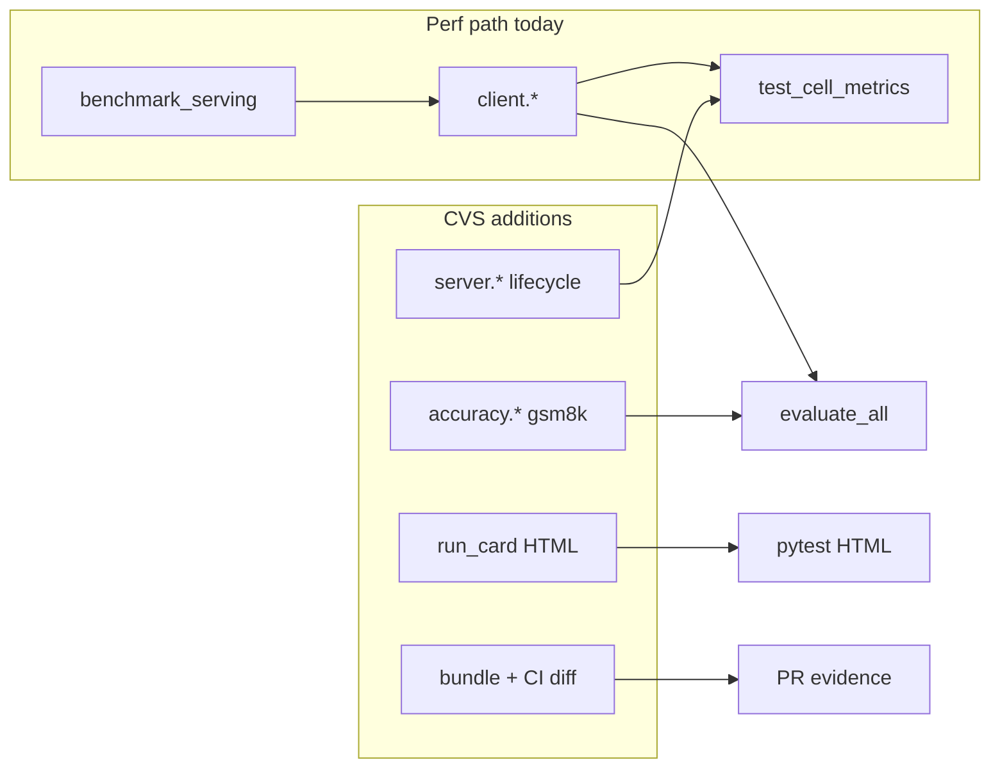
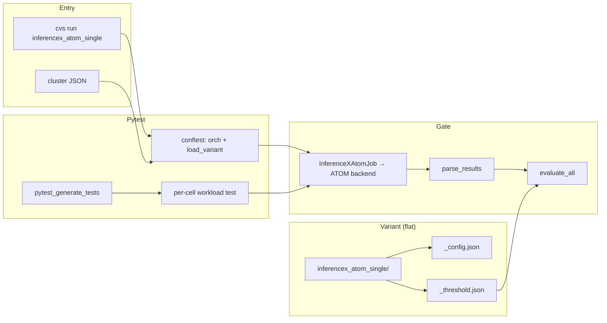
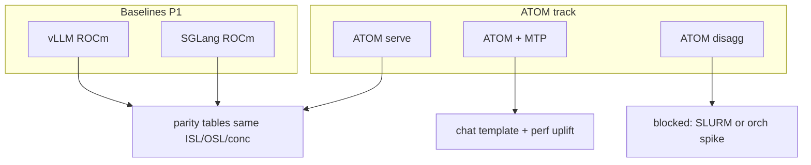
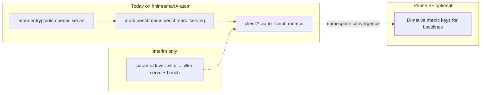
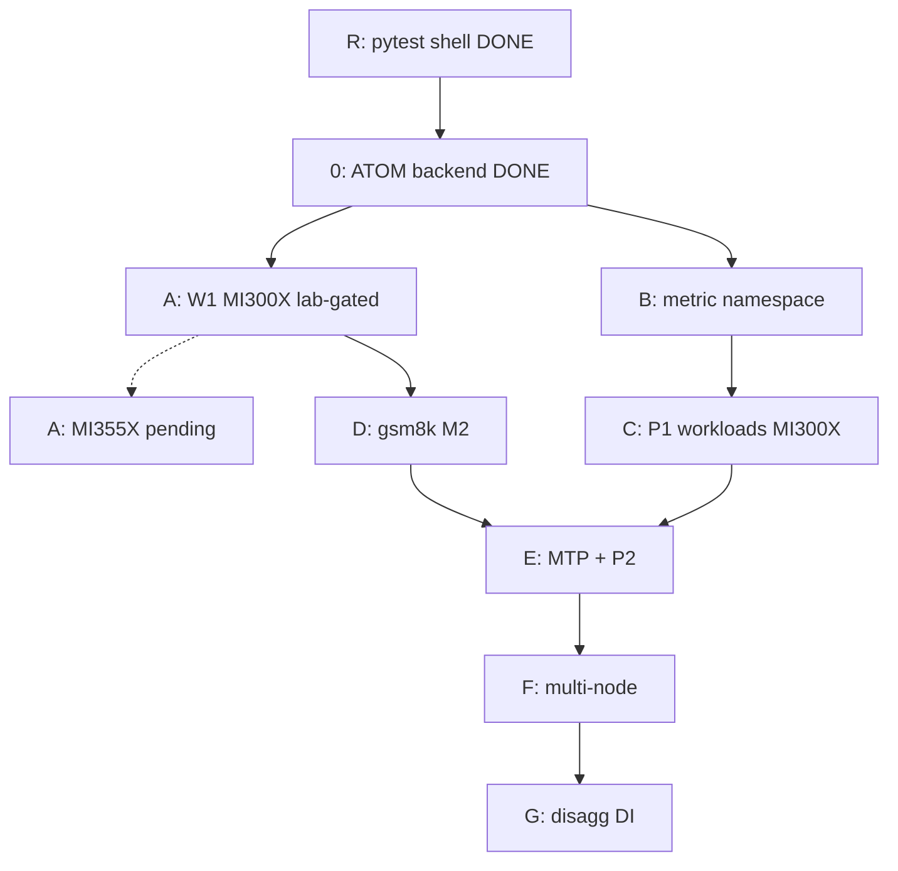
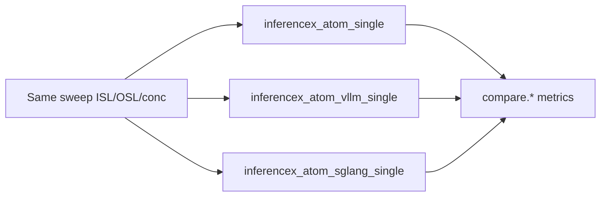
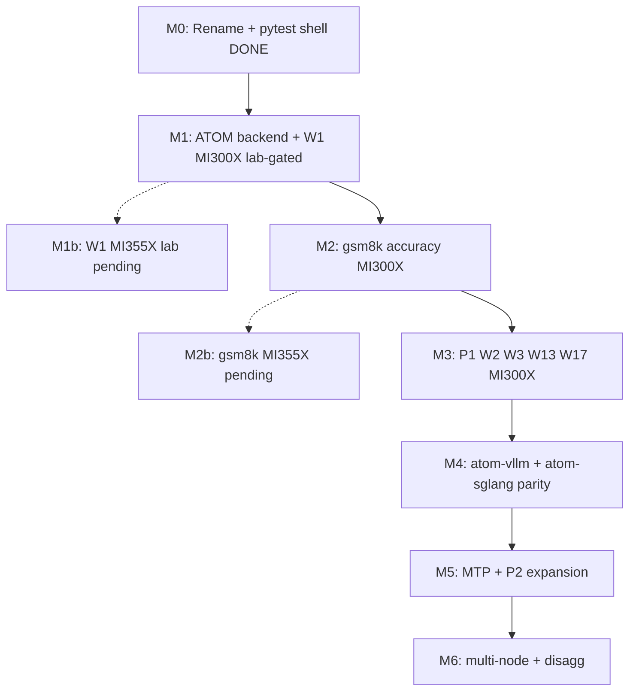
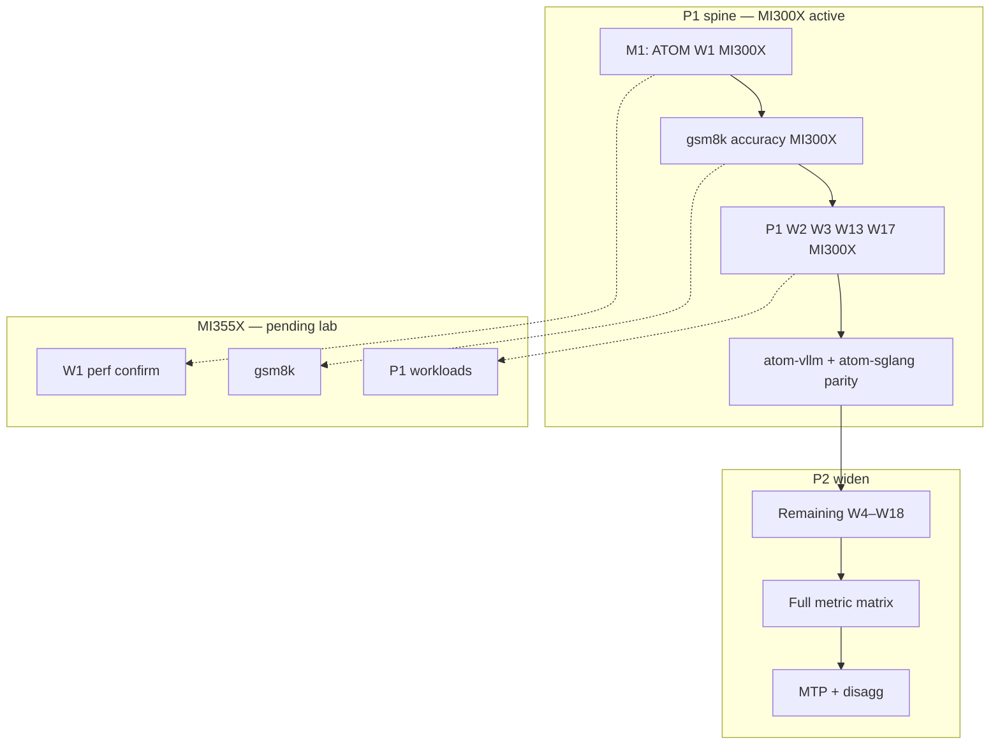

# InferenceX ATOM — CVS automation implementation plan (DTNI-first)

## 0. Branch state (`hnimrama/IX-atom`) — read this first

This section records **what exists on the branch today** vs **what this plan targets**. Refresh when landing major phases.

| Area                          | Current on branch                                                                                                                                                                                            | Target (this plan)                                                                                                                                               |
| ----------------------------- | ------------------------------------------------------------------------------------------------------------------------------------------------------------------------------------------------------------ | ---------------------------------------------------------------------------------------------------------------------------------------------------------------- |
| **Suite name**                | `inferencex_atom_single`                                                                                                                                                                                     | Same                                                                                                                                                             |
| **Driver**                    | `InferenceXAtomJob` (`inferencex_atom_orch.py`): `params.driver=atom` → `atom.entrypoints.openai_server` + `atom.benchmarks.benchmark_serving`; `parse_results` → `to_client_metrics` (`client.*` namespace) | Same ATOM path; optional `driver=vllm` only for interim uplift variants                                                                                          |
| **Config layout (canonical)** | `cvs/input/config_file/inference/inferencex_atom_single/` — flat `<stem>_config.json` + `<stem>_threshold.json` (same as `vllm_single`); recipe CLI fragments in `ix_recipes.json` | **Source of truth** for lab + `cvs copy-config`. |
| **Cluster files**             | `cvs/input/cluster_file/mi300x_atom_single.json`, `mi355x_atom_single.json`                                                                                                                                  | Per `gpu_arch`; container names pinned in variant config (`inferencex_atom_mi300x` / `inferencex_atom_mi355x`)                                                   |
| **Shipped W1 variants**       | `mi300x_inferencex-atom-single_deepseek-r1_fp8_{perf,smoke,mtp3}`; `mi355x_inferencex-atom-single_deepseek-r1_fp8_{perf,mtp3}`                                                                                                           | + remaining W1–W18 stems (Section 3.1)                                                                                                                            |
| **Interim uplift**            | `mi300x_inferencex-atom-single_gpt-oss-120b_bf16`, `mi355x_inferencex-atom-single_gpt-oss-120b_bf16` (record-only)                                                                                                                        | Replaced by W2 ATOM stems in M3                                                                                                                                   |
| **Thresholds**                | MI300X W1 perf: calibrated (Section 4.1), `enforce_thresholds: true` after lab confirm. MI355X W1: CI seeds (Section 4.3), `enforce_thresholds: false`. Smoke / MTP3 / GPT-OSS: record-only                  | Per-arch lab calibration; never cross-arch copy                                                                                                                  |
| **Accuracy (gsm8k)**          | Not implemented                                                                                                                                                                                              | M2 — Section 5 (ACC-1..7) + Phase D                                                                                                                              |
| **Platform metrics**          | `lifecycle.record` only (server_ready, client_complete)                                                                                                                                                      | `server.*` + sweep summary — Section 6.1, CVS-2/10                                                                                                               |
| **MTP**                       | W1 `*_mtp3` flat stems + thresholds seeded; server recipe flags may need orch hardening                                                                                                                       | Recipe-specific serve args; separate from M1 FP8 perf close                                                                                                      |
| **Shared suite helpers**      | `inference_suite_lifecycle.py`, `inference_suite_results_table.py`, `unittests/fake_orch.py` (IX uses today; other suites may import)                                                                      | Documented in variant `README.md`                                                                                                                                |

**Branch implication:** Phase **R** and Phase **0** are **largely done** (ATOM serve + bench + W1 dirs + cluster JSON). Active work is **Phase A** MI300X lab confirmation → **M1 close** → **M2 gsm8k** on MI300X. MI355X lab is **pending** (Section 1.2) and does not block the spine.

---

## 1. Purpose and scope

This document is the **implementation and action-item plan** for **InferenceX ATOM** automation in CVS. Work is tracked against the **DTNI Validation Tracker (IX ATOM)** spreadsheets — not the older W1–W16 Qwen/GLM/Kimi list in earlier drafts of this plan.

**Normative references**

- `plans/dtni-dev-guide.md` — pytest phases, `orch`, Job shape, `load_variant`, `evaluate_all`.
- **DTNI Validation Tracker (IX ATOM)** — framework paths, workload list, priorities, automation status (39 framework tests; **192 workload cases** in the matrix).
- **DTNI Validation Tracker (IX ATOM Matrix)** — workload legend **W1–W18** × performance metric coverage (`Y/P` = yes / planned for every cell).

**In scope (InferenceX focus)**

- **IX paths:** vLLM (ROCm) baseline, SGLang (ROCm) baseline, **ATOM**, **ATOM + MTP**, **ATOM-Disagg** (when orchestration allows).
- **Workloads:** W1–W18 recipes aligned with `amd-master.yaml` / InferenceX ATOM (Section 3).
- **Metrics:** Per-GPU throughput, output throughput per GPU, TTFT/TPOT (mean + tails), prefill/E2E, sweep curves, goodput, scaling — Section 6 + **Section 6.1** tiers.
- **Quality:** gsm8k and MTP accuracy tests — Section 5; optional quant parity (P2).
- **Platform:** CVS enhancements from inferencex_atom — Section 1.6.
- **Lab:** **Thor2 NIC first**; AINIC documented when available. See **Section 3.1** — **MI300X and MI355X are both in scope** even though the validation tracker rows are mostly MI355X-labelled.

**GPU platforms (MI300X + MI355X)**

The DTNI Validation Tracker names many recipes with **MI355X** in the title (e.g. W1 `dsr1-fp8-mi355x-atom`). **This plan still requires MI300X automation** for the same workload cards wherever the model fits on 8× MI300X. Tracker omission is **not** an out-of-scope signal for MI300X.

- **Variant naming:** Same flat stem as `vllm_single`: `{gpu}_{framework}_{model}_{precision}[_{mode}]` (e.g. `mi300x_inferencex-atom-single_deepseek-r1_fp8_perf`, `mi355x_inferencex-atom-single_deepseek-r1_fp8_perf`; framework `inferencex_atom_single` → `inferencex-atom-single` in the filename).
- `**gpu_arch`:** `mi300x` or `mi355x` in config; **separate `threshold.json` per arch** — never share thresholds across GPUs.
- **Cluster files:** `input/cluster_file/mi300x_*.json` and `mi355x_*.json` (or equivalent) matched to variant `gpu_arch`.
- **Implementation:** Ship `_mi300x_` and `_mi355x_` variant dirs together in code/config PRs when possible. **Lab validation** follows hardware: MI300X runs gate milestones; MI355X lab runs are **pending when hardware is available** and do not block the MI300X spine (see **Section 1.2**).
- **Calibration / lab:** MI300X lab numbers in Section 4.1–4.2; **MI355X W1** numbers from upstream **ROCm/ATOM** nightly benchmark run in Section 4.3. **Never copy MI300X → MI355X** (or vice versa) for thresholds.

**Current milestone scope (M1):** Phase **0 done** on branch; **Phase A** W1 perf on `*_mi300x_*` variant dirs (Sections 4.1–4.2, `enforce_thresholds: true` after lab confirm with branch code — Section 1.5). `*_mi355x_*` dirs ship with Section 4.3 threshold **seeds** and `enforce_thresholds: false` until MI355X lab is available — **not a blocker for M1 close or M2+ on MI300X**.

### 1.2 Lab hardware policy — MI355X pending (non-blocking)

When MI355X nodes are **not** available in the lab:

| Track                 | Policy                                                                                                                                                                   |
| --------------------- | ------------------------------------------------------------------------------------------------------------------------------------------------------------------------ |
| **MI300X (active)**   | Gates milestones: Phase A lab confirm → M1 close on MI300X → M2 gsm8k on MI300X → M3 P1 workloads on MI300X.                                                             |
| **MI355X (pending)**  | Keep variant dirs, cluster JSON, and CI-seeded `threshold.json` in tree. Leave `enforce_thresholds: false`. No lab run required to merge PRs or advance M2/M3 on MI300X. |
| **When MI355X lands** | Run confirming CVS per variant → flip `enforce_thresholds: true` per arch → attach HTML/logs to PR. Does not require re-doing MI300X work.                               |

**Repo rule:** MI355X configs must never block CI or pytest collection on a machine without MI355X — only the variant you pass to `cvs run` is exercised.

### 1.3 Config layout — canonical paths

| Path                                                                     | Role                                                                   |
| ------------------------------------------------------------------------ | ---------------------------------------------------------------------- |
| `cvs/input/config_file/inference/inferencex_atom_single/`              | **Canonical** flat `*_config.json` + `*_threshold.json` pairs for lab and `cvs copy-config` |
| `cvs/input/config_file/inference/inferencex_atom_single/ix_recipes.json` | IX recipe id → CLI fragments (pin with ATOM image / `amd-master.yaml`) |
| `cvs/input/config_file/inference/inferencex_atom_single/README.md`       | Smoke vs perf runbook, MI355X pending note                             |
| `cvs/input/cluster_file/mi300x_atom_single.json`                         | Example 8× MI300X cluster                                              |
| `cvs/input/cluster_file/mi355x_atom_single.json`                         | Example 8× MI355X cluster (pending lab)                                |

Legacy InferenceMax configs, nested variant subdirs (`deepseek_r1_fp8_*`, `inferencemax/`), and the deprecated `inferencemax` suite are **removed**; all work uses flat `inferencex_atom_single/` stems.

### 1.4 ATOM benchmark artifact → CVS metrics contract

ATOM `benchmark_serving` writes a stock JSON results file. CVS maps it through `to_client_metrics` into the `client.*` namespace used by `test_cell_metrics` and `evaluate_all`.

| Topic                         | Behavior                                                                                                                                                                                                                           |
| ----------------------------- | ---------------------------------------------------------------------------------------------------------------------------------------------------------------------------------------------------------------------------------- |
| **Namespace (interim)**       | All ATOM perf scalars are `client.<field>` today (Phase B may add IX-native keys for baselines only).                                                                                                                              |
| `**metric_percentiles`**      | W1 configs use `"99"`. Benchmark emits **p99** (and mean/median) for ttft/tpot/itl/e2el — **not** p90/p95 unless percentiles string is expanded.                                                                                   |
| **GATED_METRICS vs artifact** | Loader requires a threshold spec for every `GATED_METRICS` member per cell. `test_cell_metrics` batches enforcement by tier (throughput, ttft, tpot, health); `evaluate_all` fails loudly on missing scalars when enforcing. |
| **Health gates (W1 perf)**      | MI300X perf: `success_rate ≥ 1`, `failed ≤ 0` when `enforce_thresholds: true` (pairs with `bench_max_failed_requests: 0`).                                                                                                  |
| `**failed` / `success_rate`** | ATOM JSON often omits `failed` when all prompts succeed. Parser derives `failed = num_prompts - completed` and then `success_rate`.                                                                                                |
| **Primary M1 gates**          | `client.output_throughput`, `client.mean_ttft_ms`, `client.mean_tpot_ms` (+ p99 tails where emitted).                                                                                                                              |

### 1.5 Lab operations (not optional for valid results)

| Step                                                          | Why                                                                                  |
| ------------------------------------------------------------- | ------------------------------------------------------------------------------------ |
| `pip install -e .` (or editable install of branch) on runner  | Installed `site-packages/cvs` shadows repo fixes; lab must run the branch under test |
| `cvs copy-config` variant + threshold + cluster to `~/input/` | Resolves `{user-id}` placeholders; edit cluster IPs locally                          |
| Archive `--html`, `--log-file`, and per-test HTML bundle      | PR evidence for IX-atom; run card fields in Section 8 A-3                            |
| Rotate HF token if captured in logs                           | Server env export may appear in verbose pytest capture                               |

### 1.6 CVS platform enhancements (inferencex_atom backlog)

Work below improves **CVS as a validation platform**, not only W1. Prioritize items that unblock M2/M3 lab velocity and parity with upstream ATOM CI.

| ID         | Enhancement                                      | CVS benefit                                                                                                                                                      | Phase  |
| ---------- | ------------------------------------------------ | ---------------------------------------------------------------------------------------------------------------------------------------------------------------- | ------ |
| **CVS-1**  | `**accuracy.*` metric namespace**                | Separate quality scalars from `client.*` perf; reuse `evaluate_all` with new threshold kinds (`min_ratio`, `min_exact_match`)                                    | D      |
| **CVS-2**  | `**server.*` lifecycle metrics**                 | Emit `server.time_to_ready_s`, `server.warmup_s`, `server.model_cache_bytes` from existing `lifecycle.record` + model `du` probe — gate regressions in load path | B      |
| **CVS-3**  | **Run card in HTML report**                      | Surface `gpu_arch`, `ix_recipe_id`, `atom_image_pin`, `upstream_run_url` as pytest metadata (today: log-only via `_log_variant_run_card`)                        | B      |
| **CVS-4**  | **Default `params.driver=atom`**                 | Schema default still `vllm`; flip default to `atom` once interim uplift variants are isolated                                                                    | 0+     |
| **CVS-5**  | **Recipe + arch validation**                     | `apply_ix_recipe` already checks `gpu_arch` / `model.id`; extend to warn on image pin mismatch vs `ix_recipes.json` catalog                                      | 0-1    |
| **CVS-6**  | **MTP recipe orch wiring**                       | `ix_recipes.json` MTP3 server args merged at load; orch must not drop speculative-token flags on serve restart                                                   | E      |
| **CVS-7**  | **Artifact bundle export**                       | Zip `results.json`, server log tail, run card JSON per cell into CVS HTML bundle for PR diff vs ATOM CI                                                          | A-3    |
| **CVS-8**  | **Upstream parity diff**                         | Script: compare CVS `client.`* per cell to Section 4 reference within margin; flags threshold drift before merge                                                 | A      |
| **CVS-9**  | `**placeholder_gated_threshold_cell` generator** | CLI or doc recipe to mint threshold skeletons for new W2–W18 dirs (already in `inferencex_atom_config_loader.py`)                                                | C      |
| **CVS-10** | **Sweep curve aggregation**                      | Post-run table/chart: throughput vs concurrency per ISL/OSL (tracker metric #30); no new pytest per point                                                        | B      |
| **CVS-11** | **Baseline variant pairing**                     | Same sweep cell for `*_atom_perf` vs `*_vllm_baseline` → parity HTML section (M4)                                                                                | C / M4 |
| **CVS-12** | **Secret redaction**                             | Strip `HF_TOKEN` from captured server env / verbose logs in pytest hooks                                                                                         | 1.5    |
| **CVS-13** | **Percentile policy switch**                     | Config `metric_percentiles: "90,95,99"` when tracker gates p90/p95; else keep skip-when-absent (Section 1.4)                                                     | B-4    |
| **CVS-14** | **Multi-node `nnodes` in Job**                   | Extend `InferenceXAtomJob` for F-class scaling without new suite id                                                                                              | F      |
| **CVS-15** | **DTNI mirror sync**                             | Single copy step from `config_file/inferencex_atom_single/` → `dtni/` when packaging converges                                                                   | DOC    |

**Explicitly out of scope for early waves**

- Full **Optimus / KVMGR / NIXL / hipFile / MaaS / Gateway** automation — **Appendix B** only.
- New gates via legacy `InferenceBaseJob.verify_inference_results`.

### 1.1 Diagrams — CVS entry and DTNI inputs

InferenceX paths under automation:

---

## 2. DTNI alignment (non-negotiable for new work)

| DTNI guide concept      | InferenceX ATOM application                                                                                                |
| ----------------------- | -------------------------------------------------------------------------------------------------------------------------- |
| **Load**                | Each variant = typed config via `**load_variant`** (`InferenceXAtomVariantConfig` or DTNI Pydantic equivalent).            |
| **Setup**               | Module-scoped `**orch`**: `setup_containers` on entry, `teardown_containers` on exit.                                      |
| **Generated tests**     | `**pytest_generate_tests`** builds sweep cells (`sequence_combinations` + explicit `runs[]`).                              |
| **Workload test**       | `**InferenceXAtomJob(orch, variant, hf_token)`** — verbs then `**parse_results()`** → flat metrics for `**evaluate_all**`. |
| **Verification**        | `**evaluate_all`** against `**threshold.json`** per cell (`ISL=…,OSL=…,TP=…,CONC=…`).                                      |
| **Config vs threshold** | **Run recipe** in config; **pass/fail only** in threshold.                                                                 |
| **Job class**           | Standalone job using `**orch` only** — no `InferenceBaseJob` for new ATOM gates.                                           |

### 2.1 Execution backend: ATOM (current) vs vLLM fallback

---

## 3. Workload legend (W1–W18) — from Validation Tracker

Authoritative **model / ISL / OSL / precision** mapping from **DTNI Validation Tracker (IX ATOM Matrix)**. Each workload becomes **variant directories per GPU** (Section 3.1): mode suffixes `_atom`, `_atom_mtp`, `_vllm_baseline`, etc.

| ID      | Model / recipe     | HF id (tracker)                                                                                     | TP  | Precision | Tracker ISL/OSL | Priority |
| ------- | ------------------ | --------------------------------------------------------------------------------------------------- | --- | --------- | --------------- | -------- |
| **W1**  | DeepSeek R1 FP8    | `dsr1-fp8-mi355x-atom` (tracker); **MI300X:** `dsr1-fp8-mi300x-atom` (IX sibling — confirm in repo) | 8   | FP8       | 1K / 1K         | **P1**   |
| **W2**  | GPT-OSS-120B       | `openai/gpt-oss-120b`                                                                               | 4   | MXFP4     | 8K / 1K         | **P1**   |
| **W3**  | GLM 5.1            | `zai-org/GLM-5.1`                                                                                   | 8   | BF16      | 1K / 8K         | **P1**   |
| **W4**  | GLM 5.1 FP8        | `zai-org/GLM-5.1-FP8`                                                                               | 8   | FP8       | 1K / 4K         | P2       |
| **W5**  | DeepSeek V4 Pro    | `deepseek-ai/DeepSeek-V4-Pro`                                                                       | 8   | FP4+FP8   | 5000 / 1024     | P2       |
| **W6**  | DeepSeek V4 Flash  | `deepseek-ai/DeepSeek-V4-Flash`                                                                     | 4   | FP4+FP8   | 1K / 1K         | P2       |
| **W7**  | Kimi K2.6 Thinking | `uniquealexx/Kimi-K2.6-Thinking-200x`                                                               | 4   | INT4      | 1K / 1K         | P2       |
| **W8**  | GLM 5 MXFP4        | `amd/GLM-5-MXFP4`                                                                                   | 8   | MXFP4     | 1K / 1K         | P2       |
| **W9**  | Kimi K2.5 MXFP4    | `amd/Kimi-K2.5-MXFP4`                                                                               | 4   | MXFP4     | 1K / 1K         | P2       |
| **W10** | Qwen 3.5 397B      | `Qwen/Qwen3.5-397B-A17B`                                                                            | 8   | BF16      | 1K / 1K         | P2       |
| **W11** | GLM 5.2 FP8        | `zai-org/GLM-5.2-FP8`                                                                               | 8   | FP8       | 1K / 1K         | P2       |
| **W12** | GLM 5.2            | `zai-org/GLM-5.2`                                                                                   | 8   | BF16      | 1K / 1K         | P2       |
| **W13** | Kimi K2.7 Code     | `moonshotai/Kimi-K2.7-Code`                                                                         | 8   | BF16      | 1K / 1K         | **P1**   |
| **W14** | MiniMax M3         | `MiniMaxAI/MiniMax-M3`                                                                              | —   | BF16      | 1K / 1K         | P2       |
| **W15** | Qwen 3.5 MXFP4     | `amd/Qwen3.5-397B-A17B-MXFP4`                                                                       | 8   | MXFP4     | 1K / 1K         | P2       |
| **W16** | Mistral Large 3    | `mistralai/Mistral-Large-3-675B-Instruct-2512`                                                      | 8   | FP8       | 1K / 1K         | P2       |
| **W17** | DeepSeek R1 MXFP4  | `amd/DeepSeek-R1-0528-MXFP4`                                                                        | 8   | MXFP4     | 1K / 1K         | **P1**   |
| **W18** | MiMo v2.5 Pro      | `XiaomiMiMo/MiMo-V2.5-Pro`                                                                          | 8   | BF16      | 1K / 1K         | P2       |

**P1 workloads for first automation wave:** W1, W2, W3, W13, W17 (five models) plus framework paths (ATOM, ATOM+MTP, ATOM-Disagg, **inferencex_atom_vllm**, **inferencex_atom_sglang**).

**MTP variants:** For workloads that have `*-atom-mtp` recipes in InferenceX, treat **FP8 + MTP3** (and similar) as **sibling variant dirs** or `roles`/recipe flags — not a different suite id. Chat-formatted prompts required per InferenceX AGENTS.md.

### 3.1 GPU platform coverage (MI300X + MI355X)

The tracker matrix does **not** list MI300X explicitly. **CVS automation does.** Every workload in scope ships as **one or more variant dirs per `gpu_arch`** when the model is supported on that hardware.

**Implementation priority — MI300X leads lab; MI355X code ships in parallel**

| Platform   | Code / config (M1+)                          | Thresholds / lab                                                                                 | Lab status                                                                          |
| ---------- | -------------------------------------------- | ------------------------------------------------------------------------------------------------ | ----------------------------------------------------------------------------------- |
| **MI300X** | Ship with every P1 workload                  | Section 4.1–4.2 (internal lab reference)                                                         | **Active** — gates M1/M2/M3 on available hardware                                   |
| **MI355X** | Ship variant dirs + cluster JSON with MI300X | Section 4.3 ([ROCm/ATOM run 27912164002](https://github.com/ROCm/ATOM/actions/runs/27912164002)) | **Pending** — CI seeds only until nodes available; does not block MI300X milestones |

**P1 target — dual variant dirs per workload (MI300X + MI355X)**

| Workload                  | MI300X variant                                           | MI355X variant                                 | Notes                                                                             |
| ------------------------- | -------------------------------------------------------- | ---------------------------------------------- | --------------------------------------------------------------------------------- |
| **W1** DeepSeek R1 FP8    | `mi300x_inferencex-atom-single_deepseek-r1_fp8_{perf,smoke,mtp3}` | `mi355x_inferencex-atom-single_deepseek-r1_fp8_{perf,mtp3}` | Smoke: 128 prompts pre-gate (Section 8 A-0). MTP3: **post-M1** optional on MI300X |
| **W2** GPT-OSS MXFP4      | `mi300x_inferencex-atom-single_gpt-oss-120b_mxfp4` (target)                               | `mi355x_inferencex-atom-single_gpt-oss-120b_mxfp4` (target)                     | Interim `mi300x_inferencex-atom-single_gpt-oss-120b_bf16` is **not** final W2                          |
| **W3** GLM 5.1 BF16       | `glm51_mi300x_atom`                                      | `glm51_mi355x_atom`                            | Same ISL/OSL as tracker                                                           |
| **W13** Kimi K2.7 Code    | `kimi_k27_code_mi300x_atom`                              | `kimi_k27_code_mi355x_atom`                    |                                                                                   |
| **W17** DeepSeek R1 MXFP4 | `deepseek_r1_mxfp4_mi300x_atom`                          | `deepseek_r1_mxfp4_mi355x_atom`                | gsm8k ≥ 0.93 on MXFP4                                                             |

**P2 workloads:** `_mi300x_` and `_mi355x_` dirs together when each workload is automated.

**Baselines (parity engines):** Per workload × `gpu_arch` — `inferencex_atom_vllm_single` and `inferencex_atom_sglang_single` sibling dirs (Section 12.3), not legacy `vllm_single` / SGLang disagg.

**Run card fields:** `gpu_arch`, GPU count, IX recipe id, image tag, NIC, IX SHA — comparable dashboards, separate thresholds per arch.

---

## 4. Reference performance (calibration seeds)

W1 (**DeepSeek R1 FP8**, ISL=OSL=1024, TP8, FP8 KV cache). Use to seed per-arch `threshold.json` after margin policy is agreed (typically reference × guard band, not raw copy).

**ATOM bench JSON → CVS threshold keys** (today: all prefixed `client.` in threshold files; see Section 1.4):

| ATOM artifact field             | CVS threshold key (current)            | M1 gate?                                     |
| ------------------------------- | -------------------------------------- | -------------------------------------------- |
| `output_throughput`             | `client.output_throughput`             | **Yes**                                      |
| `total_token_throughput`        | `client.total_token_throughput`        | Loose / placeholder                          |
| `mean_ttft_ms`                  | `client.mean_ttft_ms`                  | **Yes**                                      |
| `mean_tpot_ms`                  | `client.mean_tpot_ms`                  | **Yes**                                      |
| `p99_ttft_ms`, `p99_tpot_ms`, … | `client.p99_`*                         | Emitted when `metric_percentiles: "99"`      |
| `p90_*`, `p95_*`                | `client.p90_*`, `client.p95_*`         | Placeholder only unless percentiles expanded |
| (derived)                       | `client.failed`, `client.success_rate` | Derived when `failed` omitted                |

### 4.1 MI300X — FP8 (lab reference)

8× MI300X, ATOM, DeepSeek R1 FP8, TP8, FP8 KV cache.

| Concurrency | Output throughput (tok/s) | Total throughput (tok/s) | Mean TPOT (ms) |
| ----------- | ------------------------- | ------------------------ | -------------- |
| 128         | 4,274                     | 8,558                    | 28.8           |
| 256         | 6,039                     | 12,071                   | 40.8           |

### 4.2 MI300X — FP8 + MTP3 (lab reference)

8× MI300X, ATOM, DeepSeek R1 FP8 + MTP3, TP8, FP8 KV cache, 3 speculative tokens.

| Concurrency | Output throughput (tok/s) | Total throughput (tok/s) | Mean TPOT (ms) |
| ----------- | ------------------------- | ------------------------ | -------------- |
| 128         | 6,913                     | 13,856                   | 17.5           |
| 256         | 7,284                     | 14,583                   | 33.0           |

### 4.3 MI355X — from ROCm/ATOM CI (W1 seeds)

Source: [ROCm/ATOM ATOM Benchmark run 27912164002](https://github.com/ROCm/ATOM/actions/runs/27912164002) (also mirrored on [benchmark dashboard](https://rocm.github.io/ATOM/benchmark-dashboard/)). Job summary: [summarize step raw markdown](https://github.com/ROCm/ATOM/actions/runs/27912164002/jobs/65963327389/summary_raw) (GitHub login required).

| Field       | Value                                                               |
| ----------- | ------------------------------------------------------------------- |
| Model       | `deepseek-ai/DeepSeek-R1-0528` (ATOM display: **DeepSeek-R1-0528**) |
| GPU         | **AMD Instinct MI355X**, 8× GPU, TP8                                |
| Image       | `rocm/atom-dev:nightly_202606211542`                                |
| ROCm        | 7.2.4                                                               |
| ATOM commit | `ea08015`                                                           |

#### 4.3.1 FP8 — ISL=1024, OSL=1024

| Concurrency | Output throughput (tok/s) | Total throughput (tok/s) | Mean TPOT (ms) | Mean TTFT (ms) |
| ----------- | ------------------------- | ------------------------ | -------------- | -------------- |
| 128         | 4,449.62                  | 8,909.01                 | 27.64          | 329.25         |
| 256         | 6,249.73                  | 12,493.43                | 39.46          | 551.66         |

#### 4.3.2 FP8 + MTP3 — ISL=1024, OSL=1024

| Concurrency | Output throughput (tok/s) | Total throughput (tok/s) | Mean TPOT (ms) | Mean TTFT (ms) |
| ----------- | ------------------------- | ------------------------ | -------------- | -------------- |
| 128         | 5,101.99                  | 10,208.96                | 23.77          | 570.42         |
| 256         | 7,168.43                  | 14,321.35                | 34.22          | 606.67         |

**Planning notes**

- These four cells are the **MI355X W1 threshold candidates** (`mi355x_inferencex-atom-single_deepseek-r1_fp8_perf` and `_mtp3` sibling).
- Re-pull from a newer ATOM nightly when image or `ea08015`+ moves; pin the run URL + docker tag in variant README / run card.
- MI300X (Sections 4.1–4.2) and MI355X (Section 4.3) numbers are **close but not identical** — keep separate `threshold.json` per `gpu_arch`.
- As other P1 workloads appear in ATOM CI, add sibling subsections here before enabling `enforce_thresholds: true` on those variants.

---

## 5. Accuracy gates and quality tests

Reference accuracy on **8 GPUs**, FP8, FP8 KV cache (W1 DeepSeek R1):

| Task  | Version | Filter           | n-shot | Metric      | Value  | Stderr |
| ----- | ------- | ---------------- | ------ | ----------- | ------ | ------ |
| gsm8k | 3       | flexible-extract | 5      | exact_match | 0.9553 | 0.0057 |
| gsm8k | 3       | strict-match     | 5      | exact_match | 0.9538 | 0.0058 |

**CI thresholds (tracker policy)**

| Precision path | gsm8k flexible-extract minimum |
| -------------- | ------------------------------ |
| FP8            | **≥ 0.94**                     |
| MXFP4          | **≥ 0.93**                     |

### 5.1 Accuracy test catalog (what CVS should run)

Accuracy is **not** a perf sweep cell. Each row is a **separate pytest stage** (or dedicated variant dir) that reuses the same ATOM server container after perf gates pass (or cold-starts once per accuracy job).

| Test id   | Task / benchmark                   | When                          | Workloads                               | Gate?               | Metric key (proposed)                     |
| --------- | ---------------------------------- | ----------------------------- | --------------------------------------- | ------------------- | ----------------------------------------- |
| **ACC-1** | **gsm8k** flexible-extract, 5-shot | **M2** — after M1 MI300X perf | W1 FP8, W17 MXFP4, other P1 quant paths | **Yes**             | `accuracy.gsm8k_exact_match`              |
| **ACC-2** | **gsm8k** strict-match, 5-shot     | Same run as ACC-1             | W1+                                     | Record-only         | `accuracy.gsm8k_strict_match`             |
| **ACC-3** | **gsm8k stderr bound**             | Optional nightly              | W1                                      | Record-only         | `accuracy.gsm8k_stderr` (flag if > 0.02)  |
| **ACC-4** | **MTP acceptance rate**            | Post-M1 MTP3 lab              | W1 `*_mtp3`                             | P2 gate             | `mtp.acceptance_rate` (min floor TBD)     |
| **ACC-5** | **Degenerate decode check**        | MTP variants                  | W1 MTP3+                                | P2 gate             | `mtp.empty_or_repeat_ratio` (max ceiling) |
| **ACC-6** | **MMLU** (5-shot, subset)          | P2 nightly                    | W2–W3 code/reasoning models             | Record → gate later | `accuracy.mmlu_acc`                       |
| **ACC-7** | **Quant logit parity** vs BF16 ref | P2 optional                   | FP8/MXFP4 paths                         | Record-only         | `accuracy.logit_max_delta`                |

**Per-workload gsm8k floors (tracker-aligned)**

| Workload              | Precision | ACC-1 minimum (`flexible-extract`)       |
| --------------------- | --------- | ---------------------------------------- |
| W1 DeepSeek R1 FP8    | FP8       | **0.94**                                 |
| W17 DeepSeek R1 MXFP4 | MXFP4     | **0.93**                                 |
| W2 GPT-OSS MXFP4      | MXFP4     | **0.93** (confirm with IX when W2 lands) |
| W3 GLM 5.1 BF16       | BF16      | **0.94** (BF16 reference path)           |

### 5.2 Accuracy harness design (CVS integration)

**Reference pattern:** SGLang disagg already runs gsm8k via `run_gsm8k_benchmark_test` (`sglang_disagg_lib.py`). InferenceX ATOM should follow the same **DTNI shape**: one job method + one pytest test, not perf parametrization.

| Step | Implementation                                                                                                                                                                                   |
| ---- | ------------------------------------------------------------------------------------------------------------------------------------------------------------------------------------------------ |
| 1    | Add `mi300x_inferencex-atom-single_deepseek-r1_fp8_accuracy` variant: single cell, `enforce_thresholds: true`, `num_prompts` N/A (accuracy-only).                                                                 |
| 2    | Extend `InferenceXAtomJob` (or sibling `InferenceXAtomAccuracyJob`) with `run_gsm8k_eval()` — invoke **lm-eval** or ATOM-shipped eval inside container against `http://localhost:{port}`.        |
| 3    | Parse eval JSON → flat `accuracy.`* dict; attach to `inf_res_dict` under a fixed accuracy key (not per-conc sweep).                                                                              |
| 4    | Add `test_gsm8k_accuracy` in `inferencex_atom_single.py` (or `inferencex_atom_accuracy.py` module) — runs **after** perf tests when chained, or standalone via `--config_file` accuracy variant. |
| 5    | Threshold file: one global cell or `"accuracy"` key with `accuracy.gsm8k_exact_match: {kind: min, value: 0.94}`.                                                                                 |
| 6    | HTML row: add `ACCURACY_METRICS` list beside `CLIENT_METRICS` in `vllm_parsing.py` (or new `accuracy_parsing.py`).                                                                               |

**CI job split**

| Job      | Variant           | Duration                 | Blocks merge? |
| -------- | ----------------- | ------------------------ | ------------- |
| Perf     | `*_atom_perf`     | Long (full sweep)        | M1            |
| Smoke    | `*_atom_smoke`    | Short                    | Pre-gate only |
| Accuracy | `*_atom_accuracy` | Medium (~gsm8k full set) | M2            |

### 5.3 Accuracy metrics namespace

| Metric                        | Unit      | Source                      | Threshold kind       |
| ----------------------------- | --------- | --------------------------- | -------------------- |
| `accuracy.gsm8k_exact_match`  | ratio 0–1 | lm-eval / ATOM eval         | `min`                |
| `accuracy.gsm8k_strict_match` | ratio 0–1 | same run, second filter     | record-only          |
| `accuracy.gsm8k_stderr`       | ratio     | eval stderr                 | `max` (optional)     |
| `accuracy.samples_completed`  | count     | eval progress               | `min` (= expected N) |
| `accuracy.eval_duration_s`    | s         | wall clock                  | record-only          |
| `mtp.acceptance_rate`         | ratio     | ATOM MTP stats / log scrape | `min` (P2)           |
| `mtp.speculative_tokens_avg`  | count     | MTP telemetry               | record-only          |

**Automation plan (summary)** — action items in **Phase D** (Section 8) and **CVS-1** (Section 1.6).

- Accuracy is a **separate pytest stage** (not mixed into perf `test_cell_metrics` rows).
- Run after **M1** MI300X perf is green; MI355X accuracy pending with hardware (Section 1.2).
- Use a **dedicated variant stem** (e.g. `mi300x_inferencex-atom-single_deepseek-r1_fp8_accuracy`) with low concurrency / fixed eval split to limit wall time.
- Workload-specific ACC rows (W13 code, W2 long-context, etc.) — **Section 12.2**.

---

## 6. Master metric matrix (framework + workloads)

From **IX ATOM Matrix**: every workload row W1–W18 is marked **Y/P** for all core performance metrics below. CVS automation should eventually emit and gate (where P1) each metric per cell.

| #    | Category    | Test / Metric                                     | Priority     | Automation status   | Notes                                       |
| ---- | ----------- | ------------------------------------------------- | ------------ | ------------------- | ------------------------------------------- |
| 1    | IX Path     | vLLM (ROCm) baseline                              | P1           | Not started         | M4; interim GPT-OSS uplift only             |
| 2    | IX Path     | SGLang (ROCm) baseline                            | P1           | Not started         | M4                                          |
| 3    | IX Path     | ATOM (`params.driver=atom`)                       | P1           | **W1 in lab**       | `inferencex_atom_orch.py`                   |
| 4    | IX Path     | ATOM + MTP                                        | P1           | **Configs shipped** | W1 `*_mtp3` dirs; orch recipe TBD           |
| 5    | IX Path     | ATOM-Disagg                                       | P1           | Blocked             | PD pools; SLURM spike                       |
| 6–23 | Workload    | W1–W18 (Section 3)                                | P1/P2        | **W1 only**         | 192 matrix cells total                      |
| 24   | Performance | Throughput per GPU (`tput_per_gpu`)               | P1           | **W1 gated**        | `client.per_gpu_throughput` = total/TP        |
| 25   | Performance | Output throughput per GPU (`output_tput_per_gpu`) | P1           | **W1 gated**        | `client.output_tput_per_gpu` = output/TP    |
| 26   | Performance | TTFT mean & p99                                   | P1           | **W1 gated**        | p99 via `metric_percentiles: "95,99"`       |
| 27   | Performance | TPOT mean & p95                                   | P1           | **W1 gated**        | p95 via `metric_percentiles: "95,99"`       |
| 28   | Performance | Prefill latency p50 / p95                         | P2           | Not started         |                                             |
| 29   | Performance | E2E mean / p95 / p99                              | P2           | Partial             | p99 emitted; p90/p95 record-only            |
| 30   | Performance | Latency vs load (per sweep step)                  | P2           | Not started         |                                             |
| 31   | Performance | Goodput                                           | P2           | Not started         |                                             |
| 32   | Performance | Scaling efficiency %                              | P2           | Not started         |                                             |
| 33   | Performance | Peak GPU memory                                   | P2           | Not started         |                                             |
| 34   | Performance | KV cache footprint                                | P2           | Not started         |                                             |
| 35   | Performance | Request success rate & error mix                  | P2           | Partial             | Derived `failed` / `success_rate`           |
| 36   | Performance | Model load time + memory                          | P2           | Not started         |                                             |
| 37   | Performance | Time-to-ready                                     | P2           | Partial             | `wait_ready` + server warmup timing         |
| 38   | Quality     | MTP acceptance / degenerate decode                | P2           | Not started         | MTP workloads only                          |
| 39   | Quality     | Quant / logit parity vs BF16                      | P2           | Not started         | Nightly optional                            |
| 40   | Quality     | **gsm8k accuracy**                                | P1 (W1 gate) | Not started         | M2 — Section 5 + Phase D                    |

**Tracker rollup (IX ATOM tab):** 39 framework tests — 14 P1, 25 P2; **W1 ATOM perf path automated on branch**; gsm8k and remaining workloads not yet automated; 192 workload cases in matrix.

### 6.1 Recommended metrics for CVS (tiers and namespaces)

Beyond the tracker matrix above, this is the **practical metric set** CVS should emit, display in HTML, and eventually gate. Maps to code in `vllm_parsing.py` (`CLIENT_METRICS`, `GATED_METRICS`, `to_client_metrics` derivations) and planned namespaces from Section 1.6.

#### Tier 1 — Gate on every perf cell (P1, M1+)

| Metric            | Namespace key                              | Producer today                       | Gate policy                                         |
| ----------------- | ------------------------------------------ | ------------------------------------ | --------------------------------------------------- |
| Output throughput | `client.output_throughput`                 | ATOM `results.json`                  | **min_tok_s** — primary SLO                         |
| Per-GPU throughput | `client.per_gpu_throughput`, `client.output_tput_per_gpu` | derived `total/TP`, `output/TP` | **min_tok_s** on W1 perf cells                      |
| Mean TTFT         | `client.mean_ttft_ms`                      | ATOM                                 | **max_ms**                                          |
| Mean TPOT         | `client.mean_tpot_ms`                      | ATOM                                 | **max_ms**                                          |
| P99 TTFT / P95 TPOT | `client.p99_ttft_ms`, `client.p95_tpot_ms` | ATOM when `metric_percentiles: "95,99"` | **max_ms** when emitted                        |
| Run health        | `client.failed`, `client.success_rate`     | derived if `failed` omitted          | **max** failed, **min** success_rate when enforcing |

#### Tier 2 — Record on every cell; gate when calibrated (P1/P2)

| Metric                 | Namespace key                                                 | Value to CVS              | Why useful                                      |
| ---------------------- | ------------------------------------------------------------- | ------------------------- | ----------------------------------------------- |
| Total token throughput | `client.total_token_throughput`                               | ATOM                      | Prefill+decode capacity; parity vs ATOM CI      |
| Request throughput     | `client.request_throughput`                                   | ATOM if present           | Goodput proxy at fixed conc                     |
| Goodput                | `client.goodput`                                              | ATOM `request_goodput`    | SLA under rate limits                           |
| Median latencies       | `client.median_ttft_ms`, `client.median_tpot_ms`              | ATOM                      | Robust center vs mean skew                      |
| P99 ITL / E2E          | `client.p99_itl_ms`, `client.p99_e2el_ms`                     | ATOM                      | Decode jitter + end-to-end tail                 |
| Decode diagnostics     | `client.decode_latency_ratio`, `client.decode_throughput_p50` | derived                   | Spot unstable decode (p99/p50 ITL, median TPOT) |
| Normalized TTFT        | `client.normalized_ttft_ms_per_tok`                           | derived `mean_ttft / ISL` | Compare across ISL sweep steps                  |
| Bench duration         | `client.duration`                                             | ATOM                      | Wall time per cell for CI budgeting             |
| Token totals           | `client.total_input_tokens`, `client.total_output_tokens`     | ATOM                      | Sanity vs `num_prompts` × ISL/OSL               |

#### Tier 3 — Server / platform metrics (implement CVS-2)

| Metric                 | Namespace key               | Source                                     | Gate?                      |
| ---------------------- | --------------------------- | ------------------------------------------ | -------------------------- |
| Time to ready          | `server.time_to_ready_s`    | `lifecycle.record` after `wait_ready`      | P2 max regression          |
| Client bench wall time | `server.client_wall_s`      | lifecycle `client_complete`                | record-only                |
| Model cache size       | `server.model_cache_bytes`  | `_du_bytes` on `HF_HUB_CACHE` path         | record-only                |
| Container launch       | `server.container_launch_s` | existing `test_launch_container` lifecycle | P2                         |
| Image / recipe         | (metadata)                  | `run_card` + config                        | PR audit, not numeric gate |

#### Tier 4 — Accuracy and MTP quality (Section 5)

| Metric             | Namespace key                 | Test id | Gate?     |
| ------------------ | ----------------------------- | ------- | --------- |
| gsm8k exact match  | `accuracy.gsm8k_exact_match`  | ACC-1   | **M2 P1** |
| gsm8k strict match | `accuracy.gsm8k_strict_match` | ACC-2   | record    |
| MTP acceptance     | `mtp.acceptance_rate`         | ACC-4   | P2        |

#### Tier 5 — Multi-node / scaling (Phase F)

| Metric                | Namespace key                       | Notes                                |
| --------------------- | ----------------------------------- | ------------------------------------ |
| Scaling efficiency %  | `scaling.efficiency_pct`            | actual tput / (single-node × nnodes) |
| Per-node throughput   | `client.output_throughput` per rank | requires multi-node orch             |
| Fabric / NIC metadata | run_card fields                     | Thor2 vs AINIC comparability         |

#### Percentile and gating policy (summary)

| Config                                    | Emitted percentiles        | CVS behavior                                                                         |
| ----------------------------------------- | -------------------------- | ------------------------------------------------------------------------------------ |
| `metric_percentiles: "95,99"` (W1 perf) | mean + **p95/p99** tails for TPOT/TTFT | Tier gates: `p99_ttft_ms`, `p95_tpot_ms` enforced in `health` / `ttft` / `tpot` tiers |
| `metric_percentiles: "90,95,99"` (future) | full tails                 | Can gate p90/p95 per tracker rows #26–27                                             |
| Accuracy                                  | N/A                        | Never mixed into perf `GATED_METRICS`                                                |

#### Sweep-level analytics (CVS-10)

For each variant run, CVS should also produce **one summary row per ISL/OSL pair**:

- `summary.max_output_throughput` — best conc in sweep
- `summary.conc_at_max_tput` — argmax concurrency
- `summary.ttft_at_max_tput` — TTFT at that point (latency vs load knee)

These are **post-processing** over `inf_res_dict`, not new container benchmarks.

See **Section 12** for perf variant modes (PERF-2..8), supplemental metrics (12.4), MTP (12.5), and CI compare keys (12.6).

---

## 7. Phased implementation strategy (revised for `hnimrama/IX-atom`)

| Phase | Name                      | Goal                                                                              | Status on branch                        |
| ----- | ------------------------- | --------------------------------------------------------------------------------- | --------------------------------------- |
| **R** | **Rename + pytest shell** | `inferencex_atom_single`, `InferenceXAtomJob`, schema_version 1, DTNI conftest    | **Done**                                |
| **0** | **ATOM backend**          | ATOM serve + bench + parse; W1 dirs; cluster JSON; legacy `inferencemax/` removed | **Done** (0-1 image/recipe pin partial) |
| **A** | **W1 calibration**        | MI300X smoke → perf lab-gated; MI355X seeds pending (Section 1.2)                 | **MI300X in progress**                  |
| **B** | **Metric namespace**      | IX-native keys; `server.`* lifecycle; Section 6.1 tiers                           | Partial (`client.*` ATOM)               |
| **C** | **P1 workloads**          | W2, W3, W13, W17 on MI300X first; MI355X dirs when hardware available             | Not started                             |
| **D** | **Accuracy + CI**         | gsm8k M2 on MI300X (Section 5 + Phase D below)                                    | Not started                             |
| **E** | **MTP hardening + P2**    | W1 MTP3 lab optional; W4–W12, W14–W16, W18                                        | MTP configs only                        |
| **F** | **Multi-node + scaling**  | `nnodes`, fabric metadata on run card                                             | Not started                             |
| **G** | **Disagg + DI stack**     | Appendix B when infra ready                                                       | Blocked                                 |

---

## 8. Action items (detailed)

### Phase 0 — ATOM backend (complete on branch)

| ID  | Action                    | Details                                                                                                                | Status                                                            |
| --- | ------------------------- | ---------------------------------------------------------------------------------------------------------------------- | ----------------------------------------------------------------- |
| 0-1 | **IX repo + recipe pin**  | W1 → `dsr1-fp8-mi300x-atom` / `dsr1-fp8-mi355x-atom` in `ix_recipes.json`; image pin in variant `run_card` / container | Partial — image + recipe ids; no IX git checkout in container yet |
| 0-2 | **ATOM serve path**       | `InferenceXAtomJob.build_server_cmd` → `python -m atom.entrypoints.openai_server`                                      | **Done**                                                          |
| 0-3 | **ATOM bench client**     | `atom.benchmarks.benchmark_serving` → `results.json`; `to_client_metrics`                                              | **Done**                                                          |
| 0-4 | **DTNI pytest shell**     | `conftest.py` + sweep parametrization + tiered `test_cell_metrics`; shared `inference_suite_lifecycle.py` | **Done**                                                          |
| 0-5 | **Variant configs W1**  | Flat perf + smoke + mtp3 stems for MI300X and MI355X (Section 3.1)                                        | **Done**                                                          |
| 0-6 | **Cluster configs**       | `mi300x_atom_single.json`, `mi355x_atom_single.json` (`inferencex_atom_mi300x` / `mi355x` container names) | **Done**                                                          |
| 0-7 | **Remove legacy configs** | Delete `inferencemax/`, nested `deepseek_r1_fp8_*` subdirs, old monolithic JSON layouts                  | **Done**                                                          |

### Phase A — W1 calibration (MI300X lab-gated; MI355X pending)

| ID  | Action                        | Details                                                                                                                                                                           | Blocker?                                              |
| --- | ----------------------------- | --------------------------------------------------------------------------------------------------------------------------------------------------------------------------------- | ----------------------------------------------------- |
| A-0 | **MI300X smoke**              | `mi300x_inferencex-atom-single_deepseek-r1_fp8_smoke` — one cell, 128 prompts; validates path before full perf matrix                                                                               | **Recommended** before A-1                            |
| A-1 | **MI300X perf thresholds**    | `mi300x_inferencex-atom-single_deepseek-r1_fp8_perf` thresholds from Section 4.1 (10% margin). W1 perf run: ~17 pytest rows (tiered gates, server reuse on C=256). | **Yes** — M1 close on MI300X                          |
| A-2 | **MI355X threshold seeds**    | `*_mi355x_*` dirs from Section 4.3 (ATOM run 27912164002)                                                                                                                         | **No** — in tree; lab confirm when hardware available |
| A-3 | **Run card / PR evidence**    | HTML report, log file, bundle zip; log image, `gpu_arch`, TP8, KV mode, `ix_recipe_id`                                                                                            | Per arch                                              |
| A-4 | **Flip `enforce_thresholds`** | MI300X perf: after confirming CVS run. MI355X: when lab available. Smoke/MTP3: stay record-only until explicitly calibrated                                                       | MI300X perf only for M1                               |
| A-5 | **W1 MTP3 (optional)**        | `mi300x_inferencex-atom-single_deepseek-r1_fp8_mtp3` lab + Section 4.2 thresholds                                                                                                                   | **No** — post-M1; does not block M2                   |

### Phase B — Metrics pipeline

| ID  | Action                       | Details                                                                                       |
| --- | ---------------------------- | --------------------------------------------------------------------------------------------- |
| B-1 | **IX → threshold key map**   | Documented in Section 1.4 + Section 4 + Section 6.1; optional IX-native keys for M4 baselines |
| B-2 | `**client.`* for ATOM perf** | Keep for ATOM W1; deprecate only when baselines move to separate namespace                    |
| B-3 | **Results table**            | `test_print_results_table` columns match tracker P1 dashboard                                 |
| B-4 | **Percentile policy**        | Either expand `metric_percentiles` to `90,95,99` or keep record-only p90/p95 (Section 6.1)    |
| B-5 | `**server.`* lifecycle**     | Promote `lifecycle.record` timings to gated/record metrics (CVS-2, Section 6.1 Tier 3)        |
| B-6 | **Sweep summary**            | Post-run max-tput / knee detection per ISL/OSL (CVS-10, Section 6.1)                          |
| B-7 | **`compare.*` namespace**    | Ratio / delta metrics for CI and M4 parity (Section 12.6)                                     |
| B-8 | **Upstream CI diff script**  | Emit `compare.atom_ci.*` from Section 4 reference (CVS-8)                                     |
| B-9 | **Supplemental perf metrics** | Tier Section 12.4 — stddev, `output_tput_per_gpu`, `gpu.*` when INF-7 lands                    |

### Phase C — P1 workload variants (MI300X leads lab)

| ID  | Action        | Details                                                                                        |
| --- | ------------- | ---------------------------------------------------------------------------------------------- |
| C-0 | **W1**        | **Done** on branch (perf/smoke/mtp3); MI300X perf lab closes M1                                |
| C-2 | **W2**        | MI300X first: GPT-OSS MXFP4 TP4, ISL 8K / OSL 1K; replace interim `mi300x_inferencex-atom-single_gpt-oss-120b_bf16` |
| C-3 | **W3**        | MI300X: GLM 5.1 BF16; MI355X dir when hardware available                                       |
| C-4 | **W13**       | Kimi K2.7 Code — MI300X first                                                                  |
| C-5 | **W17**       | DeepSeek R1 MXFP4 — MI300X first                                                               |
| C-6 | **Parity frameworks** | Ship `inferencex_atom_vllm_single` + `inferencex_atom_sglang_single` per P1 workload (Section 12.3) |

### Phase D — Accuracy + CI (M2)

| ID  | Action                  | Details                                                                                                         |
| --- | ----------------------- | --------------------------------------------------------------------------------------------------------------- |
| D-1 | **Variant stem**         | Add `mi300x_inferencex-atom-single_deepseek-r1_fp8_accuracy` — separate from perf sweep; `enforce_thresholds: true` (Section 5.2) |
| D-2 | **Harness**             | `run_gsm8k_eval()` — lm-eval or ATOM eval in container; ACC-1 + ACC-2 filters (Section 5.1)                     |
| D-3 | **Metric namespace**    | `accuracy.gsm8k_exact_match` with `min` ≥ 0.94 FP8; add `ACCURACY_METRICS` display list (Section 5.3)           |
| D-4 | **Pytest integration**  | `test_gsm8k_accuracy` — not parametrized per conc cell; optional chain after perf job                           |
| D-5 | **CI split**            | Perf job (long) vs accuracy job (medium); smoke stays pre-gate (Section 5.2 table)                              |
| D-6 | **Threshold ownership** | Document bump process when ATOM image / model revision changes (variant README + Section 4 re-pull)             |
| D-7 | **Negative test**       | Unit test: `evaluate_all` fails below gsm8k floor                                                               |
| D-8 | **W17 MXFP4 gate**      | Mirror accuracy variant with floor **0.93** when W17 lands (Section 5.1)                                        |
| D-9 | **MTP quality (P2)**    | ACC-4/ACC-5 + Section 12.5 metrics when MTP3 orch complete                                                    |
| D-10 | **Workload ACC rows**  | ACC-8..ACC-13 per Section 12.2 when W2/W3/W13 land                                                            |

### Phases E–G

| ID  | Action           | Details                                                                               |
| --- | ---------------- | ------------------------------------------------------------------------------------- |
| E-1 | **MTP orch**     | Wire recipe-specific serve args for `*_mtp3` (Section 4.2); Section 12.5 metrics      |
| E-2 | **P2 dirs**      | W4–W12, W14–W16, W18 + perf modes PERF-2..8 (Section 12.1)                            |
| E-3 | **MTP compare**  | `_mtp_compare` variant + `mtp.speedup_vs_fp8` (PERF-8)                              |
| F-1 | **Multi-node**   | Scaling efficiency metric + fabric metadata                                           |
| G-1 | **Disagg spike** | Before W5/W6 disagg promises                                                          |
| M4-1 | **Parity frameworks** | Register `inferencex_atom_vllm_single` + `inferencex_atom_sglang_single` (Section 12.3) |
| M4-2 | **W1 parity triple** | ATOM + atom-vllm + atom-sglang dirs on MI300X                                         |
| M4-3 | **Compare report** | `compare.vllm.*` / `compare.sglang.*` in HTML (Section 12.6)                          |

### Documentation

| ID    | Action                            | Details                                                                                                           |
| ----- | --------------------------------- | ----------------------------------------------------------------------------------------------------------------- |
| DOC-1 | **Link tracker → plan**           | Point readers to W1–W18 table (Section 3) from `docs/reference/configuration-files/inferencex_atom.rst`           |
| DOC-2 | **Clarify interim vLLM variants** | Mark `mi300x_inferencex-atom-single_gpt-oss-120b_bf16` as uplift placeholder until W2 ATOM lands                                       |
| DOC-3 | **MI300X in user docs**           | State explicitly that `inferencex_atom_single` supports **MI300X and MI355X**; MI355X lab pending per Section 1.2 |
| DOC-4 | **Variant README**                | Keep `inferencex_atom_single/README.md` in sync with smoke/perf commands and Section 1.5                          |
| DOC-5 | **PR checklist**                  | M1 PR: MI300X HTML + logs; note MI355X pending; `pip install -e` called out                                       |

---

## 9. Appendix A — Recipe index

**Shipped file:** `cvs/input/config_file/inference/inferencex_atom_single/ix_recipes.json`

Maps **IX recipe id** → server CLI fragments for W1 (`dsr1-fp8-mi300x-atom`, `dsr1-fp8-mi355x-atom`, MTP3 siblings). Pin **docker image** and upstream run URL in variant `run_card`, not in `threshold.json`.

Maintain **W id → IX recipe id → CVS variant dir** in variant README tables (Section 3.1). Add a row when each new workload lands in M3+.

---

## 10. Appendix B — Deferred DI platform matrix (tracking only)

Unchanged from prior plan: Thor2/AINIC, Optimus, KVMGR, NIXL, MOR-EP, RCCL, MI3XXX/MI4XXX GPU matrix, Gateway, MaaS — implement only after P1 ATOM perf + accuracy gates are green.

---

## 12. Extended coverage — variants, frameworks, and metrics

Supplements Sections 5–6 with perf variant modes, workload-specific quality tests, **new parity framework suites** (without modifying legacy `vllm_single` or SGLang disagg), and metric keys not yet fully specified.

### 12.1 Functional and perf variant modes

Beyond `_perf`, `_smoke`, `_mtp3`, and `_accuracy`, CVS should support **variant suffixes** (separate dirs or `params.mode`) so the same workload recipe can run different bench shapes without forking the suite id.

| Mode suffix | Test id | Config knobs | Gate? | Purpose |
| ----------- | ------- | ------------ | ----- | ------- |
| `_smoke` | **PERF-0** | Low `num_prompts`, one conc cell | Pre-M1 only | Path validation (shipped W1) |
| `_perf` | **PERF-1** | `dataset_name: random`, `request_rate: inf` | **M1** | Primary throughput/latency sweep |
| `_goodput` | **PERF-2** | Finite `request_rate` + optional `goodput_slo` per sweep combo | P2 | Tracker #31; enables non-null `client.goodput` |
| `_trace` | **PERF-3** | `dataset_name: sharegpt` (or IX trace id) | P2 | Realistic arrival / length mix (W2 8K ISL) |
| `_prefix_cache` | **PERF-4** | Enable prefix caching in serve args; shared-prefix bench | P2 | `cache.prefix_hit_rate` vs W1 default (no prefix cache) |
| `_rate_sweep` | **PERF-5** | Multiple `request_rate` values per conc (sub-sweep or extra `runs[]`) | P2 | Latency vs offered load (tracker #30) |
| `_longctx` | **PERF-6** | ISL at tracker max (e.g. W5 5000, W2 8192) | P2 | OOM / TTFT tail stress |
| `_mtp3` | **PERF-7** | MTP recipe in `ix_recipes.json` | Post-M1 | Speculative decode perf |
| `_mtp_compare` | **PERF-8** | Paired run: same cell as `_perf` FP8 sibling | P2 | Emits `mtp.speedup_vs_fp8` (Section 12.5) |
| `_api_smoke` | **FUNC-1** | Single chat + completion curl after `wait_ready` | P2 | API contract / chat template sanity |
| `_health` | **FUNC-2** | `/health`, model list, max_tokens=1 | Record | Liveness distinct from bench throughput |

**Infrastructure tests (already in `inferencex_atom_single.py`)**

| Test id | Pytest | Metrics / outcome |
| ------- | ------ | ----------------- |
| **INF-1** | `test_launch_container` | `server.container_launch_s` |
| **INF-2** | `test_setup_sshd` | sshd on :2224 when multi-node |
| **INF-3** | `test_model_fetch` | `server.model_cache_bytes`, `server.model_fetch_s` |
| **INF-4** | `test_teardown` | No stale container |
| **INF-5** | `test_print_results_table` | Sweep summary HTML |

**Planned infrastructure (Phase B/E)**

| Test id | Description | Phase |
| ------- | ----------- | ----- |
| **INF-6** | dmesg / GPU hang scan post-run | B |
| **INF-7** | rocm-smi peak memory snapshot during bench | B |
| **INF-8** | Stale container cleanup pre-flight | B |
| **INF-9** | Threshold regression injection (negative test beyond D-7) | D |

### 12.2 Accuracy and quality by workload type

Section 5 covers **gsm8k** for general reasoning/quant paths. P1/P2 workloads need **additional ACC rows** keyed to model role.

| Workload | Model role | ACC tests (beyond gsm8k) | Metric keys | Gate phase |
| -------- | ---------- | ------------------------ | ----------- | ---------- |
| **W1** | General reasoning FP8 | ACC-1 gsm8k | `accuracy.gsm8k_exact_match` | **M2** |
| **W2** | Long-context MXFP4 | ACC-1 + **ACC-8** long-doc subset | `accuracy.gsm8k_exact_match`, `accuracy.longctx_exact_match` | M3 |
| **W3** | GLM BF16 | ACC-1 + **ACC-6** MMLU subset | `accuracy.mmlu_acc` | M3 |
| **W13** | Code | **ACC-9** HumanEval, **ACC-10** MBPP | `accuracy.humaneval_pass_at_1`, `accuracy.mbpp_pass_at_1` | M3 |
| **W17** | MXFP4 reasoning | ACC-1 floor **0.93** | `accuracy.gsm8k_exact_match` | M3 |
| **W7** | Thinking / reasoning | **ACC-11** MATH-500 subset | `accuracy.math500_acc` | P2 |
| **W5 / W6** | Long-context MoE | **ACC-12** needle / RULER at tracker ISL | `accuracy.needle_recall` | P2 |
| **W10 / W12** | Large BF16 | ACC-6 MMLU + gsm8k spot check | `accuracy.mmlu_acc` | P2 |
| **MTP variants** | Spec decode | ACC-4, ACC-5 + **ACC-13** chat-template golden hash | `mtp.*`, `accuracy.chat_template_ok` | P2 |

**ACC-8 … ACC-13 summary**

| Test id | Benchmark | Harness | Initial policy |
| ------- | --------- | ------- | -------------- |
| **ACC-8** | Long-context gsm8k slice | lm-eval length filter | Record → gate W2 |
| **ACC-9** | HumanEval | lm-eval `humaneval` | Gate W13 |
| **ACC-10** | MBPP | lm-eval `mbpp` | Gate W13 |
| **ACC-11** | MATH-500 subset | lm-eval | Record-only P2 |
| **ACC-12** | Needle / RULER | Custom or lm-eval | Record-only P2 |
| **ACC-13** | Chat template smoke | Fixed prompt → hash | P2 for MTP |

Variant naming: `<workload>_mi300x_atom_accuracy` for gsm8k; add `_code_accuracy`, `_longctx_accuracy` when a workload needs multiple ACC stages.

### 12.3 Framework parity suites — `inferencex_atom_vllm` and `inferencex_atom_sglang`

**Policy:** Do **not** extend legacy `vllm_single` or SGLang disagg wrappers for IX parity. Add **two new CVS frameworks** that share the InferenceX variant layout but swap the serving engine.

| Framework id | Engine | Job / orch | Bench client |
| ------------ | ------ | ---------- | ------------ |
| **`inferencex_atom_vllm_single`** | ROCm vLLM | `InferenceXAtomJob` `params.driver=vllm` or `InferenceXAtomVllmJob` | `vllm bench serve` |
| **`inferencex_atom_sglang_single`** | ROCm SGLang | `InferenceXAtomSglangJob` | SGLang-compatible serving bench |
| **`inferencex_atom_single`** | ATOM | `InferenceXAtomJob` `params.driver=atom` | `atom.benchmarks.benchmark_serving` |

**Variant directory pairing (per workload × arch)**

| ATOM reference | vLLM parity sibling | SGLang parity sibling |
| -------------- | ------------------- | --------------------- |
| `mi300x_inferencex-atom-single_deepseek-r1_fp8_perf` | `mi300x_inferencex-atom-single_deepseek-r1_fp8_vllm_perf` | `mi300x_inferencex-atom-single_deepseek-r1_fp8_sglang_perf` |
| `gpt_oss_120b_mi300x_atom` (W2) | `gpt_oss_120b_mi300x_atom_vllm` | `gpt_oss_120b_mi300x_atom_sglang` |

Rules:

- **Same** sweep cells, `gpu_arch`, and `model.id` as the ATOM reference.
- **Separate** `threshold.json` per framework — calibrate each engine independently.
- **Shared** `ix_recipes.json` where applicable; engine-specific args in `roles.server.vllm_args` / `sglang_args`.
- Interim `mi300x_inferencex-atom-single_gpt-oss-120b_bf16` remains an uplift placeholder until W2 ATOM + parity triple lands.

**M4 deliverables:** M4-1 registry + loaders; M4-2 W1 parity triple on MI300X; M4-3 `compare.*` HTML rows (Section 12.6).

### 12.4 Supplemental performance metrics

| Metric | Namespace key | Producer | Tier | Notes |
| ------ | ------------- | -------- | ---- | ----- |
| Output tput per GPU | `client.output_tput_per_gpu` | `output_throughput / TP` | 2 | Not the same as `per_gpu_throughput` (total/TP) |
| Latency stddev | `client.std_ttft_ms`, `client.std_tpot_ms`, `client.std_itl_ms`, `client.std_e2el_ms` | ATOM JSON | 2 record | Variance / stability |
| Max decode burst | `client.max_output_tokens_per_s` | ATOM JSON | 2 record | Peak vs sustained tput |
| Scheduler saturation | `client.max_concurrency`, `client.max_concurrent_requests` | ATOM JSON | 2 record | Headroom |
| RTFX | `client.rtfx` | ATOM if emitted | 2 record | Document when non-zero |
| Error mix | `client.errors_timeout`, `client.errors_4xx`, `client.errors_5xx` | Log scrape | 2 P2 | Extends tracker #35 |
| Peak GPU memory | `gpu.peak_mem_mb` | rocm-smi (INF-7) | 2 P2 | Tracker #33 |
| KV footprint | `gpu.kv_cache_used_mb` | ATOM / rocm-smi | 2 P2 | Tracker #34 |
| Prefix cache hit | `cache.prefix_hit_rate` | Server when PERF-4 | 2 P2 | Prefix-cache variant |
| Power | `gpu.avg_power_w` | rocm-smi | 3 record | Optional efficiency |

W1 `_perf` enforces **output throughput**, **mean TTFT**, **mean TPOT** (+ p99 when emitted); other `GATED_METRICS` use loose placeholders until calibrated (Section 1.4).

### 12.5 MTP metrics (complete)

| Metric | Namespace key | Source | Gate? |
| ------ | ------------- | ------ | ----- |
| Acceptance rate | `mtp.acceptance_rate` | ATOM MTP stats | P2 min |
| Speculative tokens avg | `mtp.speculative_tokens_avg` | MTP telemetry | record |
| Rejected draft tokens | `mtp.rejected_draft_tokens` | MTP telemetry | record |
| Effective decode steps | `mtp.effective_decode_steps` | MTP telemetry | record |
| Speedup vs FP8 | `mtp.speedup_vs_fp8` | Paired `_mtp_compare` / `_perf` | P2 min |
| TPOT reduction | `mtp.tpot_reduction_pct` | Paired mean TPOT | record |
| TTFT regression | `mtp.ttft_delta_ms` | MTP TTFT − FP8 TTFT | P2 max |
| Degenerate decode ratio | `mtp.empty_or_repeat_ratio` | Log / eval | P2 max |
| Chat template OK | `accuracy.chat_template_ok` | ACC-13 golden hash | P2 |

Collect in `_mtp3` and `_mtp_compare` variants only — not in FP8 `_perf` thresholds.

### 12.6 Comparative and CI metrics

Regression and **M4 parity** metrics. Use `min_ratio` / `max_ratio` / `within` per `dtni-dev-guide.md`.

| Metric | Namespace key | Reference | Kind | When |
| ------ | ------------- | --------- | ---- | ---- |
| vs upstream ATOM CI | `compare.atom_ci.output_throughput_delta_pct` | Section 4.3 / pinned URL | `within` ±10% | PR / nightly |
| vs prior CVS run | `compare.prev_run.output_throughput_ratio` | Last green artifact | `min_ratio` 0.95 | Nightly |
| vLLM parity vs ATOM | `compare.vllm.output_throughput_ratio` | Same cell ATOM | `min_ratio` TBD | M4 |
| SGLang parity vs ATOM | `compare.sglang.output_throughput_ratio` | Same cell ATOM | `min_ratio` TBD | M4 |
| Latency parity | `compare.vllm.mean_ttft_ms_ratio` | ATOM mean TTFT | `max_ratio` 1.1 | M4 |
| gsm8k regression | `compare.prev_run.gsm8k_delta` | Prior accuracy run | max drop 0.01 | M2+ nightly |
| MTP uplift | `compare.mtp.speedup_ratio` | Same as `mtp.speedup_vs_fp8` | `min_ratio` 1.05 | Post-M1 |

**CI workflow:** (1) perf job + `compare.atom_ci.*`; (2) accuracy job + `compare.prev_run.*`; (3) M4 parity job runs ATOM + atom-vllm + atom-sglang sequentially; (4) store last-green `results.json` per variant for ratio specs.

---

## 13. Risks and mitigations

| Risk                                            | Mitigation                                                                     |
| ----------------------------------------------- | ------------------------------------------------------------------------------ |
| **Stale installed package on lab runner**       | Section 1.5 — `pip install -e .` before every validation run                   |
| **vLLM driver mistaken for ATOM done**          | Section 0 + Phase 0 status; `params.driver` must be `atom` for W1              |
| **Wrong workload on branch (GPT-OSS TP8 BF16)** | W2 spec is MXFP4 TP4; track as interim in DOC-2                                |
| **Upstream ATOM CI drift**                      | Pin docker tag + run URL in variant README; re-pull Section 4.3 on image bumps |
| **MI300X vs MI355X threshold bleed**            | Separate variant dirs + `threshold.json` per `gpu_arch`                        |
| **p90/p95 threshold false failures**            | Section 1.4 — record-only when artifact omits percentiles                      |
| **MTP flakes**                                  | Separate variant dir; post-M1; chat-template checklist                         |
| **Metric key drift**                            | B-1 / Section 1.4; forbid thresholds in config                                 |
| **192 matrix scope creep**                      | MI300X spine first; MI355X parallel track pending Section 1.2                  |
| **Secrets in verbose logs**                     | Rotate HF token; avoid logging env exports in CI capture when possible         |

---

## Diagrams — milestones

**Milestone 1:** Phase 0 + Phase A — ATOM backend, W1 **MI300X** lab-gated (Sections 4.1–4.2). W1 **MI355X** dirs + Section 4.3 seeds ship in repo; lab confirm **pending** (Section 1.2).

