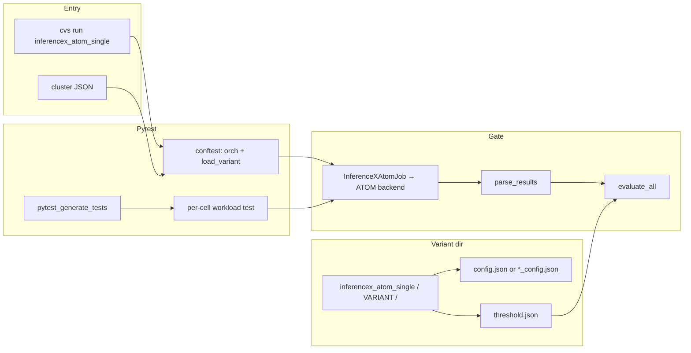
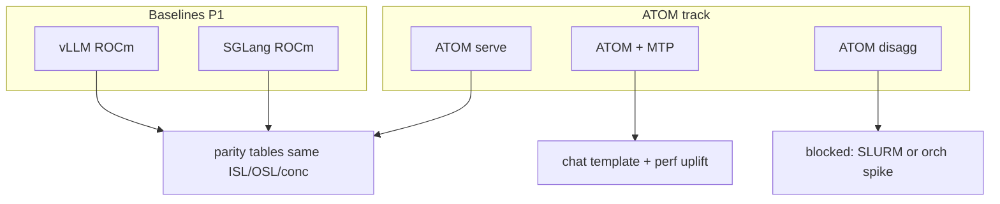
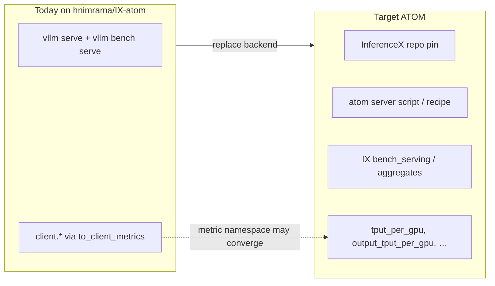
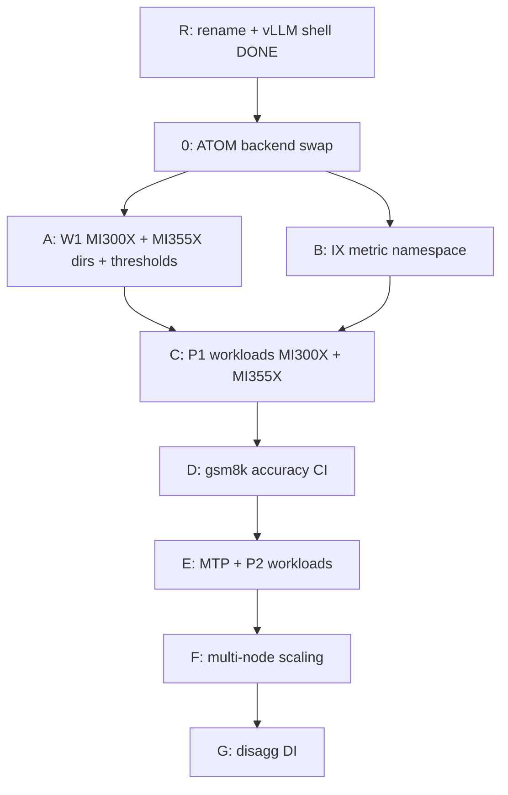
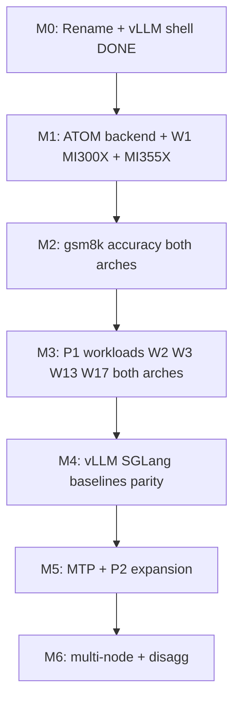
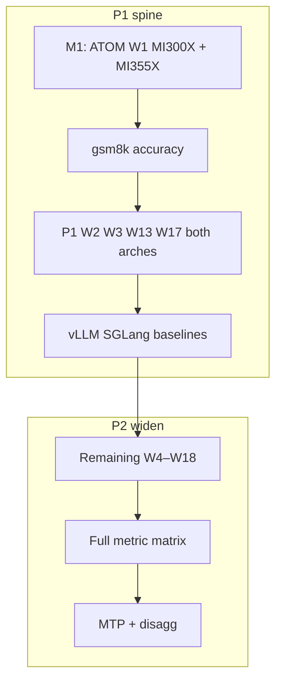

# InferenceX ATOM — CVS automation implementation plan (DTNI-first)

## 0. Branch state (`hnimrama/IX-atom`) — read this first

This section records **what exists on the branch today** vs **what this plan targets**. No further code changes are implied by this section alone.

| Area                 | Current on branch                                                                                                          | Target (this plan)                                                                                                                                                             |
| -------------------- | -------------------------------------------------------------------------------------------------------------------------- | ------------------------------------------------------------------------------------------------------------------------------------------------------------------------------ |
| **Suite name**       | `inferencex_atom_single` (renamed from `inferencemax_single`)                                            | Same                                                                                                                                                                           |
| **Driver**           | `InferenceXAtomJob` in `inferencex_atom_orch.py` — **vLLM-native** (`vllm serve` + `vllm bench serve`, `client.`* metrics) | **InferenceX ATOM framework** path: IX repo checkout, `framework: atom` server recipes from `amd-master.yaml`, IX bench client / aggregates                                    |
| **Config layout**    | `cvs/input/config_file/inference/inferencex_atom_single/` (`schema_version: 1`, vLLM-style `roles.server.serve_args`)      | DTNI variant dirs under `cvs/input/dtni/inferencex_atom_single/<variant>/` (`config.json` + `threshold.json`) **plus** parity with existing typed loader where suites converge |
| **Shipped variants** | `mi300x_gpt_oss_120b_single`, `mi355x_inferencemax_gpt_oss_120b_single` (interim GPT-OSS / vLLM uplift)                    | Tracker workloads **W1–W18** on **MI300X + MI355X** (Section 3.1); GPT-OSS maps to **W2** |
| **Thresholds**       | Placeholder / record-only (`enforce_thresholds: false`) on uplift variants                                                 | Calibrated from lab reference runs (Section 5.1–5.2)                                                                                                                           |
| **Accuracy**         | Not implemented                                                                                                            | **gsm8k** flexible-extract gates (Section 5.2)                                                                                                                                 |
| **MTP**              | Not implemented                                                                                                            | Separate variant or recipe flag (`atom-mtp`, e.g. MTP3)                                                                                                                        |

**Implication for phasing:** the branch rename and vLLM driver are a **stepping stone** (parity with `vllm_single` plumbing). The next implementation waves must **swap the execution backend** to true ATOM (InferenceX) while keeping the same DTNI pytest + `evaluate_all` shell.

---

## 1. Purpose and scope

This document is the **implementation and action-item plan** for **InferenceX ATOM** automation in CVS. Work is tracked against the **DTNI Validation Tracker (IX ATOM)** spreadsheets — not the older W1–W16 Qwen/GLM/Kimi list in earlier drafts of this plan.

**Normative references**

- `plans/dtni-dev-guide.md` — pytest phases, `orch`, Job shape, `load_variant`, `evaluate_all`.
- **DTNI Validation Tracker (IX ATOM)** — framework paths, workload list, priorities, automation status (39 framework tests; **192 workload cases** in the matrix).
- **DTNI Validation Tracker (IX ATOM Matrix)** — workload legend **W1–W18** × performance metric coverage (`Y/P` = yes / planned for every cell).

**In scope (InferenceX focus)**

- **IX paths:** vLLM (ROCm) baseline, SGLang (ROCm) baseline, **ATOM**, **ATOM + MTP**, **ATOM-Disagg** (when orchestration allows).
- **Workloads:** W1–W18 recipes aligned with `amd-master.yaml` / InferenceX ATOM (Section 5).
- **Metrics:** Per-GPU throughput, output throughput per GPU, TTFT/TPOT (mean + tails), prefill/E2E, sweep curves, goodput, scaling — full matrix in Section 5.
- **Quality:** gsm8k accuracy gates; optional MTP health / quant parity (P2).
- **Lab:** **Thor2 NIC first**; AINIC documented when available. See **Section 3.1** — **MI300X and MI355X are both in scope** even though the validation tracker rows are mostly MI355X-labelled.

**GPU platforms (MI300X + MI355X)**

The DTNI Validation Tracker names many recipes with **MI355X** in the title (e.g. W1 `dsr1-fp8-mi355x-atom`). **This plan still requires MI300X automation** for the same workload cards wherever the model fits on 8× MI300X. Tracker omission is **not** an out-of-scope signal for MI300X.

- **Variant naming:** `<workload>_mi300x_<mode>` and `<workload>_mi355x_<mode>` (e.g. `deepseek_r1_fp8_mi300x_atom_perf`, `deepseek_r1_fp8_mi355x_atom_perf`).
- **`gpu_arch`:** `mi300x` or `mi355x` in config; **separate `threshold.json` per arch** — never share thresholds across GPUs.
- **Cluster files:** `input/cluster_file/mi300x_*.json` and `mi355x_*.json` (or equivalent) matched to variant `gpu_arch`.
- **Implementation:** **MI300X and MI355X in parallel** — every P1 workload gets `_mi300x_` and `_mi355x_` variant dirs, cluster JSON examples, and configs in the same PR wave where possible.
- **Calibration / lab:** MI300X lab numbers in Section 4.1–4.2; **MI355X W1** numbers from upstream **ROCm/ATOM** nightly benchmark run in Section 4.3. **Never copy MI300X → MI355X** (or vice versa) for thresholds.

**Current milestone scope (M1):** Phase 0 (ATOM backend swap) + Phase A (W1 perf on **both** `*_mi300x_*` and `*_mi355x_*` variant dirs). Threshold seeds: Section 4.1–4.2 (MI300X), Section 4.3 (MI355X).

**Explicitly out of scope for early waves**

- Full **Optimus / KVMGR / NIXL / hipFile / MaaS / Gateway** automation — **Appendix B** only.
- New gates via legacy `InferenceBaseJob.verify_inference_results`.

### 1.1 Diagrams — CVS entry and DTNI inputs

InferenceX paths under automation:

---

## 2. DTNI alignment (non-negotiable for new work)

| DTNI guide concept      | InferenceX ATOM application                                                                                                |
| ----------------------- | -------------------------------------------------------------------------------------------------------------------------- |
| **Load**                | Each variant = typed config via `**load_variant`** (`InferenceXAtomVariantConfig` or DTNI Pydantic equivalent).            |
| **Setup**               | Module-scoped `**orch`**: `setup_containers` on entry, `teardown_containers` on exit.                                      |
| **Generated tests**     | `**pytest_generate_tests`** builds sweep cells (`sequence_combinations` + explicit `runs[]`).                              |
| **Workload test**       | `**InferenceXAtomJob(orch, variant, hf_token)`** — verbs then `**parse_results()**` → flat metrics for `**evaluate_all**`. |
| **Verification**        | `**evaluate_all`** against `**threshold.json**` per cell (`ISL=…,OSL=…,TP=…,CONC=…`).                                      |
| **Config vs threshold** | **Run recipe** in config; **pass/fail only** in threshold.                                                                 |
| **Job class**           | Standalone job using `**orch` only** — no `InferenceBaseJob` for new ATOM gates.                                           |

### 2.1 Execution backend: vLLM interim vs ATOM target

---

## 3. Workload legend (W1–W18) — from Validation Tracker

Authoritative **model / ISL / OSL / precision** mapping from **DTNI Validation Tracker (IX ATOM Matrix)**. Each workload becomes **variant directories per GPU** (Section 3.1): mode suffixes `_atom`, `_atom_mtp`, `_vllm_baseline`, etc.

| ID | Model / recipe | HF id (tracker) | TP | Precision | Tracker ISL/OSL | Priority |
|----|----------------|-----------------|-----|-----------|-----------------|----------|
| **W1** | DeepSeek R1 FP8 | `dsr1-fp8-mi355x-atom` (tracker); **MI300X:** `dsr1-fp8-mi300x-atom` (IX sibling — confirm in repo) | 8 | FP8 | 1K / 1K | **P1** |
| **W2** | GPT-OSS-120B | `openai/gpt-oss-120b` | 4 | MXFP4 | 8K / 1K | **P1** |
| **W3** | GLM 5.1 | `zai-org/GLM-5.1` | 8 | BF16 | 1K / 8K | **P1** |
| **W4** | GLM 5.1 FP8 | `zai-org/GLM-5.1-FP8` | 8 | FP8 | 1K / 4K | P2 |
| **W5** | DeepSeek V4 Pro | `deepseek-ai/DeepSeek-V4-Pro` | 8 | FP4+FP8 | 5000 / 1024 | P2 |
| **W6** | DeepSeek V4 Flash | `deepseek-ai/DeepSeek-V4-Flash` | 4 | FP4+FP8 | 1K / 1K | P2 |
| **W7** | Kimi K2.6 Thinking | `uniquealexx/Kimi-K2.6-Thinking-200x` | 4 | INT4 | 1K / 1K | P2 |
| **W8** | GLM 5 MXFP4 | `amd/GLM-5-MXFP4` | 8 | MXFP4 | 1K / 1K | P2 |
| **W9** | Kimi K2.5 MXFP4 | `amd/Kimi-K2.5-MXFP4` | 4 | MXFP4 | 1K / 1K | P2 |
| **W10** | Qwen 3.5 397B | `Qwen/Qwen3.5-397B-A17B` | 8 | BF16 | 1K / 1K | P2 |
| **W11** | GLM 5.2 FP8 | `zai-org/GLM-5.2-FP8` | 8 | FP8 | 1K / 1K | P2 |
| **W12** | GLM 5.2 | `zai-org/GLM-5.2` | 8 | BF16 | 1K / 1K | P2 |
| **W13** | Kimi K2.7 Code | `moonshotai/Kimi-K2.7-Code` | 8 | BF16 | 1K / 1K | **P1** |
| **W14** | MiniMax M3 | `MiniMaxAI/MiniMax-M3` | — | BF16 | 1K / 1K | P2 |
| **W15** | Qwen 3.5 MXFP4 | `amd/Qwen3.5-397B-A17B-MXFP4` | 8 | MXFP4 | 1K / 1K | P2 |
| **W16** | Mistral Large 3 | `mistralai/Mistral-Large-3-675B-Instruct-2512` | 8 | FP8 | 1K / 1K | P2 |
| **W17** | DeepSeek R1 MXFP4 | `amd/DeepSeek-R1-0528-MXFP4` | 8 | MXFP4 | 1K / 1K | **P1** |
| **W18** | MiMo v2.5 Pro | `XiaomiMiMo/MiMo-V2.5-Pro` | 8 | BF16 | 1K / 1K | P2 |

**P1 workloads for first automation wave:** W1, W2, W3, W13, W17 (five models) plus framework paths (vLLM, SGLang, ATOM, ATOM+MTP, ATOM-Disagg).

**MTP variants:** For workloads that have `*-atom-mtp` recipes in InferenceX, treat **FP8 + MTP3** (and similar) as **sibling variant dirs** or `roles`/recipe flags — not a different suite id. Chat-formatted prompts required per InferenceX AGENTS.md.

### 3.1 GPU platform coverage (MI300X + MI355X)

The tracker matrix does **not** list MI300X explicitly. **CVS automation does.** Every workload in scope ships as **one or more variant dirs per `gpu_arch`** when the model is supported on that hardware.

**Implementation priority — both platforms in parallel**

| Platform | Code / config (M1+) | Thresholds / lab |
|----------|---------------------|------------------|
| **MI300X** | **Ship alongside MI355X** | Section 4.1–4.2 (internal lab reference) |
| **MI355X** | **Ship alongside MI300X** | Section 4.3 ([ROCm/ATOM run 27912164002](https://github.com/ROCm/ATOM/actions/runs/27912164002)) |

**P1 target — dual variant dirs per workload (MI300X + MI355X)**

| Workload | MI300X variant | MI355X variant | Notes |
|----------|----------------|----------------|-------|
| **W1** DeepSeek R1 FP8 | `deepseek_r1_fp8_mi300x_atom_perf` (+ `_atom_mtp3`) | `deepseek_r1_fp8_mi355x_atom_perf` (+ MTP sibling) | MI300X: §4.1–4.2; MI355X: §4.3 (`DeepSeek-R1-0528` in ATOM CI) |
| **W2** GPT-OSS MXFP4 | `gpt_oss_120b_mi300x_atom` | `gpt_oss_120b_mi355x_atom` | Interim `mi300x_gpt_oss_120b_single` is **not** final W2 |
| **W3** GLM 5.1 BF16 | `glm51_mi300x_atom` | `glm51_mi355x_atom` | Same ISL/OSL as tracker |
| **W13** Kimi K2.7 Code | `kimi_k27_code_mi300x_atom` | `kimi_k27_code_mi355x_atom` | |
| **W17** DeepSeek R1 MXFP4 | `deepseek_r1_mxfp4_mi300x_atom` | `deepseek_r1_mxfp4_mi355x_atom` | gsm8k ≥ 0.93 on MXFP4 |

**P2 workloads:** `_mi300x_` and `_mi355x_` dirs together when each workload is automated.

**Baselines (vLLM / SGLang):** Per workload × `gpu_arch` — both arches for parity tables within each platform.

**Run card fields:** `gpu_arch`, GPU count, IX recipe id, image tag, NIC, IX SHA — comparable dashboards, separate thresholds per arch.

---

## 4. Reference performance (calibration seeds)

W1 (**DeepSeek R1 FP8**, ISL=OSL=1024, TP8, FP8 KV cache). Use to seed per-arch `threshold.json` after margin policy is agreed (typically reference × guard band, not raw copy).

**ATOM bench JSON → CVS threshold keys** (from upstream `ROCm/ATOM` `.github/scripts/summarize.py`):

| ATOM artifact field | CVS / threshold metric (P1) |
|---------------------|-----------------------------|
| `output_throughput` | `output_throughput` or `client.output_throughput` (namespace TBD in Phase B) |
| `total_token_throughput` | `total_token_throughput` |
| `mean_tpot_ms` | `mean_tpot_ms` |
| `mean_ttft_ms` | `mean_ttft_ms` |

### 4.1 MI300X — FP8 (lab reference)

8× MI300X, ATOM, DeepSeek R1 FP8, TP8, FP8 KV cache.

| Concurrency | Output throughput (tok/s) | Total throughput (tok/s) | Mean TPOT (ms) |
| ----------- | ------------------------- | ------------------------ | -------------- |
| 128         | 4,274                     | 8,558                    | 28.8           |
| 256         | 6,039                     | 12,071                   | 40.8           |

### 4.2 MI300X — FP8 + MTP3 (lab reference)

8× MI300X, ATOM, DeepSeek R1 FP8 + MTP3, TP8, FP8 KV cache, 3 speculative tokens.

| Concurrency | Output throughput (tok/s) | Total throughput (tok/s) | Mean TPOT (ms) |
| ----------- | ------------------------- | ------------------------ | -------------- |
| 128         | 6,913                     | 13,856                   | 17.5           |
| 256         | 7,284                     | 14,583                   | 33.0           |

### 4.3 MI355X — from ROCm/ATOM CI (W1 seeds)

Source: [ROCm/ATOM ATOM Benchmark run 27912164002](https://github.com/ROCm/ATOM/actions/runs/27912164002) (also mirrored on [benchmark dashboard](https://rocm.github.io/ATOM/benchmark-dashboard/)). Job summary: [summarize step raw markdown](https://github.com/ROCm/ATOM/actions/runs/27912164002/jobs/65963327389/summary_raw) (GitHub login required).

| Field | Value |
|-------|-------|
| Model | `deepseek-ai/DeepSeek-R1-0528` (ATOM display: **DeepSeek-R1-0528**) |
| GPU | **AMD Instinct MI355X**, 8× GPU, TP8 |
| Image | `rocm/atom-dev:nightly_202606211542` |
| ROCm | 7.2.4 |
| ATOM commit | `ea08015` |

#### 4.3.1 FP8 — ISL=1024, OSL=1024

| Concurrency | Output throughput (tok/s) | Total throughput (tok/s) | Mean TPOT (ms) | Mean TTFT (ms) |
| ----------- | ------------------------- | ------------------------ | -------------- | -------------- |
| 128         | 4,449.62                  | 8,909.01                 | 27.64          | 329.25         |
| 256         | 6,249.73                  | 12,493.43                | 39.46          | 551.66         |

#### 4.3.2 FP8 + MTP3 — ISL=1024, OSL=1024

| Concurrency | Output throughput (tok/s) | Total throughput (tok/s) | Mean TPOT (ms) | Mean TTFT (ms) |
| ----------- | ------------------------- | ------------------------ | -------------- | -------------- |
| 128         | 5,101.99                  | 10,208.96                | 23.77          | 570.42         |
| 256         | 7,168.43                  | 14,321.35                | 34.22          | 606.67         |

**Planning notes**

- These four cells are the **MI355X W1 threshold candidates** (`deepseek_r1_fp8_mi355x_atom_perf` and `_atom_mtp3` sibling).
- Re-pull from a newer ATOM nightly when image or `ea08015`+ moves; pin the run URL + docker tag in variant README / run card.
- MI300X (§4.1–4.2) and MI355X (§4.3) numbers are **close but not identical** — keep separate `threshold.json` per `gpu_arch`.
- As other P1 workloads appear in ATOM CI, add sibling subsections here before enabling `enforce_thresholds: true` on those variants.

---

## 5. Accuracy gates (quality)

Reference accuracy on **8 GPUs**, FP8, FP8 KV cache:

| Task  | Version | Filter           | n-shot | Metric      | Value  | Stderr |
| ----- | ------- | ---------------- | ------ | ----------- | ------ | ------ |
| gsm8k | 3       | flexible-extract | 5      | exact_match | 0.9553 | 0.0057 |
| gsm8k | 3       | strict-match     | 5      | exact_match | 0.9538 | 0.0058 |

**CI thresholds (tracker policy)**

| Precision path | gsm8k flexible-extract minimum |
| -------------- | ------------------------------ |
| FP8            | **≥ 0.94**                     |
| MXFP4          | **≥ 0.93**                     |

**Automation plan**

- Accuracy is a **separate test or post-bench hook** (not mixed into perf sweep `test_metric` unless explicitly merged).
- Threshold kind: propose `min_ratio` or dedicated `min_exact_match` in verdict layer — **design in Phase D**, implement after perf path is green for W1.
- Run accuracy on a **reduced concurrency** or dedicated variant dir to avoid perf sweep cost.

---

## 6. Master metric matrix (framework + workloads)

From **IX ATOM Matrix**: every workload row W1–W18 is marked **Y/P** for all core performance metrics below. CVS automation should eventually emit and gate (where P1) each metric per cell.

| #    | Category    | Test / Metric                                     | Priority     | Automation status     | Notes                                |
| ---- | ----------- | ------------------------------------------------- | ------------ | --------------------- | ------------------------------------ |
| 1    | IX Path     | vLLM (ROCm) baseline                              | P1           | In progress           | Same cards as ATOM                   |
| 2    | IX Path     | SGLang (ROCm) baseline                            | P1           | In progress           | Second open engine                   |
| 3    | IX Path     | ATOM (`framework: atom`)                          | P1           | Not started (backend) | Primary IX path                      |
| 4    | IX Path     | ATOM + MTP                                        | P1           | Not started           | EAGLE / MTP3 recipes                 |
| 5    | IX Path     | ATOM-Disagg                                       | P1           | Blocked               | PD pools; SLURM spike                |
| 6–23 | Workload    | W1–W18 (Section 3)                                | P1/P2        | Not started           | 192 matrix cells total               |
| 24   | Performance | Throughput per GPU (`tput_per_gpu`)               | P1           | Partial               | vLLM `client.`* interim only         |
| 25   | Performance | Output throughput per GPU (`output_tput_per_gpu`) | P1           | Partial               |                                      |
| 26   | Performance | TTFT mean & p99                                   | P1           | Partial               |                                      |
| 27   | Performance | TPOT mean & p95                                   | P1           | Partial               |                                      |
| 28   | Performance | Prefill latency p50 / p95                         | P2           | Not started           |                                      |
| 29   | Performance | E2E mean / p95 / p99                              | P2           | Not started           |                                      |
| 30   | Performance | Latency vs load (per sweep step)                  | P2           | Not started           |                                      |
| 31   | Performance | Goodput                                           | P2           | Not started           |                                      |
| 32   | Performance | Scaling efficiency %                              | P2           | Not started           |                                      |
| 33   | Performance | Peak GPU memory                                   | P2           | Not started           |                                      |
| 34   | Performance | KV cache footprint                                | P2           | Not started           |                                      |
| 35   | Performance | Request success rate & error mix                  | P2           | Not started           |                                      |
| 36   | Performance | Model load time + memory                          | P2           | Not started           |                                      |
| 37   | Performance | Time-to-ready                                     | P2           | Partial               | `wait_ready` timing exists on branch |
| 38   | Quality     | MTP acceptance / degenerate decode                | P2           | Not started           | MTP workloads only                   |
| 39   | Quality     | Quant / logit parity vs BF16                      | P2           | Not started           | Nightly optional                     |
| 40   | Quality     | **gsm8k accuracy**                                | P1 (W1 gate) | Not started           | Section 5                            |

**Tracker rollup (IX ATOM tab):** 39 framework tests — 14 P1, 25 P2; 0% automated today; 192 workload cases in matrix.

---

## 7. Phased implementation strategy (revised for `hnimrama/IX-atom`)

| Phase | Name                         | Goal                                                                               | Status on branch          |
| ----- | ---------------------------- | ---------------------------------------------------------------------------------- | ------------------------- |
| **R** | **Rename + vLLM shell**      | `inferencex_atom_single`, `InferenceXAtomJob`, schema_version 1 configs, docs      | **Done**      |
| **0** | **ATOM backend swap**        | IX repo pin, atom server recipe, IX bench parse; keep pytest/`orch`/`evaluate_all` | Not started               |
| **A** | **W1 vertical slice**        | W1 on **MI300X + MI355X** variant dirs; thresholds from §4.1–4.3 | Not started               |
| **B** | **Metric namespace**         | Map IX aggregates → threshold keys; document field map                             | Partial (`client.`* only) |
| **C** | **P1 workloads**             | W1–W17 on **MI300X + MI355X** (Section 3.1) + baselines per arch                     | Not started               |
| **D** | **Accuracy + CI**            | gsm8k gate Section 5; negative threshold test                                      | Not started               |
| **E** | **MTP + P2**                 | `_atom_mtp` variants; W4–W12, W14–W16, W18                                         | Not started               |
| **F** | **Multi-node + scaling**     | `nnodes`, fabric metadata on run card                                              | Not started               |
| **G** | **Disagg + DI stack**        | Appendix B when infra ready                                                        | Blocked                   |

---

## 8. Action items (detailed)

### Phase 0 — ATOM backend swap (next code wave)

| ID  | Action                        | Details                                                                                                                         |
| --- | ----------------------------- | ------------------------------------------------------------------------------------------------------------------------------- |
| 0-1 | **IX repo + recipe pin**      | W1 → `dsr1-fp8-mi300x-atom` **and** `dsr1-fp8-mi355x-atom` (confirm both in IX `amd-master.yaml`). |
| 0-2 | **Replace vLLM serve path**   | `InferenceXAtomJob.build_server_cmd` runs IX atom server script inside container, not `vllm serve`. |
| 0-3 | **Replace bench client**      | IX `bench_serving` / stock artifact; `parse_results` reads IX log + optional `agg_bmk` JSON. |
| 0-4 | **Keep DTNI pytest shell**    | No return to ordered `test_launch_*` tests; `conftest.py` + sweep parametrization unchanged. |
| 0-5 | **Variant dirs W1**           | `deepseek_r1_fp8_mi300x_atom_perf/` **and** `deepseek_r1_fp8_mi355x_atom_perf/`; same sweep cells (Section 4 ISL/OSL/conc). |
| 0-6 | **Cluster configs**           | Example `cluster_file` for 8× MI300X **and** 8× MI355X matched to `gpu_arch`. |

### Phase A — W1 calibration (MI300X + MI355X)

| ID  | Action                        | Details                                                                                             |
| --- | ----------------------------- | --------------------------------------------------------------------------------------------------- |
| A-1 | **MI300X thresholds**         | `threshold.json` for `*_mi300x_*` dirs from Section 4.1–4.2. |
| A-2 | **MI355X thresholds**         | `threshold.json` for `*_mi355x_*` dirs from Section 4.3 (ATOM run 27912164002). |
| A-3 | **Run card**                  | Log IX/ATOM SHA, image, `gpu_arch`, TP8, KV cache mode, MTP off/on, upstream run URL. |
| A-4 | **Flip `enforce_thresholds`** | Per arch after one confirming CVS run matches reference band. |

### Phase B — Metrics pipeline

| ID  | Action                                     | Details                                                                                    |
| --- | ------------------------------------------ | ------------------------------------------------------------------------------------------ |
| B-1 | **IX → threshold key map**                 | Align with Section 4 ATOM fields: `output_throughput`, `total_token_throughput`, `mean_ttft_ms`, `mean_tpot_ms`, … |
| B-2 | **Deprecate `client.`* for ATOM variants** | May keep for vLLM baseline variant dirs only.                                              |
| B-3 | **Results table**                          | `test_print_results_table` columns match tracker P1 dashboard.                             |

### Phase C — P1 workload variants (MI300X + MI355X)

| ID  | Action        | Details                                                                                  |
| --- | ------------- | ---------------------------------------------------------------------------------------- |
| C-1 | **W1**        | **Both arches:** `*_mi300x_atom_perf` + `*_mi355x_atom_perf` (+ MTP siblings) |
| C-2 | **W2**        | **Both arches:** GPT-OSS MXFP4 TP4, ISL 8K / OSL 1K |
| C-3 | **W3**        | **Both arches:** GLM 5.1 BF16 |
| C-4 | **W13**       | **Both arches:** Kimi K2.7 Code |
| C-5 | **W17**       | **Both arches:** DeepSeek R1 MXFP4 |
| C-6 | **Baselines** | vLLM + SGLang per workload × `gpu_arch` |

### Phase D — Accuracy + CI

| ID  | Action                  | Details                                    |
| --- | ----------------------- | ------------------------------------------ |
| D-1 | **gsm8k harness**       | flexible-extract; FP8 ≥ 0.94, MXFP4 ≥ 0.93 |
| D-2 | **Job split**           | Perf sweep CI vs accuracy CI (or nightly)  |
| D-3 | **Threshold ownership** | Who updates on image/kernel bumps          |

### Phases E–G

| ID  | Action           | Details                                             |
| --- | ---------------- | --------------------------------------------------- |
| E-1 | **MTP variants** | Section 4.2 pattern for other MTP-capable workloads |
| E-2 | **P2 dirs**      | W4–W12, W14–W16, W18 per Section 3                  |
| F-1 | **Multi-node**   | Scaling efficiency metric + fabric metadata         |
| G-1 | **Disagg spike** | Before W5/W6 disagg promises                        |

### Documentation

| ID    | Action                            | Details                                                                                                 |
| ----- | --------------------------------- | ------------------------------------------------------------------------------------------------------- |
| DOC-1 | **Link tracker → plan**           | Point readers to W1–W18 table (Section 3) from `docs/reference/configuration-files/inferencex_atom.rst` |
| DOC-2 | **Clarify interim vLLM variants** | Mark `mi300x_gpt_oss_120b_single` as uplift placeholder until W2 ATOM lands                             |
| DOC-3 | **MI300X in user docs**             | State explicitly that `inferencex_atom_single` supports **MI300X and MI355X**; tracker rows may say MI355X only |

---

## 9. Appendix A — Recipe index (reference)

Maintain **W id → IX recipe id → upstream script → CVS paths** map (YAML or variant README). Pin **IX git ref** in each variant **config**, never in **threshold**.

---

## 10. Appendix B — Deferred DI platform matrix (tracking only)

Unchanged from prior plan: Thor2/AINIC, Optimus, KVMGR, NIXL, MOR-EP, RCCL, MI3XXX/MI4XXX GPU matrix, Gateway, MaaS — implement only after P1 ATOM perf + accuracy gates are green.

---

## 11. Risks and mitigations

| Risk                                            | Mitigation                                                           |
| ----------------------------------------------- | -------------------------------------------------------------------- |
| **vLLM driver mistaken for ATOM done**          | Section 0 + Phase 0 explicitly swap backend                          |
| **Wrong workload on branch (GPT-OSS TP8 BF16)** | W2 spec is MXFP4 TP4; track as interim in DOC-2                      |
| **Upstream ATOM CI drift**                      | Pin docker tag + run URL in variant README; re-pull §4.3 on image bumps |
| **MI300X vs MI355X threshold bleed**            | Separate variant dirs + `threshold.json` per `gpu_arch`                |
| **MTP flakes**                                  | Separate CI job; chat-template checklist                             |
| **Metric key drift**                            | B-1 single map; forbid thresholds in config                          |
| **192 matrix scope creep**                      | Automate P1 workloads × P1 metrics first; matrix `Y/P` is north star |

---

## Diagrams — milestones

**Milestone 1 (next implementation):** Phase 0 + Phase A — ATOM backend, W1 variant dirs and thresholds on **MI300X** (§4.1–4.2) and **MI355X** (§4.3 / ATOM run 27912164002).

