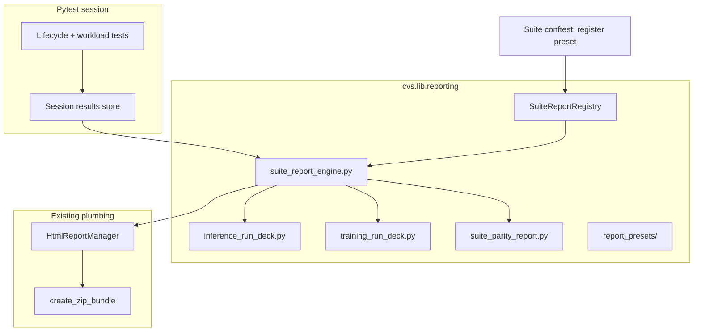

# CVS Suite Reporting Library: Proposal

**Author:** Hamna  
**Status:** Draft proposal  
**Demo suite:** `inferencex_atom_single` (MI300X W1 perf)  
**Branch:** `hnimrama/IX-atom-experimental-run-deck`

---

## Summary

This proposal productizes post-run HTML dashboards as a **shared CVS library**, not a one-off for InferenceX ATOM. When a suite runs with `--html`, the output includes the **pytest HTML report and a suite report in the same zip**, ready to upload as one artifact. The same pipeline applies to **inference** (InferenceX, vLLM, SGLang), **training** (Megatron, JAX), and eventually **parity comparison** (ATOM vs atom-vLLM vs atom-SGLang).

InferenceX ATOM is the first end-to-end demo. After that lands, other suites register a preset only; they do not copy HTML generation logic.

---

## Problem

Several pieces work today, but they are not unified:

- **InferenceX ATOM** produces a suite report (`inferencex_atom_report.html` + `.json`) when `--html` is set, bundled into the pytest zip via `HtmlReportManager`.
- **vLLM single** and **training** suites do not share that path; training still relies on older `html_lib` patterns without a module-scoped results contract or zip integration.
- **Parity comparison** (M4) is planned (`compare.*` metrics in the automation plan) but has no report merge layer yet.
- Report generation is wired as a **per-suite lifecycle test** (`test_ix_report`) rather than a **central pytest hook**, so every new suite must handle ordering, fixtures, and duplicated wiring.

The proposal is one library, one registration pattern, and one upload artifact, regardless of whether the workload is inference, vLLM, or training.

---

## Proposal

### Vision

```text
cvs run <suite> ... --html=report.html
        │
        ├─► pytest-html report              (existing)
        ├─► Suite Run Deck HTML + JSON      (new shared library)
        └─► {suite}_{timestamp}.zip         (existing HtmlReportManager)
                ├── report.html
                ├── {suite}_html/
                │     ├── *_run_deck.html
                │     └── *_run_deck.json
                └── cluster/config copies
```

Suites **register** a config preset. A **central session hook** generates reports after tests complete. Workload tests only populate a results store; they remain unaware of HTML.

### Architecture



**Design principle:** generic engine plus domain adapters plus per-suite presets. Inference gets sweep cells, concurrency charts, and gate matrices. Training gets per-node throughput tables. Parity merges multiple JSON sidecars.

---

## Package layout

The plan introduces `cvs/lib/report/` and moves logic out of inference-only modules:

```text
cvs/lib/report/
├── __init__.py
├── types.py                      # InferenceReportConfig, ReportChartSeries
├── inference.py                  # build/write/render, make_report_test
├── presets/
│   ├── inferencex_atom.py
│   └── vllm_single.py            # stub preset
└── unittests/
    └── test_inference_report.py
```

---

## Data contracts

### Inference (InferenceX ATOM, vLLM, SGLang)

**Inputs (already in place for ATOM):**

- `inf_res_dict`: `cell_key → {host → {metric: value}}`
- `variant_config`: thresholds, sweep, `enforce_thresholds`
- `lifecycle.report`: stage timings

**Run deck panels:**

| Panel | Today | Remaining gap |
|-------|-------|---------------|
| Run card | Yes | None |
| Lifecycle timeline | Yes | None |
| Gate matrix | Yes | None |
| Concurrency charts | Yes | Needs 2+ sweep cells |
| Sweep analytics | Yes | None |
| Full results table | Yes | None |
| All hosts in deck | No | Fix first-host-only rendering |
| Parity panel | No | M4: separate merge or embedded `compare.*` |

### Training (Megatron / JAX)

**Inputs (new):**

- `training_res_dict`: `{node_id → {throughput_per_gpu, tokens_per_gpu, elapsed_time_per_iteration, nan_iterations, mem_usages}}`
- `training_config`: model, precision, distributed flag, optional thresholds

**Panels (training-specific):**

- Run card (framework, model, nodes, GPUs)
- Per-node results table (same semantics as today's `html_lib` training table, modern styling)
- Cluster aggregate (mean throughput, worst node, NaN count)
- Optional scaling panel for distributed suites

Training suites do not yet have a module-scoped results dict or `add_html_to_report` wiring. That is a prerequisite before the deck adapter.

### Parity (M4, inference-first)

**Inputs:** Two to three `*_run_deck.json` files from aligned runs (ATOM + atom-vLLM + atom-SGLang), same sweep cells.

**Outputs:** `parity_report.html` + `parity_report.json` in the same `{suite}_html/` folder.

**Metrics** (from `plans/inferencex-atom-cvs-automation-plan.md` §12.6): `compare.vllm.output_throughput_ratio`, `compare.sglang.mean_ttft_ms_ratio`, `compare.prev_run.*`, etc.

---

## Central integration

### Current state

Each inference suite exports a lifecycle test via `make_run_deck_test()` and pins it in `LIFECYCLE_RANK`. This works but does not scale to every suite.

### Target state

**Suite conftest:** register once:

```python
from cvs.lib.reporting.presets.inferencex_atom import INFERENCEX_ATOM_REPORT_CONFIG
from cvs.lib.reporting.suite_report_registry import register_suite_report

def pytest_configure(config):
    register_suite_report(config, INFERENCEX_ATOM_REPORT_CONFIG)
```

**Root conftest:** generate before zip:

```python
@pytest.hookimpl(hookwrapper=True)
def pytest_sessionfinish(session, exitstatus):
    yield
    session.config._html_report_manager.generate_suite_reports(session)
    session.config._html_report_manager.create_zip_bundle(session)
```

**`generate_suite_reports(session)`:**

1. No-op if `--html` is not set
2. Load registered `SuiteReportConfig`
3. Read results and lifecycle from a **session store**
4. Write run deck HTML/JSON via `add_html_to_report()`
5. Optionally write parity report if baseline JSONs are configured

**Session store:** inference conftest binds module fixtures:

```python
@pytest.fixture(scope="module", autouse=True)
def _suite_report_session(inf_res_dict, variant_config, lifecycle):
    bind_session_results(inf_res_dict, variant_config, lifecycle)
    yield
```

The optional `test_run_deck` lifecycle row can remain for pytest visibility, but generation moves to session finish so ordering bugs cannot skip the deck.

---

## Phased delivery

### Phase 0: Commit and stabilize demo baseline (1 to 2 days)

- Commit current generic `inference_suite_run_deck` + ATOM preset + unit tests on `hnimrama/IX-atom`
- Re-run lab: confirm zip contains pytest HTML + `inferencex_atom_run_deck.html/json`
- Document artifact paths in `inferencex_atom_single/README.md`

**Demo criteria:** open one zip, open pytest HTML, click through to Run Deck.

---

### Phase 1: Extract `cvs.lib.reporting` and central hook (3 to 5 days)

| Task | Detail |
|------|--------|
| Move engine | `inference_suite_run_deck.py` → `reporting/inference_run_deck.py` + shim |
| Registry | `register_suite_report(config, preset)` |
| Session store | `bind_session_results` in inferencex_atom conftest |
| `HtmlReportManager.generate_suite_reports()` | Root `pytest_sessionfinish` |
| Unit tests | `cvs/lib/reporting/unittests/` |

**Outcome:** inferencex_atom demo works without relying on lifecycle test ordering.

---

### Phase 2: Polish inference deck (3 to 4 days)

| Task | Priority |
|------|----------|
| Render all hosts in cell cards + table | P0 |
| `max_cells_in_html` + "see JSON for full sweep" for large matrices | P1 |
| Gate matrix heatmap | P1 |
| Per-cell lifecycle mini-timeline (port from experimental branch) | P2 |
| Update `ADDING_A_SUITE.md` to point at `cvs.lib.reporting` | P0 |

**Demo command:**

```bash
cvs run inferencex_atom_single \
  --cluster_file .../mi300x_atom_single.json \
  --config_file .../mi300x_inferencex-atom-single_deepseek-r1_fp8_perf_config.json \
  --html=~/cvs_results/ix-atom-demo.html
# produces ix-atom-demo_<timestamp>.zip
```

---

### Phase 3: vLLM inference preset (2 to 3 days)

- Finish `VLLM_SINGLE_RUN_DECK_CONFIG`
- Wire `vllm_single` conftest with `register_suite_report` + session bind
- Demonstrates the library is not ATOM-specific: same engine, different preset

---

### Phase 4: Training adapter (5 to 7 days)

- Add `training_res_dict` module fixture (Megatron 8B single as pilot)
- Normalize metrics in `verify_training_results()`
- `TrainingRunDeckConfig` + preset; register in megatron conftest
- JAX suite as second preset once Megatron works

Training v1: node table plus PASS badge is sufficient; sweep charts remain inference-only.

---

### Phase 5: Parity report (M4, 5 to 8 days)

- `suite_parity_report.py`: align cells across N JSON sidecars
- CLI: `cvs report parity --atom json --vllm json --out parity.html`
- CI: sequential ATOM + atom-vLLM + atom-SGLang, one zip with parity summary
- Optional `compare.*` gate enforcement in metrics tests later

---

### Phase 6: CI upload and docs (2 days)

- Document zip layout in `plans/dtni-dev-guide.md` and suite READMEs
- CI publishes `{suite}_{timestamp}.zip` as a single artifact
- PR / Confluence template: attach zip, link pytest HTML + run deck

---

## Suite onboarding checklist

Any new suite should only need:

```text
□ Populate a module-scoped results dict during workload tests
□ register_suite_report(config, PRESET) in conftest.py
□ bind_session_results autouse fixture
□ (Inference) keep print_results_table as-is for logs
□ (Optional) register baseline JSON paths for parity
□ Run with --html and verify zip contents
```

---

## Generic vs suite-specific

| Shared library (`cvs.lib.reporting`) | Per-suite preset only |
|--------------------------------------|------------------------|
| HTML shell, CSS, zip wiring | Column definitions / metric names |
| Gate matrix renderer | `tier_metric_specs` |
| Chart.js concurrency plots | `chart_series` |
| JSON export schema | Cell key function |
| Sessionfinish hook | `run_card_display_builder` |
| Parity merge engine | Which baselines to compare |

---

## Proposed commit sequence

1. `feat(reporting): add inference run deck engine and ATOM preset`
2. `refactor(reporting): extract cvs.lib.reporting and session registry`
3. `feat(reporting): centralize suite report generation in pytest_sessionfinish`
4. `fix(reporting): multi-host cell rendering in inference deck`
5. `feat(reporting): add vllm_single preset`
6. `feat(reporting): training run deck adapter (megatron 8b single)`
7. `feat(reporting): parity report merge for M4`

---

## Success criteria (InferenceX ATOM demo)

- [ ] `cvs run inferencex_atom_single ... --html=...` produces zip automatically
- [ ] Pytest HTML Reports section links to the InferenceX ATOM Run Deck
- [ ] Deck shows run card, lifecycle, gates, charts (multi-cell), full table
- [ ] JSON sidecar is valid and ready for parity merge
- [ ] No change to pytest pass/fail or threshold enforcement
- [ ] `ADDING_A_SUITE.md` documents three-line registration for the next suite
- [ ] One zip attachable to a PR or status page

---

## Rationale

1. **Builds on existing plumbing:** `HtmlReportManager`, zip bundling, and the ATOM run deck on `hnimrama/IX-atom` are the foundation, not throwaway POC code.
2. **Low friction for new suites:** register a preset; do not fork HTML.
3. **Upload path already exists:** the zip bundles pytest HTML and `{suite}_html/`; this proposal makes that consistent across inference and training.
4. **Parity is a layer, not a rewrite:** JSON sidecars from each framework run merge into a comparison report in the same bundle (M4).
5. **Concrete demo:** MI300X W1 perf on `inferencex_atom_single` is green in lab; the zip can serve as the reference artifact before rollout to vLLM and training.

---

## Immediate next steps

1. Commit Phase 0 (current ATOM generic deck on `hnimrama/IX-atom`)
2. Implement Phase 1 (registry + `pytest_sessionfinish`): core "library integrated with pytest HTML" milestone
3. Lab demo: inferencex_atom W1 perf zip as the reference artifact

---

## References

- `cvs/lib/report/inference.py`: inference suite report engine
- `cvs/lib/report/presets/inferencex_atom.py`: ATOM + vLLM presets
- `cvs/lib/report_plugins.py`: `HtmlReportManager`, zip bundling
- `cvs/conftest.py`: root pytest hooks
- `plans/inferencex-atom-cvs-automation-plan.md`: M4 parity, §12.6 `compare.*` metrics
- `cvs/lib/inference/ADDING_A_SUITE.md`: Step 6b Run Deck (to update after Phase 1)
